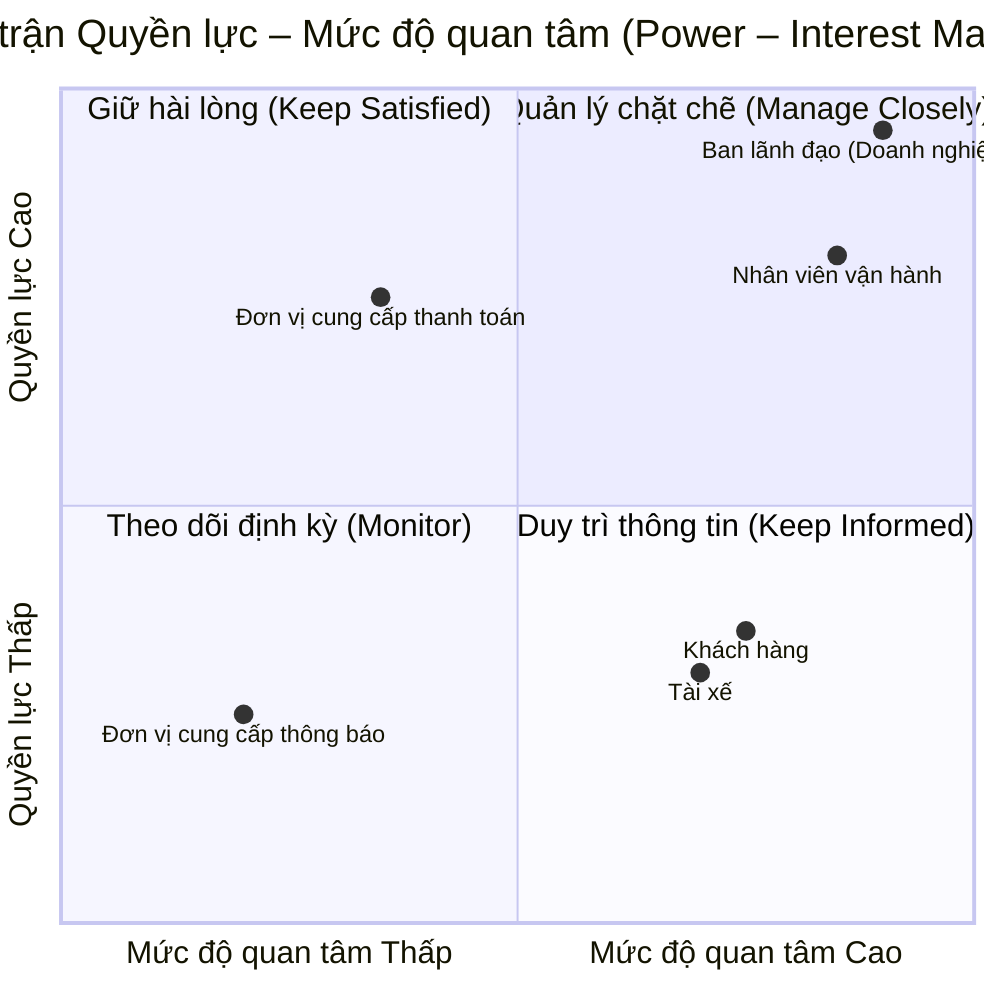
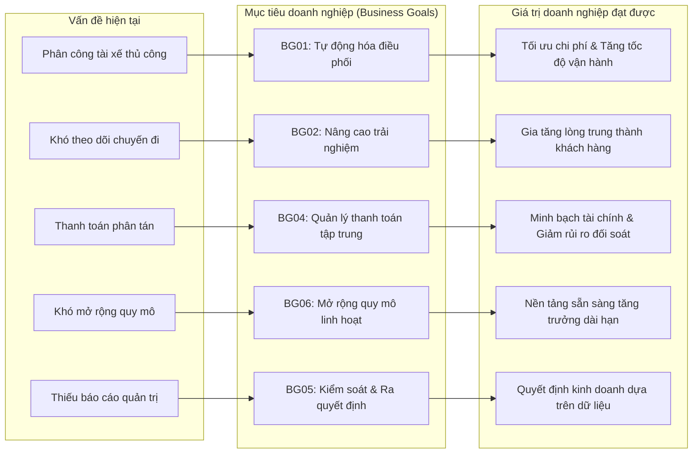
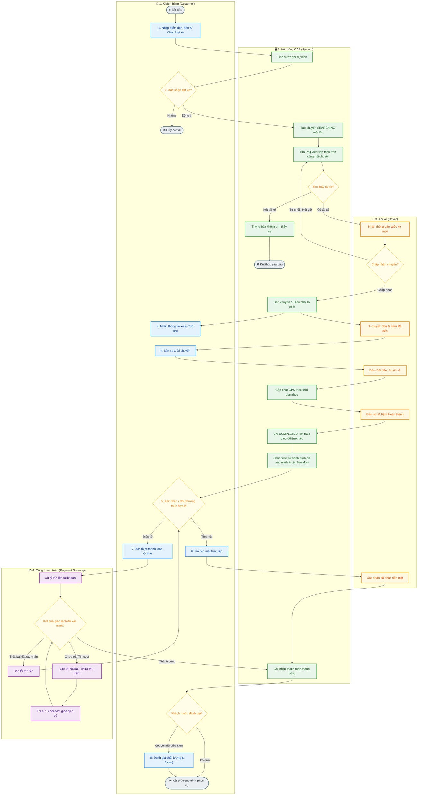

# BÁO CÁO PHÂN TÍCH VÀ THIẾT KẾ HỆ THỐNG
# ĐỀ TÀI: NỀN TẢNG ĐẶT XE TRỰC TUYẾN (CAB SYSTEM)

Tài liệu này đặc tả yêu cầu và quy trình nghiệp vụ của CAB. Phân rã 7 domain, phân loại DDD, dữ liệu sở hữu và đánh giá high cohesion/loose coupling được trình bày tại [Thiết kế domain](SUBDOMAIN_DESIGN.md). Bảng truy vết ở mục 11 liên kết yêu cầu với thiết kế; các nhóm FR không đồng nghĩa với các service triển khai.

**Thông tin đề tài**
Mã sinh viên: 23635951
Họ và tên: Nguyễn Tuấn Kiệt
Đơn vị chủ quản: Doanh nghiệp ABC

## 1. TỔNG QUAN VÀ ĐỊNH NGHĨA HỆ THỐNG (SYSTEM DEFINITION)

### 1.1. Giới thiệu hệ thống
CAB System là nền tảng đặt xe trực tuyến được nghiên cứu và thiết kế cho Doanh nghiệp ABC nhằm số hóa quy trình đặt xe, tự động hóa công tác điều phối vận hành và tối ưu hóa trải nghiệm cho khách hàng cùng tài xế.

### 1.2. Hiện trạng và hạn chế của hệ thống cũ
Hệ thống tiếp nhận yêu cầu đặt xe hiện tại thông qua tổng đài thoại hoặc ứng dụng cơ bản đang bộc lộ nhiều điểm nghẽn nghiêm trọng trong quá trình vận hành:
Thứ nhất, quy trình điều phối hoàn toàn phụ thuộc vào việc chỉ định thủ công của nhân viên tổng đài, dẫn đến độ trễ lớn và dễ xảy ra sai sót khi lượng yêu cầu tăng cao.
Thứ hai, khách hàng không có công cụ trực quan để theo dõi vị trí di chuyển của tài xế cũng như tiến trình chuyến đi theo thời gian thực.
Thứ ba, dữ liệu về chuyến đi, lịch sử giao dịch và doanh thu chưa được quản lý tập trung, gây nhiều khó khăn và rủi ro trong công tác đối soát tài chính.
Thứ tư, kiến trúc kỹ thuật hiện tại có tính đóng và khó mở rộng quy mô khi số lượng người dùng đồng thời gia tăng nhanh chóng.

### 1.3. Mục tiêu xây dựng hệ thống mới
Hệ thống CAB mới được định hướng phát triển nhằm tự động hóa toàn diện quy trình tìm kiếm, khớp nối và phân công tài xế dựa trên vị trí GPS và các tiêu chuẩn vận hành. Đồng thời, hệ thống cung cấp giải pháp giám sát hành trình thời gian thực, tích hợp cổng thanh toán trực tuyến, quản lý và giám sát nghiệp vụ qua giao diện tập trung, với dữ liệu được sở hữu riêng theo từng domain và thiết lập kiến trúc module hóa đảm bảo hiệu năng cao, tính sẵn sàng và khả năng mở rộng linh hoạt.

### 1.4. Bảng so sánh cải tiến hệ thống

| Tiêu chí so sánh | Hệ thống hiện tại | Hệ thống CAB mới |
| :--- | :--- | :--- |
| **Phương thức đặt chuyến** | Tổng đài thoại hoặc ứng dụng cơ bản | Ứng dụng trực tuyến đa nền tảng |
| **Phân bổ tài xế** | Điều phối viên chỉ định thủ công | Tự động hóa phân công dựa trên thuật toán tối ưu |
| **Tiêu chí ghép chuyến** | Chưa có tiêu chuẩn định lượng | Dựa trên vị trí GPS, trạng thái sẵn sàng và tiêu chí vận hành |
| **Xử lý từ chối cuốc xe** | Xử lý thủ công, độ trễ cao | Tự động chuyển tiếp tìm kiếm tài xế kế tiếp |
| **Giám sát hành trình** | Khách hàng không theo dõi được | Theo dõi lộ trình và vị trí GPS theo thời gian thực |
| **Phương thức thanh toán** | Chủ yếu tiền mặt, dữ liệu phân tán | Hỗ trợ linh hoạt: Tiền mặt, Thẻ ngân hàng, Ví điện tử |
| **Hệ thống thông báo** | Thiếu đồng bộ | Tự động gửi SMS OTP, Push Notification theo sự kiện |
| **Công cụ quản trị** | Chưa được chuẩn hóa | Cổng quản trị tập trung (Dashboard) cho nhân viên vận hành |
| **Báo cáo & Phân tích** | Tổng hợp thủ công, thiếu tức thời | Báo cáo trực quan: Doanh thu, số chuyến, tỷ lệ hoàn thành/hủy |
| **Bảo mật & Phân quyền** | Chưa có cơ chế rõ ràng | Phân quyền theo vai trò (RBAC) và ghi log kiểm toán hệ thống |
| **Khả năng mở rộng** | Kiến trúc đóng, khó tích hợp | Kiến trúc module hóa, dễ dàng tích hợp dịch vụ mới |

### 1.5. Phạm vi của hệ thống (System Scope)

#### 1.5.1. Phạm vi thực hiện (In-Scope)
Hệ thống đảm nhiệm toàn bộ quy trình từ khâu quản lý tài khoản người dùng (Khách hàng, Tài xế, Nhân viên vận hành), tiếp nhận yêu cầu đặt chuyến, tự động điều phối tài xế, định vị lộ trình di chuyển thời gian thực, tự động tính toán cước phí và xử lý thanh toán đa phương thức. Ngoài ra, hệ thống cung cấp hạ tầng gửi tin nhắn thông báo tự động, cổng quản trị tập trung về giao diện và quyền thao tác và hệ thống báo cáo thống kê phục vụ công tác giám sát điều hành.

#### 1.5.2. Các nội dung cần làm rõ thêm (Pending / Further Clarification)
Một số nội dung kỹ thuật và quy định nghiệp vụ chi tiết cần tiếp tục làm việc với các bên liên quan để thống nhất:
Quy tắc điều phối, timeout, phí hủy MVP, OTP, GPS, thanh toán và báo cáo đã chốt tại mục 10–10.1. Các điểm còn mở gồm giá/công thức/làm tròn, thời hạn lưu dữ liệu, chi tiết bảo mật và phục hồi; xem danh sách được quản lý tại mục 11.2. Giá động theo giờ cao điểm nằm ngoài MVP.

### 1.6. Tích hợp hệ thống bên ngoài (External Integrations)
Hệ thống thực hiện tích hợp với các đối tác dịch vụ bên thứ ba bao gồm cổng thanh toán điện tử (Payment Gateway) để tiếp nhận và xác thực giao dịch trực tuyến; dịch vụ thông báo (Notification Provider) để truyền tải mã xác thực OTP và thông báo hành trình qua SMS, Email, Push Notification; và dịch vụ bản đồ số (Map/GIS Services) phục vụ tính toán cước phí, lộ trình di chuyển và thời gian dự kiến đón xe.

### 1.7. Yêu cầu phi chức năng (Non-Functional Requirements)
Các yêu cầu dưới đây là tiêu chí cần kiểm chứng, không phải tuyên bố hệ thống đã đạt. Những thông số chưa thống nhất được ghi rõ để chốt trước nghiệm thu.

| Mã | Yêu cầu | Cách kiểm chứng và thông số cần chốt |
| --- | --- | --- |
| NFR01 | Mục tiêu p95 độ trễ xử lý dưới 1 giây cho tác vụ truy vấn ứng viên điều phối và cập nhật vị trí. Không tính thời gian con người phản hồi lời mời vào thời gian xử lý máy chủ. | Đo từ khi máy chủ nhận request đến khi trả kết quả; tải GPS cơ sở đã chốt là 100 tài xế, mỗi thiết bị gửi theo CFG-GPS-01 (trung bình 20 cập nhật/giây). Ghi cấu hình máy, dữ liệu, thời gian chạy, p95 riêng từng tác vụ và tỷ lệ lỗi; tải truy vấn điều phối/mức lỗi chấp nhận còn cần chốt. Chưa có kết quả đo để kết luận đạt. |
| NFR02 | Có khả năng vận hành liên tục và phục hồi khi một thành phần gặp lỗi; 24/7 là định hướng vận hành, không có nghĩa không bao giờ gián đoạn. | Cần chốt tỷ lệ sẵn sàng, kỳ đo, thời gian phục hồi và mức mất dữ liệu chấp nhận được; kiểm tra bằng kịch bản ngắt/khởi động lại thành phần. |
| NFR03 | Có thể mở rộng độc lập các thành phần chịu tải cao theo ranh giới thiết kế. | Kiểm tra mở rộng thành phần và tính đúng của kết quả; cấu hình tài nguyên và tải mục tiêu cần chốt. |
| NFR04 | Bảo vệ thông tin cá nhân, giấy tờ và vị trí bằng xác thực, phân quyền theo tài nguyên và mã hóa đường truyền; không lưu mật khẩu dạng rõ hay dữ liệu thẻ nhạy cảm. | Kiểm tra truy cập sai vai trò/sai chủ sở hữu, cấu hình đường truyền và dữ liệu/log; danh mục dữ liệu cần mã hóa khi lưu và cách quản lý khóa cần chốt. |
| NFR05 | Thao tác quản trị quan trọng, thay đổi trạng thái chuyến và giao dịch có audit gồm người thực hiện, thời điểm, đối tượng, hành động và kết quả. | Đối chiếu thao tác với audit; che dữ liệu nhạy cảm; thời hạn lưu và quyền tra cứu cần chốt. |
| NFR06 | Gửi lại yêu cầu hoặc sự kiện không được gây trùng chuyến, trùng phân công, thu/hoàn tiền nhiều lần cho cùng thao tác. | Kiểm tra gửi lặp, xử lý đồng thời và mất phản hồi; đối chiếu dữ liệu cuối cùng, không chỉ mã phản hồi. |
| NFR07 | Lỗi gửi thông báo hoặc tạo báo cáo không được làm mất kết quả chuyến/giao dịch đã xác nhận; dữ liệu theo dõi/báo cáo phải thể hiện độ mới. | Mô phỏng lỗi, phục hồi và kiểm tra xử lý lại; ngưỡng GPS theo CFG-GPS-02–CFG-GPS-03; độ trễ báo cáo và giới hạn thử lại thông báo còn cần chốt. |

### 1.8. Ranh giới hệ thống và dữ liệu

CAB bao gồm 7 domain nội bộ theo [SUBDOMAIN_DESIGN.md](SUBDOMAIN_DESIGN.md). Quản lý tập trung là khả năng giám sát và thao tác qua giao diện thống nhất; không yêu cầu các domain dùng chung database. Mỗi service sở hữu dữ liệu của mình và trao đổi qua hợp đồng giao tiếp, không đọc/ghi trực tiếp database của service khác.

Notification Domain là thành phần bên trong CAB. Nhà cung cấp SMS/email/push, bản đồ và cổng thanh toán là các tích hợp bên ngoài hoặc bộ mô phỏng tương ứng trong MVP. Trong use case toàn hệ thống, các domain nội bộ được mô tả ở phía System; chỉ nhà cung cấp bên ngoài mới là actor phụ khi thực sự tham gia.

## 2. PHÂN TÍCH VÀ MA TRẬN CÁC BÊN LIÊN QUAN (STAKEHOLDER ANALYSIS & MATRIX)

### 2.1. Phân tích chi tiết các bên liên quan

#### 2.1.1. Nhóm người dùng trực tiếp
Khách hàng (Customer) là người dùng cuối có nhu cầu di chuyển, tương tác với hệ thống thông qua việc đăng ký tài khoản, tìm kiếm tuyến đường, đặt xe, theo dõi hành trình di chuyển của tài xế trên bản đồ số, thực hiện thanh toán cước phí và đánh giá chất lượng phục vụ sau mỗi chuyến đi.
Tài xế (Driver) là đối tác cung cấp phương tiện và trực tiếp thực hiện dịch vụ vận chuyển, tương tác với hệ thống qua việc cập nhật hồ sơ, bật tắt trạng thái sẵn sàng nhận cuốc, tiếp nhận hoặc từ chối yêu cầu chuyến đi, cập nhật trạng thái đón trả khách và chia sẻ dữ liệu vị trí GPS liên tục.

#### 2.1.2. Nhóm quản trị và vận hành nội bộ
Nhân viên vận hành (Operations Staff) giữ vai trò điều phối và duy trì tính ổn định của hoạt động vận hành thường nhật, thực hiện quản trị dữ liệu người dùng và phương tiện, giám sát các cuốc xe đang diễn ra trong thời gian thực, đồng thời tiếp nhận và xử lý các sự cố phát sinh hoặc khiếu nại của người dùng.
Ban lãnh đạo / Doanh nghiệp ABC (Business Owner / Management) là đơn vị sở hữu hệ thống và định hướng chiến lược kinh doanh, sử dụng hệ thống để theo dõi các báo cáo thống kê tổng quan về doanh thu, số lượng cuốc xe, tỷ lệ hoàn thành/hủy chuyến nhằm đưa ra các quyết định mở rộng dịch vụ và đầu tư nâng cấp.

#### 2.1.3. Nhóm đối tác và dịch vụ bên thứ ba
Nhà cung cấp cổng thanh toán (Payment Gateway Provider) cung cấp giải pháp xử lý giao dịch điện tử an toàn, tiếp nhận yêu cầu thanh toán từ CAB System, thực hiện xác thực bảo mật và hoàn trả kết quả giao dịch về hệ thống.
Nhà cung cấp dịch vụ thông báo (Notification Provider) cung cấp hạ tầng truyền thông điệp đa kênh, tiếp nhận dữ liệu từ hệ thống CAB để gửi tin nhắn OTP xác thực, thông báo trạng thái hành trình và chương trình ưu đãi đến người dùng.

### 2.2. Ma trận các bên liên quan (Stakeholder Matrix)

| Bên liên quan (Stakeholder) | Vai trò trong hệ thống | Phạm vi tương tác và trách nhiệm | Mức độ ảnh hưởng (Power) | Mức độ quan tâm (Interest) |
| :--- | :--- | :--- | :---: | :---: |
| **Khách hàng** | Người sử dụng dịch vụ | Đặt xe, theo dõi hành trình, thanh toán cước phí và đánh giá dịch vụ | Trung bình | Cao |
| **Tài xế** | Đối tác thực hiện chuyến xe | Tiếp nhận cuốc xe, vận chuyển khách hàng, cập nhật vị trí và trạng thái chuyến | Trung bình | Cao |
| **Nhân viên vận hành** | Quản lý và điều phối hệ thống | Quản lý dữ liệu, giám sát hoạt động thời gian thực, hỗ trợ xử lý sự cố | Trung bình | Cao |
| **Ban lãnh đạo (Doanh nghiệp ABC)** | Chủ sở hữu & Định hướng chiến lược | Đưa ra yêu cầu nghiệp vụ, theo dõi báo cáo kinh doanh, phê duyệt mở rộng hệ thống | Cao | Cao |
| **Đơn vị cung cấp thanh toán** | Đối tác xử lý giao dịch tài chính | Nhận và xác thực các giao dịch thanh toán trực tuyến | Cao | Trung bình |
| **Đơn vị cung cấp thông báo** | Đối tác hạ tầng truyền thông tin | Chuyển tiếp tin nhắn OTP, thông báo trạng thái cuốc xe tới người dùng | Trung bình | Thấp |

### 2.3. Sơ đồ Ma trận Quyền lực – Mức độ quan tâm (Power – Interest Matrix)

#### Bảng ma trận 2x2 tổng hợp phân loại:

| Mức độ Quyền lực \ Quan tâm | Mức độ quan tâm Thấp (Low Interest) | Mức độ quan tâm Cao (High Interest) |
| :--- | :--- | :--- |
| **Quyền lực Cao (High Power)** | **Giữ hài lòng (Keep Satisfied)** Đơn vị cung cấp thanh toán | **Quản lý chặt chẽ (Manage Closely)** Ban lãnh đạo / Doanh nghiệp ABC Nhân viên vận hành |
| **Quyền lực Thấp / TB (Low/Medium Power)** | **Theo dõi định kỳ (Monitor)** Đơn vị cung cấp thông báo | **Duy trì thông tin thường xuyên (Keep Informed)** Khách hàng Tài xế |

### 2.4. Chiến lược quản lý các bên liên quan

Chiến lược Quản lý chặt chẽ (Manage Closely - High Power, High Interest) áp dụng cho Ban lãnh đạo Doanh nghiệp ABC và Đội ngũ nhân viên vận hành. Đây là nhóm có quyền quyết định cao nhất về ngân sách, nghiệp vụ và trực tiếp điều hành hệ thống hàng ngày, đòi hỏi sự phối hợp chặt chẽ trong mọi giai đoạn phát triển.

Chiến lược Duy trì sự hài lòng (Keep Satisfied - High Power, Medium/Low Interest) áp dụng cho Nhà cung cấp cổng thanh toán. Cần đảm bảo quy trình tích hợp tuân thủ các chuẩn an toàn tài chính và phản hồi kịp thời nhằm giữ luồng tiền luôn thông suốt.

Chiến lược Duy trì thông tin thường xuyên (Keep Informed - Medium/Low Power, High Interest) áp dụng cho Khách hàng và Tài xế. Đây là hai đối tượng trực tiếp quyết định sự thành công của nền tảng trên thị trường, cần được cung cấp thông tin chuyến đi minh bạch và tiếp nhận phản hồi thường xuyên để cải tiến trải nghiệm.

Chiến lược Theo dõi định kỳ (Monitor - Low Power, Low Interest) áp dụng cho Nhà cung cấp dịch vụ thông báo. Cần theo dõi chất lượng dịch vụ định kỳ và đảm bảo hệ thống duy trì tính linh hoạt để có thể bổ sung hoặc thay thế nhà cung cấp khi cần thiết.

## 3. MỤC TIÊU DOANH NGHIỆP (BUSINESS GOALS)

### 3.1. Danh sách Business Goals

| ID | Business Goal | Mô tả | Vấn đề được giải quyết | Stakeholder liên quan |
| :--- | :--- | :--- | :--- | :--- |
| **BG01** | **Tự động hóa quy trình phân công và điều phối tài xế** | Tự động tìm kiếm và phân công tài xế phù hợp dựa trên vị trí GPS, trạng thái sẵn sàng và tiêu chí vận hành, giảm tối đa thao tác thủ công. | Phân công tài xế chủ yếu thực hiện thủ công, gây chậm trễ và phụ thuộc nhân sự điều phối. | Tài xế, Nhân viên vận hành, Khách hàng |
| **BG02** | **Nâng cao trải nghiệm và sự tiện lợi cho khách hàng** | Cung cấp giải pháp đặt xe trực tuyến đa nền tảng, cho phép theo dõi trực quan vị trí tài xế và trạng thái chuyến đi theo thời gian thực. | Khách hàng chỉ đặt xe qua tổng đài hoặc ứng dụng cơ bản, khó theo dõi lộ trình di chuyển. | Khách hàng |
| **BG03** | **Tối ưu hóa hiệu quả quản trị và điều hành vận hành** | Trang bị công cụ quản trị tập trung giúp nhân viên vận hành giám sát cuốc xe trực tiếp, quản lý hồ sơ và xử lý kịp thời các sự cố phát sinh. | Chưa có công cụ quản trị tập trung, quy trình hỗ trợ và xử lý sự cố cuốc xe chưa tối ưu. | Nhân viên vận hành, Ban lãnh đạo |
| **BG04** | **Tập trung hóa và minh bạch hóa quản lý thanh toán** | Tích hợp linh hoạt các phương thức thanh toán (tiền mặt và thanh toán điện tử), quản lý tập trung dữ liệu giao dịch phục vụ đối soát chính xác. | Thông tin thanh toán chưa được quản lý tập trung, hạn chế về phương thức thanh toán không tiền mặt. | Khách hàng, Tài xế, Đơn vị thanh toán, Ban lãnh đạo |
| **BG05** | **Nâng cao năng lực kiểm soát và ra quyết định kinh doanh** | Cung cấp hệ thống báo cáo phân tích toàn diện về số lượng chuyến đi, doanh thu, tỷ lệ hoàn thành, tỷ lệ hủy chuyến và hiệu quả tài xế. | Ban lãnh đạo thiếu dữ liệu thống kê kịp thời và chuẩn xác để theo dõi hoạt động kinh doanh. | Ban lãnh đạo / Doanh nghiệp ABC |
| **BG06** | **Đảm bảo khả năng mở rộng quy mô hệ thống (Scalability)** | Xây dựng kiến trúc hệ thống module hóa, đáp ứng hoạt động ổn định khi số lượng khách hàng, tài xế và giao dịch đồng thời gia tăng. | Hệ thống hiện tại khó mở rộng khi số lượng người dùng và nhu cầu thị trường tăng cao. | Ban lãnh đạo, Nhân viên vận hành |
| **BG07** | **Đảm bảo an toàn, bảo mật và lưu vết dữ liệu** | Kiểm soát chặt chẽ quyền truy cập các chức năng quản trị (RBAC) và lưu vết toàn bộ các thao tác nghiệp vụ quan trọng phục vụ kiểm toán. | Chưa có cơ chế phân quyền rõ ràng và chưa ghi log kiểm toán các thao tác quản trị hệ thống. | Ban lãnh đạo, Nhân viên vận hành |
| **BG08** | **Xây dựng nền tảng linh hoạt phục vụ mở rộng dài hạn** | Thiết kế hệ thống sẵn sàng tích hợp thêm các dịch vụ vận tải mới, cổng thanh toán và nhà cung cấp thông báo mà không phải tái cấu trúc toàn bộ. | Hệ thống cũ có tính đóng, khó mở rộng thêm đối tác và dịch vụ mới trong tương lai. | Ban lãnh đạo, Đối tác bên ngoài |

*(Ghi chú: Các chỉ số KPI định lượng cụ thể cho từng mục tiêu chưa được xác định trong tài liệu – Cần BA làm rõ thêm với stakeholder).*

### 3.2. Business Goals trọng tâm

Doanh nghiệp ABC đặt ưu tiên cao nhất vào ba mục tiêu kinh doanh cốt lõi:

Mục tiêu BG01 – Tự động hóa quy trình phân công và điều phối tài xế: Đây là nghiệp vụ trọng tâm quyết định hiệu suất vận hành của nền tảng đặt xe. Việc tự động hóa giúp giải quyết triệt để vấn đề nghẽn cổ chai điều phối thủ công, giảm độ trễ khớp cuốc xe, giúp tài xế nhận chuyến nhanh chóng phù hợp với vị trí, khách hàng được phục vụ sớm và giảm áp lực điều phối cho nhân viên vận hành.

Mục tiêu BG02 – Nâng cao trải nghiệm và sự tiện lợi cho khách hàng: Trải nghiệm khách hàng là yếu tố then chốt thu hút và giữ chân người dùng trong môi trường cạnh tranh. Mục tiêu này giải quyết tình trạng thiếu thông tin của khách hàng bằng cách cung cấp lộ trình trực quan, thời gian dự kiến đón chính xác và đa dạng hóa hình thức thanh toán, từ đó nâng cao mức độ hài lòng và uy tín thương hiệu của Doanh nghiệp ABC.

Mục tiêu BG06 – Đảm bảo khả năng mở rộng quy mô hệ thống (Scalability): Mục tiêu này bảo đảm tính sẵn sàng cao khi doanh nghiệp phát triển lượng người dùng và tăng lưu lượng cuốc xe trong giờ cao điểm. Việc chuyển đổi sang kiến trúc module hóa giúp hệ thống vận hành ổn định liên tục, giải quyết giới hạn kỹ thuật của hệ thống cũ và tạo sự tự tin cho ban lãnh đạo trong kế hoạch mở rộng thị phần.

### 3.3. Sơ đồ mối quan hệ Mục tiêu doanh nghiệp (Business Goal Relationship Diagram)

## 4. XÁC ĐỊNH PHẠM VI DỰ ÁN TRONG 7 TUẦN (PROJECT SCOPE)

### 4.1. Các chức năng cần thực hiện trong 7 tuần (In-Scope MVP)
Trong giới hạn 7 tuần của đồ án môn học, phạm vi hệ thống tập trung hoàn thiện 13 chức năng cốt lõi đảm bảo vận hành trọn vẹn luồng nghiệp vụ đặt xe:

| STT | Chức năng | Nội dung chính |
| :---: | :--- | :--- |
| **1** | Quản lý tài khoản khách hàng | Đăng ký, đăng nhập và cập nhật thông tin cá nhân |
| **2** | Quản lý tài khoản tài xế | Tạo tài khoản, đăng nhập và cập nhật hồ sơ tài xế |
| **3** | Đặt xe | Nhập điểm đón, điểm đến, chọn loại xe và gửi yêu cầu chuyến đi |
| **4** | Tìm tài xế | Tìm kiếm tài xế phù hợp dựa trên vị trí GPS và trạng thái sẵn sàng |
| **5** | Phân công tài xế | Gửi yêu cầu chuyến xe cho tài xế và xử lý phản hồi chấp nhận hoặc từ chối |
| **6** | Quản lý chuyến đi | Cập nhật các mốc trạng thái: nhận chuyến, đến điểm đón, đón khách, di chuyển và hoàn thành |
| **7** | Theo dõi chuyến | Khách hàng theo dõi trạng thái chuyến đi và thông tin tài xế theo thời gian thực |
| **8** | Tính cước | Tự động xác định số tiền cước phí khách hàng phải trả sau khi hoàn thành chuyến |
| **9** | Thanh toán | Hỗ trợ phương thức thanh toán tiền mặt và mô phỏng thanh toán điện tử cơ bản |
| **10** | Thông báo | Gửi thông báo trạng thái đặt xe, tiến trình chuyến đi và kết quả thanh toán |
| **11** | Quản lý vận hành | Cung cấp giao diện quản trị theo dõi khách hàng, tài xế và chuyến đi |
| **12** | Xử lý chuyến lỗi | Hỗ trợ nhân viên vận hành tra cứu và xử lý các trường hợp chuyến đi gặp sự cố |
| **13** | Báo cáo cơ bản | Thống kê số lượng chuyến, doanh thu, tỷ lệ hoàn thành và tỷ lệ hủy chuyến |

### 4.2. Các chức năng ngoài phạm vi thực hiện (Out-of-Scope)
Nhằm đảm bảo tính khả thi trong thời gian 7 tuần, các tính năng nâng cao sau đây sẽ được đưa ra ngoài phạm vi thực hiện:
Về tài khoản và phương tiện, không tích hợp đăng nhập qua mạng xã hội (OAuth2), xác thực sinh trắc học và không xây dựng phân hệ quản lý hồ sơ kiểm định phương tiện chuyên sâu.
Về đặt xe, không thực hiện đặt xe hẹn giờ trước, đặt xe hộ người khác, đặt chuyến nhiều điểm dừng và cơ chế ghép xe đi chung (Carpooling).
Về định vị và điều phối, không áp dụng thuật toán AI phân tích giao thông và không tích hợp bản đồ số bản quyền có định tuyến tránh kẹt xe.
Về tính cước và thanh toán, không áp dụng giá cước động theo thời tiết/giờ cao điểm (Dynamic Pricing) và không tích hợp cổng thanh toán quốc tế thật.
Về thông báo và phân tích, không tích hợp SMS Brandname viễn thông và không xây dựng báo cáo phân tích dữ liệu lớn (BI Analytics).

### 4.3. Kế hoạch triển khai theo tuần (7-Week Implementation Roadmap)

| Tuần | Nội dung công việc cốt lõi | Sản phẩm bàn giao |
| :---: | :--- | :--- |
| **Tuần 1** | Khảo sát yêu cầu, xác định phạm vi và phân tích Stakeholders | Báo cáo Definition và Stakeholder Matrix |
| **Tuần 2** | Đặc tả yêu cầu phần mềm và xây dựng sơ đồ Use Case | Use Case Diagram và Use Case Specifications |
| **Tuần 3** | Phân rã domain từ nghiệp vụ, xác định dữ liệu sở hữu và tương tác theo quy trình, sau đó thiết kế dữ liệu | Mô hình domain, bảng truy vết FR/UC, sơ đồ tương tác và ERD/schema theo service |
| **Tuần 4** | Thiết kế giao diện khung và đặc tả các API endpoints | Giao diện mẫu (UI Wireframe) và API Docs |
| **Tuần 5** | Xây dựng chức năng đăng nhập, đặt xe và phân công tài xế | Bản dựng phân hệ Auth và Booking |
| **Tuần 6** | Xây dựng chức năng cập nhật chuyến, thanh toán và quản trị | Bản dựng phân hệ Trip và Admin Dashboard |
| **Tuần 7** | Kiểm thử luồng nghiệp vụ, sửa lỗi và hoàn thiện đồ án | Sản phẩm hoàn chỉnh và Báo cáo nghiệm thu |

## 5. YÊU CẦU NGHIỆP VỤ (BUSINESS REQUIREMENTS)

| ID | Business Requirement | Mô tả |
| :---: | :--- | :--- |
| **BR01** | Cải thiện dịch vụ đặt xe | Hệ thống phải cung cấp nền tảng đặt xe trực tuyến thuận tiện hơn hệ thống hiện tại. |
| **BR02** | Tự động hóa tìm và phân công tài xế | Hệ thống phải hỗ trợ tự động tìm và phân công tài xế phù hợp. |
| **BR03** | Nâng cao khả năng theo dõi chuyến đi | Hệ thống phải cho phép khách hàng theo dõi trạng thái chuyến và thông tin liên quan. |
| **BR04** | Quản lý tập trung hoạt động vận hành | Hệ thống phải hỗ trợ nhân viên vận hành quản lý khách hàng, tài xế và chuyến đi. |
| **BR05** | Hỗ trợ và quản lý thanh toán | Hệ thống phải hỗ trợ thanh toán tiền mặt và điện tử và quản lý kết quả giao dịch. |
| **BR06** | Cung cấp thông tin phục vụ quản lý | Hệ thống phải cung cấp dữ liệu và báo cáo về hoạt động kinh doanh. |
| **BR07** | Đảm bảo khả năng mở rộng | Hệ thống phải phục vụ số lượng lớn người dùng và có thể mở rộng khi tải tăng. |
| **BR08** | Xây dựng nền tảng phát triển lâu dài | Hệ thống phải hỗ trợ bổ sung dịch vụ, phương thức thanh toán và nhà cung cấp mới trong tương lai. |

## 6. YÊU CẦU CHỨC NĂNG (FUNCTIONAL REQUIREMENTS)

Các yêu cầu chức năng (Functional Requirements - FR) được phân rã chi tiết từ các yêu cầu nghiệp vụ (Business Requirements) nhằm đặc tả đầy đủ các khả năng xử lý mà hệ thống CAB cung cấp cho từng nhóm người dùng và quy trình vận hành.

### 6.1. Phân hệ Quản lý tài khoản
Phân hệ đảm nhiệm các chức năng đăng ký, xác thực và quản lý hồ sơ thông tin cho khách hàng và tài xế, gắn liền với yêu cầu nghiệp vụ BR01 (Cải thiện dịch vụ đặt xe).

| Mã FR | Chức năng (Functional Requirement) | Mô tả chi tiết |
| :---: | :--- | :--- |
| **FR01.1** | Đăng ký tài khoản khách hàng | Hệ thống cho phép khách hàng mới tạo tài khoản cá nhân |
| **FR01.2** | Đăng nhập hệ thống | Hệ thống xác thực và cho phép khách hàng cùng tài xế đăng nhập |
| **FR01.3** | Cập nhật thông tin cá nhân | Người dùng có thể chỉnh sửa và cập nhật thông tin cá nhân của mình |
| **FR01.4** | Quản lý hồ sơ tài xế | Tài xế có thể cập nhật thông tin hồ sơ và giấy tờ liên quan |
| **FR01.5** | Quản lý phương tiện | Tài xế có thể cập nhật thông tin chi tiết về phương tiện vận chuyển |

### 6.2. Phân hệ Đặt xe
Phân hệ cho phép khách hàng tạo yêu cầu chuyến đi trực tuyến nhanh chóng, gắn liền với yêu cầu nghiệp vụ BR01 (Cải thiện dịch vụ đặt xe).

| Mã FR | Chức năng (Functional Requirement) | Mô tả chi tiết |
| :---: | :--- | :--- |
| **FR02.1** | Nhập điểm đón | Khách hàng nhập hoặc chọn vị trí điểm đón trên bản đồ |
| **FR02.2** | Nhập điểm đến | Khách hàng nhập địa chỉ hoặc định vị điểm trả khách |
| **FR02.3** | Chọn loại xe | Khách hàng lựa chọn loại phương tiện di chuyển mong muốn |
| **FR02.4** | Tạo yêu cầu đặt xe | Hệ thống tiếp nhận thông tin và khởi tạo yêu cầu chuyến đi |
| **FR02.5** | Theo dõi trạng thái yêu cầu | Khách hàng theo dõi tiến trình hệ thống đang tìm kiếm tài xế |

### 6.3. Phân hệ Tìm và Phân công tài xế
Phân hệ tự động hóa toàn diện quy trình khớp nối chuyến xe, thay thế quy trình điều phối thủ công, gắn liền với yêu cầu nghiệp vụ BR02 (Tự động hóa tìm và phân công tài xế).

| Mã FR | Chức năng (Functional Requirement) | Mô tả chi tiết |
| :---: | :--- | :--- |
| **FR03.1** | Xác định tài xế phù hợp | Hệ thống quét và tìm tài xế dựa trên vị trí GPS, trạng thái sẵn sàng và tiêu chuẩn vận hành |
| **FR03.2** | Ưu tiên tài xế gần nhất | Hệ thống tính toán và ưu tiên điều phối cho tài xế phù hợp ở gần khách hàng nhất |
| **FR03.3** | Gửi yêu cầu chuyến xe | Hệ thống tự động gửi thông báo đề xuất chuyến đi đến thiết bị của tài xế |
| **FR03.4** | Chấp nhận chuyến xe | Tài xế có thể xác nhận tiếp nhận cuốc xe được đề xuất |
| **FR03.5** | Từ chối chuyến xe | Tài xế có thể từ chối nhận cuốc xe được gửi đến |
| **FR03.6** | Tìm tài xế thay thế | Hệ thống tự động chuyển tiếp tìm kiếm tài xế kế tiếp khi tài xế trước từ chối hoặc hết thời gian chờ |
| **FR03.7** | Thông báo không tìm được xe | Hệ thống thông báo rõ ràng cho khách hàng khi không có tài xế khả dụng |

### 6.4. Phân hệ Quản lý tiến trình chuyến đi
Phân hệ kiểm soát chuỗi trạng thái di chuyển và hỗ trợ khách hàng giám sát hành trình thời gian thực, gắn liền với yêu cầu nghiệp vụ BR03 (Nâng cao khả năng theo dõi chuyến đi).

| Mã FR | Chức năng (Functional Requirement) | Mô tả chi tiết |
| :---: | :--- | :--- |
| **FR04.1** | Cập nhật trạng thái "Đã nhận chuyến" | Tài xế xác nhận đã nhận cuốc xe và bắt đầu di chuyển đón khách |
| **FR04.2** | Cập nhật trạng thái "Đã đến điểm đón" | Tài xế cập nhật trạng thái khi đã có mặt tại điểm đón quy định |
| **FR04.3** | Cập nhật trạng thái "Đã đón khách" | Tài xế xác nhận khách đã lên xe để bắt đầu lộ trình di chuyển |
| **FR04.4** | Cập nhật trạng thái "Đang di chuyển" | Hệ thống ghi nhận tiến trình xe đang di chuyển trên đường |
| **FR04.5** | Cập nhật trạng thái "Hoàn thành" | Tài xế xác nhận đã trả khách và hoàn thành chuyến đi |
| **FR04.6** | Theo dõi trạng thái trực quan | Khách hàng theo dõi vị trí và tiến trình cuốc xe theo thời gian thực |
| **FR04.7** | Lưu trữ dữ liệu vị trí GPS | Hệ thống liên tục lưu vết vị trí tài xế phục vụ điều phối và ước tính thời gian đón (ETA) |
| **FR04.8** | Kiểm soát độ mới dữ liệu vị trí | Lưu thời điểm lấy mẫu/tiếp nhận; phân biệt vị trí mới, cũ và chưa có dữ liệu; không để mẫu đến trễ ghi đè vị trí mới. Ngưỡng cũ theo CFG-GPS-02–CFG-GPS-03. |
| **FR04.9** | Kiểm soát quyền theo dõi | Chỉ chủ chuyến hoặc nhân viên có quyền được xem dữ liệu thuộc phạm vi cho phép; ngừng cung cấp vị trí mới ngoài chuyến khi chuyến kết thúc. |
| **FR04.10** | Phục hồi theo dõi và chốt hành trình | Khi kết nối trở lại, đọc trạng thái mới nhất và đồng bộ GPS hợp lệ theo chuyến; chỉ sử dụng số liệu hành trình đã xác minh để chốt cước, không tự thay dữ liệu thiếu bằng quãng đường giả định. |

### 6.5. Phân hệ Tính cước phí
Phân hệ tự động xác định giá trị thanh toán của chuyến đi, gắn liền với yêu cầu nghiệp vụ BR05 (Hỗ trợ và quản lý thanh toán).

| Mã FR | Chức năng (Functional Requirement) | Mô tả chi tiết |
| :---: | :--- | :--- |
| **FR05.1** | Tính toán cước phí chuyến đi | Hệ thống tự động xác định số tiền cước khách hàng phải trả khi chuyến đi hoàn tất |
| **FR05.2** | Xác định cước theo loại dịch vụ | Hệ thống áp dụng bảng giá tương ứng theo loại xe và quãng đường thực tế |

*(Ghi chú: MVP dùng bảng giá cố định theo loại dịch vụ/quãng đường. Giá trị bảng giá, công thức và cách làm tròn còn cần chốt; phí hủy theo CFG-TRIP-03; không đưa hệ số giá động giờ cao điểm vào yêu cầu nghiệm thu MVP.)*

### 6.6. Phân hệ Xử lý thanh toán
Phân hệ hỗ trợ đa dạng phương thức thanh toán an toàn và lưu trữ lịch sử đối soát, gắn liền với yêu cầu nghiệp vụ BR05 (Hỗ trợ và quản lý thanh toán).

| Mã FR | Chức năng (Functional Requirement) | Mô tả chi tiết |
| :---: | :--- | :--- |
| **FR06.1** | Thanh toán bằng tiền mặt | Hệ thống ghi nhận xác nhận thu tiền mặt trực tiếp từ tài xế |
| **FR06.2** | Thanh toán điện tử | Hệ thống tích hợp xử lý giao dịch không tiền mặt qua cổng thanh toán |
| **FR06.3** | Tiếp nhận kết quả thanh toán | Hệ thống nhận và đối chiếu phản hồi xác thực giao dịch từ đối tác thanh toán |
| **FR06.4** | Thông báo thanh toán thất bại | Hệ thống gửi cảnh báo khi giao dịch thanh toán trực tuyến không thành công |
| **FR06.5** | Xử lý thanh toán lại | Hệ thống hỗ trợ thực hiện lại giao dịch hoặc chuyển sang hình thức thanh toán khác |
| **FR06.6** | Lưu trữ lịch sử giao dịch | Hệ thống ghi nhận đầy đủ chứng từ thanh toán phục vụ tra cứu và đối soát tài chính |
| **FR06.7** | Đối soát giao dịch chưa rõ kết quả | Giữ trạng thái chờ khi chưa xác định được kết quả; tra cứu bằng mã giao dịch và chỉ cập nhật sau khi có bằng chứng xác minh; chưa thu thêm khi còn giao dịch cần đối soát. |
| **FR06.8** | Hoàn tiền theo quyền và phê duyệt | Mọi hoàn tiền cần quản lý đủ quyền khác người tạo phê duyệt theo BR-22; số tiền lớn hơn 0 và không vượt số đã thu trừ số đã hoàn và hạn mức đang giữ cho yêu cầu hoàn xử lý; chống hoàn lặp; chỉ ghi thành công sau xác nhận thực tế. |

### 6.7. Phân hệ Quản lý thông báo
Phân hệ gửi thông điệp kịp thời đến người dùng trong từng giai đoạn của chuyến đi, gắn liền với yêu cầu nghiệp vụ BR03 (Nâng cao trải nghiệm khách hàng).

| Mã FR | Chức năng (Functional Requirement) | Mô tả chi tiết |
| :---: | :--- | :--- |
| **FR07.1** | Thông báo tiếp nhận yêu cầu | Gửi xác nhận cho khách hàng khi cuốc xe được khởi tạo thành công |
| **FR07.2** | Thông báo tài xế nhận chuyến | Gửi thông tin xe và tài xế cho khách hàng ngay khi có tài xế nhận chuyến |
| **FR07.3** | Thông báo tài xế đã đến điểm đón | Gửi thông báo nhắc nhở khách hàng khi phương tiện đã tới điểm hẹn |
| **FR07.4** | Thông báo hoàn thành chuyến đi | Gửi tổng kết chuyến đi và thông báo cước phí cho người dùng |
| **FR07.5** | Thông báo kết quả thanh toán | Gửi biên lai xác nhận giao dịch thanh toán thành công hoặc thất bại |
| **FR07.6** | Thông báo cuốc xe mới cho tài xế | Đẩy thông tin chuyến đi mới đến thiết bị tài xế để tiếp nhận |
| **FR07.7** | Thông báo thay đổi chuyến đi | Cập nhật thông tin cho tài xế và khách hàng khi có điều chỉnh hoặc hủy chuyến |

### 6.8. Phân hệ Quản trị vận hành
Phân hệ cung cấp bộ công cụ tập trung cho nhân viên vận hành giám sát và xử lý sự cố, gắn liền với yêu cầu nghiệp vụ BR04 (Quản lý tập trung hoạt động vận hành).

| Mã FR | Chức năng (Functional Requirement) | Mô tả chi tiết |
| :---: | :--- | :--- |
| **FR08.1** | Quản lý thông tin khách hàng | Tra cứu, kiểm duyệt và quản lý danh sách hồ sơ khách hàng |
| **FR08.2** | Quản lý thông tin tài xế | Tiếp nhận, xác minh hồ sơ và quản lý trạng thái tài xế |
| **FR08.3** | Quản lý thông tin phương tiện | Theo dõi và cập nhật thông tin phương tiện đăng ký hoạt động |
| **FR08.4** | Quản lý danh mục chuyến đi | Tra cứu toàn bộ dữ liệu lịch sử các cuốc xe trên hệ thống |
| **FR08.5** | Giám sát chuyến đi thời gian thực | Theo dõi các chuyến xe đang diễn ra trực tiếp trên bản đồ điều hành |
| **FR08.6** | Kiểm tra trạng thái tài xế | Giám sát danh sách tài xế đang trực tuyến, đang chở khách hoặc ngoại tuyến |
| **FR08.7** | Xử lý chuyến đi bị lỗi | Can thiệp hỗ trợ điều phối lại hoặc hủy cuốc khi phát sinh sự cố vận hành |
| **FR08.8** | Quản lý yêu cầu và phê duyệt can thiệp | Ghi lý do, bằng chứng, người tạo và kết quả; hành động cần duyệt phải chờ người đủ quyền khác người tạo; được duyệt vẫn phải kiểm tra lại điều kiện trước thực thi. Mọi hoàn tiền cần phê duyệt theo BR-22; chính sách phê duyệt hành động khác cần xác định riêng. |

### 6.9. Phân hệ Báo cáo và Thống kê
Phân hệ cung cấp số liệu tổng quan phục vụ quản lý và ra quyết định kinh doanh, gắn liền với yêu cầu nghiệp vụ BR06 (Cung cấp thông tin phục vụ quản lý).

| Mã FR | Chức năng (Functional Requirement) | Mô tả chi tiết |
| :---: | :--- | :--- |
| **FR09.1** | Báo cáo số lượng chuyến đi | Tổng hợp số lượng cuốc xe theo ngày, tuần, tháng và khu vực |
| **FR09.2** | Báo cáo tổng doanh thu | Thống kê doanh thu chuyến đi, chiết khấu và đối soát thanh toán |
| **FR09.3** | Báo cáo tỷ lệ hoàn thành | Đánh giá tỷ lệ cuốc xe thực hiện thành công trên tổng số yêu cầu |
| **FR09.4** | Báo cáo tỷ lệ hủy chuyến | Phân tích tỷ lệ hủy chuyến từ phía khách hàng và từ phía tài xế |
| **FR09.5** | Báo cáo hiệu quả tài xế | Cung cấp số liệu đánh giá năng suất và chất lượng phục vụ của tài xế |
| **FR09.6** | Xuất báo cáo | Tạo tệp XLSX/PDF theo bộ lọc và phạm vi quyền, theo dõi tiến trình xuất; chỉ cho tải tệp đã hoàn tất, còn hạn và đúng quyền; ghi thời điểm tạo/mốc dữ liệu. |

### 6.10. Phân hệ Bảo mật và Phân quyền quản trị
Phân hệ kiểm soát an toàn hệ thống và lưu vết kiểm toán dữ liệu, gắn liền với yêu cầu nghiệp vụ BR07 và BR08.

| Mã FR | Chức năng (Functional Requirement) | Mô tả chi tiết |
| :---: | :--- | :--- |
| **FR10.1** | Xác thực người dùng (Authentication) | Kiểm soát chặt chẽ danh tính trước khi cho phép thực hiện thao tác nghiệp vụ |
| **FR10.2** | Phân quyền vai trò (Role-Based Access) | Phân chia quyền hạn rõ ràng giữa Khách hàng, Tài xế và Nhân viên vận hành |
| **FR10.3** | Nhật ký kiểm toán (Audit Logging) | Ghi nhận thời điểm, người thực hiện và nội dung các thao tác quản trị quan trọng |

### 6.11. Chức năng đánh giá sau chuyến

Nhóm yêu cầu này làm rõ UC012 đã có trong phạm vi nghiệp vụ, không tạo thêm một domain hoặc service riêng.

| Mã FR | Chức năng | Mô tả chi tiết |
| --- | --- | --- |
| **FR11.1** | Gửi đánh giá chuyến đi | Chủ chuyến được đánh giá một lần khi chuyến COMPLETED, đã PAID và còn hạn; sao là số nguyên 1–5; nhận xét không bắt buộc; 1–2 sao cần lý do phản ánh theo UC012. Khách có thể bỏ qua. |
| **FR11.2** | Tổng hợp điểm và chuyển phản ánh | Tính điểm từ đánh giá đã lưu, không coi chuyến chưa đánh giá là 0 sao; gắn cờ đánh giá thấp cho vận hành; gửi lặp không làm tăng số đánh giá. Quy tắc làm tròn cần chốt. |

## 7. SƠ ĐỒ USE CASE HỆ THỐNG (USE CASE DIAGRAM)

### 7.1. Sơ đồ Use Case trực quan (UML Use Case Diagram)

---

## 8. Đặc tả USE CASE HỆ THỐNG

### 8.1. Đăng nhập

| **Trường thông tin** | **Nội dung chi tiết** |
| :--- | :--- |
| **Tên use case** | **Đăng nhập** |
| **UCID** | UC001 |
| **Mô tả** | Người dùng xác thực bằng Số điện thoại hoặc Email và Mật khẩu để nhận phiên truy cập. Đối chiếu API `POST /auth/login`: trường `identifier` là SĐT/email, trường `password` là mật khẩu; không sử dụng username riêng. |
| **Actor chính** | Khách hàng, Tài xế, Nhân viên vận hành; tài khoản Quản lý/Quản trị viên đăng nhập theo cùng cơ chế và quyền được cấp. |
| **Tiền điều kiện** | Người dùng đang ở màn hình đăng nhập. Để thực hiện luồng thành công, tài khoản đã được tạo, ở trạng thái ACTIVE và thiết bị kết nối được với hệ thống. |
| **Hậu điều kiện** | Thành công: hệ thống cấp phiên gồm accessToken, tokenType=Bearer, expiresAt và thông tin người dùng; mở giao diện theo vai trò do hệ thống xác định. Thất bại xác thực/kiểm tra dữ liệu: không cấp phiên mới, không cho truy cập bằng lần đăng nhập đó. Không trả mật khẩu trong phản hồi. |

#### Luồng sự kiện chính

| Bước | Actor | System |
| :---: | :--- | :--- |
| **1** | Người dùng chọn chức năng "Đăng nhập". | Hiển thị ô SĐT/Email, ô Mật khẩu được che ký tự và nút "Đăng nhập". |
| **2** | Nhập SĐT/email đã đăng ký và mật khẩu. | |
| **3** | Nhấn "Đăng nhập". | Kiểm tra hai trường bắt buộc trước khi gửi yêu cầu. Không coi việc nhập dữ liệu là đã xác thực thành công. |
| **4** | | Gửi yêu cầu đăng nhập; phía máy chủ kiểm tra lại dữ liệu, kể cả khi yêu cầu được gửi trực tiếp không qua giao diện. |
| **5** | | Đối chiếu định danh và mật khẩu. Với thông tin đúng, kiểm tra tài khoản không bị khóa. Vai trò/quyền lấy từ dữ liệu hệ thống, không lấy từ giá trị người gọi tự khai báo. |
| **6** | | Tạo phiên, trả kết quả thành công HTTP 200 và thông tin phiên. |
| **7** | | Ứng dụng tiếp nhận phiên, chuyển Khách hàng đến giao diện đặt xe, Tài xế đến giao diện tài xế, nhân viên/quản lý đến giao diện quản trị phù hợp quyền. Đăng nhập của tài xế chưa đồng nghĩa được phép nhận chuyến khi hồ sơ/xe chưa duyệt. |

#### Luồng sự kiện thay thế

| Trường hợp | Các bước xử lý |
| :--- | :--- |
| **3.1. Bỏ trống SĐT/Email hoặc Mật khẩu** | 1. Hiển thị lỗi yêu cầu nhập tại từng trường bị bỏ trống; nếu cả hai rỗng thì báo cả hai. 2. Không gửi yêu cầu xác thực từ biểu mẫu; người dùng sửa tại bước 2. 3. API vẫn phải từ chối trường bắt buộc bị thiếu, null hoặc sai kiểu; lỗi kiểm tra dữ liệu không được tạo phiên. Quy tắc chuỗi toàn khoảng trắng, chuẩn hóa SĐT/email và giới hạn độ dài cần thống nhất thêm với schema Login; không tự đặt ngưỡng. |
| **5.1. SĐT/Email không tồn tại hoặc mật khẩu sai** | 1. Trả HTTP 401, mã INVALID_CREDENTIALS. 2. Hiển thị chung "Tài khoản hoặc mật khẩu không chính xác", không chỉ rõ tài khoản có tồn tại hay không. 3. Không cấp phiên; quay lại bước 2. |
| **5.2. Tài khoản bị khóa, thông tin đăng nhập đúng** | 1. Trả HTTP 403, mã ACCOUNT_LOCKED. 2. Hiển thị "Tài khoản đã bị khóa, vui lòng liên hệ quản trị viên". 3. Không cấp phiên; kết thúc lần đăng nhập. |
| **4.1. Mất kết nối hoặc lỗi hệ thống** | 1. Thông báo chưa thể hoàn tất đăng nhập và cho phép thử lại. 2. Không chuyển vào hệ thống khi chưa nhận được phiên hợp lệ. Nếu mất phản hồi, không suy diễn máy chủ chắc chắn chưa tạo phiên. |
| **4.2. Yêu cầu bị giới hạn tần suất** | 1. Nếu API trả HTTP 429, ứng dụng yêu cầu chờ theo Retry-After trước khi thử lại. 2. Áp dụng BR-25 và CFG-AUTH-05–CFG-AUTH-07 theo cặp định danh/IP; đây là hạn chế thử, không phải trạng thái khóa quản trị. |

### 8.2. Đăng ký tài khoản

| **Trường thông tin** | **Nội dung chi tiết** |
| :--- | :--- |
| **Tên use case** | **Đăng ký tài khoản** |
| **UCID** | UC002 |
| **Mô tả** | Khách hàng hoặc Tài xế đăng ký thông tin, nhận OTP và xác minh để tạo tài khoản. Phân biệt hồ sơ đăng ký tạm với tài khoản đã xác minh. SMS/email được mô phỏng trong phạm vi đồ án. |
| **Actor chính** | Khách hàng, Tài xế |
| **Tiền điều kiện** | Người dùng mở màn hình đăng ký và kết nối được hệ thống. Luồng thành công sử dụng SĐT/email chưa thuộc tài khoản khác. |
| **Hậu điều kiện** | Thành công: tạo duy nhất tài khoản có ID, cho phép đăng nhập và chuyển về màn hình đăng nhập. Tài xế chưa được nhận chuyến khi hồ sơ hoặc xe chưa duyệt. Xác minh thất bại: không kích hoạt tài khoản từ hồ sơ đăng ký tạm. |

#### Luồng sự kiện chính

| Bước | Actor | System |
| :---: | :--- | :--- |
| **1** | Chọn "Đăng ký" và vai trò Khách hàng hoặc Tài xế. | Hiển thị biểu mẫu tương ứng; không cho tự đăng ký vai trò quản trị. |
| **2** | Nhập họ tên, SĐT, email, mật khẩu; tài xế bổ sung CCCD, bằng lái và thông tin xe. | Hiển thị trường bắt buộc theo vai trò. Theo API, tệp giấy tờ có thể bổ sung sau xác minh nhưng phải đủ trước khi được duyệt. |
| **3** | Nhấn "Đăng ký". | Kiểm tra trường bắt buộc, kiểu/định dạng và SĐT/email trùng. Chính sách độ dài/độ mạnh mật khẩu, định dạng SĐT/giấy tờ chi tiết chưa chốt; không coi minLength=1 trong API là chính sách mật khẩu hoàn chỉnh. |
| **4** | | Lưu hồ sơ đăng ký tạm và gửi OTP; trả mã hồ sơ, thời điểm OTP hết hạn và thời điểm được gửi lại. Không trả OTP trong phản hồi API. |
| **5** | Nhập OTP nhận được và nhấn xác nhận. | Kiểm tra OTP thuộc hồ sơ, chưa dùng và chưa hết hạn; kiểm tra lại tính duy nhất SĐT/email trước khi tạo tài khoản. |
| **6** | | Tạo tài khoản, đánh dấu OTP đã dùng. Với tài xế, giữ điều kiện chờ duyệt hồ sơ/xe trước khi nhận chuyến. |
| **7** | | Hiển thị "Đăng ký thành công" và chuyển đến đăng nhập. |

#### Luồng sự kiện thay thế

| Trường hợp | Các bước xử lý |
| :--- | :--- |
| **3.1. Thiếu hoặc sai dữ liệu bắt buộc** | 1. Báo lỗi ở trường tương ứng, không tiếp tục gửi OTP cho bộ dữ liệu chưa hợp lệ. 2. Quay lại bước 2; các trường khác hợp lệ được giữ để sửa. |
| **3.2. SĐT/Email đã tồn tại** | 1. Báo "Số điện thoại/Email này đã được sử dụng". 2. Không tạo tài khoản trùng; quay lại bước 2. Nếu trùng được phát hiện lại ở bước 5 cũng không tạo tài khoản thứ hai. |
| **5.1. OTP rỗng, sai, đã dùng hoặc hết hạn** | 1. Không xác minh tài khoản; yêu cầu nhập OTP nếu rỗng. 2. OTP sai/hết hạn theo API trả OTP_INVALID_OR_EXPIRED. 3. Cho phép nhập lại hoặc chuyển sang gửi lại OTP. Độ dài, giới hạn thử, thời hạn và gửi lại áp dụng CFG-AUTH-01–CFG-AUTH-04; mã cũ vô hiệu khi phát hành mã mới. |
| **5.2. Người dùng yêu cầu gửi lại OTP** | 1. Kiểm tra thời điểm cho phép gửi lại và giới hạn cấu hình. 2. Nếu được phép, tạo/gửi mã mới và vô hiệu mã cũ; quay lại bước 5. 3. Nếu chưa được phép, thông báo phải chờ, không phát sinh mã mới. |
| **4.1. Không gửi được OTP hoặc mất kết nối** | 1. Thông báo chưa hoàn tất xác minh; hồ sơ tạm không được coi là tài khoản đã kích hoạt. 2. Cho phép tiếp tục/gửi lại khi điều kiện kết nối và thời gian cho phép. |

### 8.3. Tạo yêu cầu đặt xe

| **Trường thông tin** | **Nội dung chi tiết** |
| :--- | :--- |
| **Tên use case** | **Tạo yêu cầu đặt xe** |
| **UCID** | UC003 |
| **Mô tả** | Khách hàng nhập lộ trình, chọn loại xe và phương thức thanh toán, xem báo giá rồi tạo yêu cầu. Tạo yêu cầu thành công chưa có nghĩa tài xế đã nhận chuyến; việc điều phối thuộc UC004. |
| **Actor chính** | Khách hàng |
| **Actor phụ** | Dịch vụ bản đồ, Nhà cung cấp kênh thông báo bên ngoài/mô phỏng (nếu sử dụng) |
| **Tiền điều kiện** | Khách hàng có phiên đăng nhập hợp lệ, tài khoản được phép sử dụng dịch vụ và kết nối được hệ thống. |
| **Hậu điều kiện** | Thành công: tạo mã chuyến, trạng thái SEARCHING (Đang tìm tài xế), thanh toán UNPAID và kích hoạt UC004. Dữ liệu bị từ chối: không tạo chuyến. Hủy tìm kiếm: chuyến đã tạo chuyển CANCELLED và điều phối dừng. |

#### Luồng sự kiện chính

| Bước | Actor | System |
| :---: | :--- | :--- |
| **1** | Mở đặt xe, nhập/chọn điểm đón và điểm đến. | Xác định tọa độ, hiển thị lộ trình và khoảng cách dự kiến. |
| **2** | Chọn xe máy, ô tô 4 chỗ hoặc ô tô 7 chỗ và phương thức tiền mặt, thẻ hoặc ví điện tử. | Chỉ hiển thị lựa chọn dịch vụ khả dụng theo khu vực. |
| **3** | | Tính và hiển thị cước dự kiến, thời gian dự kiến và mã báo giá có thời hạn theo CFG-FARE-01. Ghi phiên bản bảng giá dùng cho chuyến theo BR-20. Công thức bảng giá chi tiết chưa chốt; không áp dụng giá động ngoài phạm vi MVP. |
| **4** | Kiểm tra thông tin và nhấn "Đặt xe". | Kiểm tra dữ liệu bắt buộc, báo giá thuộc khách, còn hạn và khớp điểm đón/đến/loại xe theo API tạo chuyến. |
| **5** | | Tạo chuyến ở trạng thái SEARCHING/UNPAID; trả mã chuyến. Gửi lại cùng một yêu cầu với cùng khóa thao tác không tạo thêm chuyến. |
| **6** | | Kích hoạt UC004 và hiển thị "Đang tìm tài xế xung quanh bạn". |

#### Luồng sự kiện thay thế

| Trường hợp | Các bước xử lý |
| :--- | :--- |
| **1.1. Điểm đón/đến trống hoặc không xác định được** | 1. Báo trường cần bổ sung hoặc "Không thể định vị địa chỉ này, vui lòng chọn lại điểm đón/đến". 2. Không tạo chuyến; quay lại bước 1. Quy định điểm đón trùng điểm đến và phạm vi phục vụ cần chốt thêm. |
| **4.1. Thiếu lựa chọn hoặc báo giá không còn hợp lệ** | 1. Không tạo chuyến với bộ dữ liệu thiếu/sai. 2. Yêu cầu chọn lại dữ liệu; nếu đổi hành trình/loại xe hoặc báo giá hết hạn thì lấy báo giá mới và để khách xác nhận lại. |
| **6.1. UC004 kết thúc mà không tìm được tài xế** | 1. Cập nhật CANCELLED, lý do NO_DRIVER_AVAILABLE, bên hủy SYSTEM theo API. 2. Hiển thị không tìm thấy tài xế và dừng màn hình chờ; không xem đây là lỗi tạo bản ghi tại bước 5. |
| **6.2. Khách hàng hủy khi đang tìm tài xế** | 1. Khách nhấn "Hủy tìm kiếm". 2. Hệ thống kiểm tra trạng thái hiện tại, hủy chuyến, thu hồi lời mời còn hiệu lực và gửi thông báo liên quan. 3. Nếu tài xế đã nhận trước lúc xử lý, áp dụng điều kiện hủy của trạng thái mới; không ghi đè trạng thái một cách tự động. Áp dụng BR-17 và CFG-TRIP-03; không tự áp chế tài tài xế chưa được quy định. |

### 8.4. Tìm và phân công tài xế

| **Trường thông tin** | **Nội dung chi tiết** |
| :--- | :--- |
| **Tên use case** | **Tìm và phân công tài xế** |
| **UCID** | UC004 |
| **Mô tả** | CAB tự động điều phối sau khi UC003 tạo yêu cầu: tìm tài xế đủ điều kiện, gửi lời mời và xử lý kết quả phản hồi thông qua UC007. |
| **Actor chính** | Khách hàng có yêu cầu đặt xe; quá trình tìm kiếm do CAB tự động thực hiện, CAB không phải actor bên ngoài của chính nó. |
| **Actor phụ** | Tài xế, Nhà cung cấp kênh thông báo bên ngoài/mô phỏng (nếu sử dụng) |
| **Tiền điều kiện** | Có chuyến SEARCHING chưa bị hủy và đầy đủ điểm đón, điểm đến, loại xe. |
| **Hậu điều kiện** | Có người nhận: gán một tài xế, chuyến DRIVER_ASSIGNED và tài xế BUSY. Không có người nhận: chuyến CANCELLED với lý do NO_DRIVER_AVAILABLE. Khách hủy: dừng điều phối và thu hồi lời mời; không gán thêm tài xế vào chuyến đã hủy. |

#### Luồng sự kiện chính

| Bước | Actor (Tài xế / Khách hàng) | System |
| :---: | :--- | :--- |
| **1** | | Tìm tài xế AVAILABLE, hồ sơ/xe đã duyệt, loại xe phù hợp và vị trí trong vùng tìm kiếm. Không chọn tài xế đang BUSY hoặc bị khóa. |
| **2** | | Xếp khoảng cách đường thẳng gần nhất, rồi điểm đánh giá cao hơn, rồi thời gian chờ nhận cuốc lâu hơn theo BR-16. Bán kính theo CFG-MATCH-01–CFG-MATCH-02; chi tiết tài xế chưa có đánh giá/đồng hạng cuối cùng còn mở tại mục 11.2. |
| **3** | | Gửi lời mời cho tài xế ưu tiên qua UC005, kèm thời điểm hết hạn do máy chủ xác định; UC006 hiển thị nội dung. |
| **4** | Tài xế phản hồi chấp nhận qua UC007. | Kiểm tra lại lời mời, trạng thái chuyến và khả năng nhận chuyến ngay lúc xử lý. |
| **5** | | Nếu còn hợp lệ, gán tài xế và chuyển tài xế sang BUSY trong cùng thao tác; chuyển chuyến sang DRIVER_ASSIGNED. Không cho hai phản hồi tạo hai tài xế được gán cho cùng chuyến. |
| **6** | | Gửi xác nhận, lộ trình đón cho tài xế; gửi tên tài xế, biển số, SĐT, vị trí và ETA cho khách. |

#### Luồng sự kiện thay thế

| Trường hợp | Các bước xử lý |
| :--- | :--- |
| **4.1. Từ chối hoặc hết thời gian phản hồi** | 1. Đánh dấu lời mời REJECTED hoặc EXPIRED tương ứng, không gán tài xế đó. 2. Chuyển tài xế tiếp theo trên cùng mã chuyến; quay lại bước 3. 3. Hạn lời mời và tổng thời gian tìm theo CFG-MATCH-03–CFG-MATCH-04; không mời lại người đã từ chối trong cùng lượt. |
| **1.1. Không có ứng viên hoặc hết giới hạn tìm kiếm** | 1. Dừng tìm khi không còn tài xế phù hợp hoặc hết giới hạn cấu hình. 2. Chuyển CANCELLED, lý do NO_DRIVER_AVAILABLE, bên hủy SYSTEM; thông báo khách thử lại sau. 3. Thu hồi lời mời còn hiệu lực và kết thúc. |
| **4.2. Khách hủy trong lúc điều phối** | 1. Kiểm tra và ghi nhận hủy theo trạng thái hiện tại. 2. Dừng tìm kiếm, thu hồi lời mời và thông báo tài xế đang được mời nếu có. 3. Phản hồi nhận chuyến đến sau khi hủy thành công bị từ chối. |
| **4.3. Tài xế/lời mời không còn đủ điều kiện** | 1. Không gán chuyến cho tài xế đang bận, lời mời hết hạn/thu hồi hoặc chuyến không còn SEARCHING. 2. Nếu chuyến vẫn SEARCHING, tiếp tục tìm người khác; nếu đã hủy/đã gán thì không khởi động lại điều phối. |

### 8.5. Gửi thông báo tới tài xế

| **Trường thông tin** | **Nội dung chi tiết** |
| :--- | :--- |
| **Tên use case** | **Gửi thông báo tới tài xế** |
| **UCID** | UC005 |
| **Mô tả** | CAB gửi thông báo phát sinh từ sự kiện nghiệp vụ: lời mời chuyến mới, khách hủy hoặc cập nhật vận hành. Không cung cấp thao tác cho người dùng tự gửi thông báo tùy ý tới tài xế khác. |
| **Actor chính** | Tài xế nhận thông báo; CAB tự kích hoạt gửi khi sự kiện nghiệp vụ phát sinh. |
| **Actor phụ** | Nhà cung cấp SMS/email/push bên ngoài hoặc bộ mô phỏng kênh gửi trong MVP; Notification Domain thuộc nội bộ CAB. |
| **Tiền điều kiện** | Có sự kiện hợp lệ và xác định được tài xế nhận. Để nhận trực tiếp, thiết bị đã đăng nhập, có kết nối và quyền nhận thông báo phù hợp. |
| **Hậu điều kiện** | Thông báo được lưu cho đúng người nhận, trạng thái gửi/đã nhận/đã đọc phản ánh xác nhận thực tế. Gửi thất bại được ghi nhận và xử lý lại; không tự coi đã gửi là đã đọc. |

#### Luồng sự kiện chính

| Bước | Actor (Tài xế / Nhà cung cấp kênh gửi) | System |
| :---: | :--- | :--- |
| **1** | | Ghi nhận sự kiện, xác định tài xế nhận và tài nguyên liên quan như mã chuyến/lời mời. |
| **2** | | Notification Domain tạo nội dung, lưu lịch sử và yêu cầu gửi qua kênh bên ngoài hoặc mô phỏng. |
| **3** | Nhà cung cấp kênh gửi chuyển thông báo và phản hồi kết quả. | Ghi nhận kết quả gửi; chưa đánh dấu đã nhận/đã đọc chỉ từ việc kênh gửi tiếp nhận yêu cầu. |
| **4** | Thiết bị nhận và xác nhận đã nhận. | Cập nhật đã nhận, hiển thị thông báo; âm thanh phụ thuộc cài đặt thiết bị. |
| **5** | Tài xế mở thông báo. | Kiểm tra quyền và trạng thái mới nhất của nội dung liên quan, mở màn hình phù hợp; cập nhật đã đọc khi có xác nhận. |

#### Luồng sự kiện thay thế

| Trường hợp | Các bước xử lý |
| :--- | :--- |
| **3.1. Thiết bị mất mạng hoặc không nhận được thông báo ngay** | 1. Giữ thông báo trong hàng đợi để gửi lại khi kết nối cho phép. 2. Nếu lời mời đã hết hạn/thu hồi thì không hiển thị lại như một chuyến còn nhận được; UC004 chuyển người tiếp theo. |
| **3.2. Kênh gửi chính thất bại** | 1. Ghi log lỗi gửi. 2. Với tin quan trọng, dùng kênh dự phòng mô phỏng trong MVP; không mặc định có tích hợp SMS Brandname thật. 3. Giới hạn số lần và khoảng cách gửi lại chưa chốt. |
| **5.1. Thông báo trỏ tới lời mời hết hạn hoặc chuyến đã hủy** | 1. Hiển thị trạng thái hiện tại và không cho nhận chuyến từ dữ liệu thông báo cũ. 2. Đánh dấu đã đọc nếu tài xế thực sự mở thông báo. |
| **5.2. Xác nhận đã nhận/đã đọc bị gửi lặp hoặc sai người nhận** | 1. Xác nhận lặp hợp lệ không tạo thông báo mới hoặc làm lùi trạng thái. 2. Từ chối người gọi không sở hữu thông báo; không thay đổi lịch sử của tài xế khác. |

### 8.6. Nhận yêu cầu chuyến

| **Trường thông tin** | **Nội dung chi tiết** |
| :--- | :--- |
| **Tên use case** | **Nhận yêu cầu chuyến** |
| **UCID** | UC006 |
| **Mô tả** | Tài xế mở và xem lời mời được phân bổ để đưa ra quyết định. Việc chấp nhận/từ chối và gán chuyến thuộc UC007, tránh lặp cùng nghiệp vụ ở hai use case. |
| **Actor chính** | Tài xế |
| **Actor phụ** | Nhà cung cấp kênh thông báo bên ngoài/mô phỏng (nếu sử dụng) |
| **Tiền điều kiện** | Tài xế đã đăng nhập, có lời mời gửi cho chính mình. Luồng chính áp dụng lời mời PENDING chưa hết hạn và tài xế AVAILABLE. |
| **Hậu điều kiện** | Hiển thị đúng lời mời và thời gian còn lại; chỉ xem không làm tài xế BUSY hoặc gán chuyến. Quyết định của tài xế chuyển sang UC007; lời mời hết hiệu lực không còn cho phản hồi nhận chuyến. |

#### Luồng sự kiện chính

| Bước | Actor (Tài xế) | System |
| :---: | :--- | :--- |
| **1** | Mở thông báo chuyến mới hoặc danh sách lời mời. | Truy xuất lời mời thuộc tài xế hiện tại và kiểm tra trạng thái mới nhất. |
| **2** | | Hiển thị điểm đón, điểm đến, loại dịch vụ, khoảng cách/cước dự kiến có trong lời mời và đồng hồ tính từ expiresAt của máy chủ. |
| **3** | Xem thông tin. | Giữ nút "Chấp nhận"/"Từ chối" khi lời mời còn hiệu lực; tiếp nhận cập nhật nếu lời mời bị thu hồi. |
| **4** | Chọn "Chấp nhận" hoặc "Từ chối". | Chuyển xử lý sang UC007; không tự coi thao tác bấm là đã gán chuyến thành công. |

#### Luồng sự kiện thay thế

| Trường hợp | Các bước xử lý |
| :--- | :--- |
| **1.1. Không có lời mời** | 1. Hiển thị danh sách rỗng và "Chưa có yêu cầu chuyến mới". 2. Không tạo chuyến hay thay đổi trạng thái sẵn sàng. |
| **3.1. Hết hạn khi đang xem** | 1. Thu hồi khả năng phản hồi lời mời; đóng hoặc cập nhật màn hình hết hạn. 2. UC004 tự chuyển tài xế tiếp theo; không phụ thuộc tài xế gửi yêu cầu timeout. |
| **3.2. Khách đã hủy chuyến** | 1. Hiển thị "Khách hàng đã hủy yêu cầu đặt xe". 2. Đóng màn hình nhận chuyến; không chuyển tài xế sang BUSY từ lời mời này. |
| **1.2. Mở lời mời không thuộc mình hoặc không tồn tại** | 1. Từ chối truy cập/hiển thị không tìm thấy theo API. 2. Không hiển thị dữ liệu riêng của lời mời tài xế khác. |
| **3.3. Mất mạng trong lúc xem** | 1. Thông báo chưa cập nhật được trạng thái; đồng hồ trên thiết bị không thay thế kiểm tra máy chủ. 2. Khi kết nối lại, đọc lại lời mời trước khi cho tiếp tục xử lý. |

### 8.7. Chấp nhận và từ chối chuyến

| **Trường thông tin** | **Nội dung chi tiết** |
| :--- | :--- |
| **Tên use case** | **Chấp nhận và từ chối chuyến** |
| **UCID** | UC007 |
| **Mô tả** | Xử lý quyết định của tài xế đối với lời mời đã xem ở UC006; kiểm tra điều kiện tại thời điểm máy chủ tiếp nhận phản hồi. |
| **Actor chính** | Tài xế |
| **Actor phụ** | Khách hàng, Nhà cung cấp kênh thông báo bên ngoài/mô phỏng (nếu sử dụng) |
| **Tiền điều kiện** | Tài xế đã đăng nhập và đang phản hồi lời mời của mình. Luồng chấp nhận thành công yêu cầu lời mời PENDING còn hạn, chuyến SEARCHING, tài xế AVAILABLE và đủ điều kiện nhận chuyến. |
| **Hậu điều kiện** | Chấp nhận: lời mời ACCEPTED, chuyến DRIVER_ASSIGNED, tài xế BUSY. Từ chối: lời mời REJECTED, tài xế vẫn AVAILABLE và điều phối tiếp trên cùng chuyến. Phản hồi không hợp lệ: không gán chuyến hoặc ghi đè trạng thái đã thay đổi. |

#### Luồng sự kiện chính (Trường hợp Chấp nhận)

| Bước | Actor (Tài xế) | System |
| :---: | :--- | :--- |
| **1** | Nhấn "Chấp nhận" trên lời mời đang xem. | Gửi phản hồi kèm mã lời mời. |
| **2** | | Kiểm tra người nhận, thời hạn theo máy chủ, trạng thái lời mời/chuyến và tài xế. |
| **3** | | Ghi nhận nhận chuyến và khóa khả năng nhận cuốc khác trong cùng thao tác: lời mời ACCEPTED, gán tài xế, chuyến DRIVER_ASSIGNED, tài xế BUSY. |
| **4** | | Trả thành công, dừng đồng hồ và mở lộ trình đến điểm đón cho tài xế. |
| **5** | | Gửi thông tin tài xế và ETA cho Khách hàng. |

#### Luồng sự kiện thay thế

| Trường hợp | Các bước xử lý |
| :--- | :--- |
| **1.1. Tài xế chọn Từ chối/Bỏ qua** | 1. Kiểm tra lời mời PENDING thuộc tài xế. 2. Ghi REJECTED và chỉ số từ chối, đóng lời mời; giữ AVAILABLE. 3. UC004 chuyển người tiếp theo trên cùng mã chuyến; không bắt khách đặt lại. |
| **2.1. Lời mời hết hạn hoặc bị thu hồi** | 1. Không chấp nhận gán chuyến; API nhận lời mời trả 409 OFFER_UNAVAILABLE. 2. Hiển thị lời mời không còn khả dụng, đọc lại trạng thái; không thay đổi trạng thái tài xế của một chuyến khác. |
| **2.2. Khách đã hủy hoặc chuyến đã được gán** | 1. Từ chối phản hồi nhận chuyến không còn hợp lệ. 2. Thông báo trạng thái hiện tại và đóng lời mời; không hồi phục chuyến đã hủy hoặc gán thêm người. |
| **2.3. Tài xế đã bận hoặc không phải người được mời** | 1. Từ chối thao tác, không sửa người được gán. 2. Với truy cập sai chủ sở hữu, không tiết lộ thông tin lời mời của người khác. |
| **3.1. Nhấn lặp/gửi lại do mất phản hồi** | 1. Gửi lại cùng khóa thao tác và dữ liệu trả kết quả của thao tác đã xử lý theo API. 2. Không gán hoặc ghi chỉ số từ chối nhiều lần cho cùng thao tác. |
| **1.2. Không có phản hồi trước thời hạn** | 1. Máy chủ ghi EXPIRED và chuyển tài xế tiếp theo. 2. Hết hạn có cùng hướng điều phối như từ chối nhưng được lưu bằng trạng thái riêng; cách tính vào chỉ số hiệu quả cần chốt. |

### 8.8. Cập nhật trạng thái chuyến

| **Trường thông tin** | **Nội dung chi tiết** |
| :--- | :--- |
| **Tên use case** | **Cập nhật trạng thái chuyến** |
| **UCID** | UC008 |
| **Mô tả** | Tài xế được phân công cập nhật tuần tự DRIVER_ASSIGNED → ARRIVED → PICKED_UP → IN_PROGRESS → COMPLETED. Trạng thái chuyến độc lập với trạng thái thanh toán; COMPLETED chưa có nghĩa PAID. |
| **Actor chính** | Tài xế |
| **Actor phụ** | Khách hàng, Nhà cung cấp kênh thông báo bên ngoài/mô phỏng (nếu sử dụng) |
| **Tiền điều kiện** | Tài xế có phiên hợp lệ, được phân công cho chuyến đang hoạt động. Mỗi thao tác phải có trạng thái trước phù hợp; không cho tài xế khác cập nhật. |
| **Hậu điều kiện** | Cập nhật hợp lệ được lưu cùng thời gian/lịch sử và thông báo liên quan. Khi COMPLETED, kết thúc ghi hành trình và chốt cước để sang UC010. Cập nhật bị từ chối không thay đổi trạng thái/cước đã lưu. Giải phóng Assignment khi COMPLETED theo BR-14; tiền chưa thu vẫn theo dõi ở Payment, không giữ BUSY chỉ vì chưa PAID. |

#### Luồng sự kiện chính

| Bước | Actor (Tài xế) | System |
| :---: | :--- | :--- |
| **1** | Tới điểm đón và nhấn "Đã đến điểm đón". | Kiểm tra chuyến DRIVER_ASSIGNED và vị trí nằm trong ngưỡng khoảng cách cho phép; ngưỡng theo CFG-TRIP-01 và GPS phải còn mới theo CFG-GPS-02. |
| **2** | | Chuyển ARRIVED, lưu thời điểm đến và thông báo cho khách. |
| **3** | Khách lên xe, tài xế nhấn "Bắt đầu chuyến đi". | Kiểm tra ARRIVED; ghi mốc PICKED_UP rồi IN_PROGRESS theo thứ tự để lưu đủ sự kiện đón khách/bắt đầu di chuyển như thiết kế API. |
| **4** | | Lưu thời gian bắt đầu, cập nhật theo dõi hành trình và thông báo trạng thái cho khách. |
| **5** | Đưa khách đến nơi và nhấn "Hoàn thành chuyến đi". | Kiểm tra IN_PROGRESS và dữ liệu hành trình/thời gian hợp lệ. |
| **6** | | Chuyển COMPLETED, lưu điểm/thời gian kết thúc, ngừng ghi vị trí mới ngoài hành trình chuyến. Giải phóng Assignment theo BR-14, không chờ PAID; tiền chưa thu vẫn gắn với chuyến cũ. Chốt cước từ hành trình đã xác minh và phiên bản bảng giá lúc đặt theo BR-20; công thức và cách làm tròn chưa chốt. |
| **7** | | Hiển thị kết quả hoàn thành và hóa đơn khi đã có cước cuối; chuyển UC010. Không ghi PAID chỉ từ thao tác hoàn thành. |

#### Luồng sự kiện thay thế

| Trường hợp | Các bước xử lý |
| :--- | :--- |
| **1.1. Bấm Đã đến khi còn ngoài ngưỡng điểm đón** | 1. Từ chối cập nhật ARRIVED; theo API trả PICKUP_TOO_FAR. 2. Hiển thị "Bạn chưa đến gần điểm đón, vui lòng kiểm tra lại". 3. Giữ DRIVER_ASSIGNED, tài xế di chuyển và thử lại bước 1. |
| **3.1. Khách không xuất hiện** | 1. Chỉ tài xế được phân công, chuyến ARRIVED và đã hết thời gian chờ cấu hình được báo khách vắng mặt. 2. Nếu đủ điều kiện, hủy với lý do tương ứng, lưu log, thông báo và giải phóng tài xế. 3. Nếu chưa đủ thời gian, từ chối hủy theo lý do này. Thời gian chờ tính từ ARRIVED theo CFG-TRIP-02; phí hủy theo CFG-TRIP-03. |
| **5.1. Mất mạng khi bấm hoàn thành** | 1. Lưu tạm yêu cầu và dữ liệu kết thúc trên thiết bị, hiển thị chờ đồng bộ; không thông báo máy chủ đã chốt cước. 2. Có mạng thì gửi lại cùng khóa thao tác; máy chủ kiểm tra phiên bản và trình tự. 3. Nếu trạng thái đã bị thay đổi, đọc lại chuyến và xử lý xung đột; không ghi đè tự động. |
| **1.2. Chuyển sai thứ tự, sai tài xế hoặc chuyến đã hủy** | 1. Kiểm tra trước mọi thay đổi tại bước 1, 3, 5. 2. Từ chối thao tác; giữ trạng thái/cước hiện tại, hiển thị lý do phù hợp. 3. Sự cố trong chuyến đang chở khách chuyển UC015; không tự đưa về trạng thái tìm tài xế. |
| **6.1. Yêu cầu/sự kiện bị gửi lặp hoặc đảo thứ tự** | 1. Không ghi sự kiện, tính cước hoặc gửi thông báo thành công lần hai cho cùng thao tác. 2. Không chấp nhận thời gian tương lai hoặc thứ tự sự kiện không hợp lệ; yêu cầu đọc lại dữ liệu khi xung đột phiên bản. |

### 8.9. Theo dõi trạng thái chuyến

| **Trường thông tin** | **Nội dung chi tiết** |
| :--- | :--- |
| **Tên use case** | **Theo dõi trạng thái chuyến** |
| **UCID** | UC009 |
| **Mô tả** | Khách hàng xem trạng thái và vị trí thuộc chuyến của mình từ lúc tìm tài xế đến khi kết thúc. Dữ liệu mới nhất và dữ liệu vị trí đã cũ phải được phân biệt trên giao diện. |
| **Actor chính** | Khách hàng |
| **Actor phụ** | Tài xế, Dịch vụ định vị/bản đồ, Nhà cung cấp kênh thông báo bên ngoài/mô phỏng (nếu sử dụng) |
| **Tiền điều kiện** | Khách hàng có phiên hợp lệ và mã chuyến thuộc tài khoản của mình. Luồng theo dõi trực tiếp áp dụng chuyến chưa kết thúc. |
| **Hậu điều kiện** | Hiển thị trạng thái hiện tại, vị trí/ETA khi có dữ liệu và cảnh báo khi dữ liệu không còn trực tiếp. Thao tác xem không làm thay đổi trạng thái chuyến. Sau kết thúc không tiếp tục cung cấp vị trí mới của tài xế ngoài chuyến đó. |

#### Luồng sự kiện chính

| Bước | Actor (Khách hàng) | System |
| :---: | :--- | :--- |
| **1** | Mở chi tiết chuyến đang diễn ra. | Kiểm tra chủ sở hữu và truy xuất trạng thái hiện tại. |
| **2** | | Hiển thị điểm đón, điểm đến, lộ trình và trạng thái. Nếu SEARCHING thì hiển thị đang tìm tài xế, chưa hiển thị tài xế/ETA đón như dữ liệu đã có. |
| **3** | | Khi đã gán tài xế, hiển thị thông tin xe/tài xế, vị trí mới nhất và ETA nếu tính được. |
| **4** | | Làm mới dữ liệu theo cơ chế polling của API, kèm thời điểm cập nhật; chỉ coi vị trí LIVE là trực tiếp. Thiết bị tài xế gửi GPS theo CFG-GPS-01; độ mới theo CFG-GPS-02–CFG-GPS-03. Chu kỳ polling phía khách còn cần chốt riêng. |
| **5** | | Khi UC008 thay đổi trạng thái, cập nhật màn hình và thông báo tương ứng; không yêu cầu khách tạo chuyến mới để xem thay đổi. |
| **6** | | Khi COMPLETED, ngừng theo dõi vị trí trực tiếp, hiển thị chi tiết/cước và chuyển thanh toán; chỉ cho gửi đánh giá khi đủ điều kiện UC012. |

#### Luồng sự kiện thay thế

| Trường hợp | Các bước xử lý |
| :--- | :--- |
| **3.1. Chưa có dữ liệu GPS hoặc ETA** | 1. Hiển thị chưa có vị trí/ETA; không dùng tọa độ hoặc thời gian giả định. 2. Tiếp tục nhận cập nhật khi chuyến còn hoạt động. |
| **4.1. Mất GPS hoặc mất kết nối từ tài xế** | 1. Giữ vị trí cuối thuộc chuyến, hiển thị thời điểm cuối và cảnh báo "Đang cập nhật lại vị trí tài xế...". 2. Đánh dấu dữ liệu cũ/không khả dụng; khi có tín hiệu thì cập nhật vị trí mới nhất. 3. Không dùng mẫu GPS đến trễ để ghi đè mẫu mới hơn. |
| **5.1. Tài xế hoặc Khách hàng hủy hợp lệ** | 1. Nhận trạng thái CANCELLED và lý do đã được máy chủ xác nhận. 2. Thông báo hủy, dừng theo dõi trực tiếp. Chức năng xem không tự quyết định quyền hủy; khi đang chở khách, sự cố do UC015 xử lý. |
| **1.1. Chuyến không tồn tại hoặc không thuộc khách** | 1. Từ chối truy cập/hiển thị không tìm thấy theo API. 2. Không tiết lộ vị trí, thông tin tài xế/khách của chuyến khác. |
| **4.2. Thiết bị khách mất mạng** | 1. Hiển thị mất kết nối và thời điểm dữ liệu cuối. 2. Có mạng thì đọc lại trạng thái trước khi tiếp tục; nếu chuyến đã kết thúc thì chuyển màn hình kết quả. |

### 8.10. Thanh toán cước phí

| **Trường thông tin** | **Nội dung chi tiết** |
| :--- | :--- |
| **Tên use case** | **Thanh toán cước phí** |
| **UCID** | UC010 |
| **Mô tả** | Khách hàng thanh toán hóa đơn cước cuối bằng tiền mặt hoặc điện tử. Cước do hệ thống chốt từ hành trình và loại dịch vụ ở UC008, không lấy số tiền phải thu do người dùng tự nhập. |
| **Actor chính** | Khách hàng |
| **Actor phụ** | Tài xế, Cổng thanh toán mô phỏng, Nhà cung cấp kênh thông báo bên ngoài/mô phỏng (nếu sử dụng) |
| **Tiền điều kiện** | Khách hàng đã đăng nhập, là chủ chuyến; chuyến đã hoàn thành và có hóa đơn cước cuối, chưa PAID. Một lần thanh toán mới chỉ bắt đầu khi không còn giao dịch trước đang PENDING cần đối soát. |
| **Hậu điều kiện** | Thành công: giao dịch được ghi nhận một lần, paymentStatus=PAID, lưu hóa đơn/lịch sử và gửi biên lai; trạng thái chuyến vẫn COMPLETED. Chưa được xác nhận hoặc chưa rõ kết quả: giữ trạng thái chờ thích hợp, không tự ghi PAID. |

#### Luồng sự kiện chính

| Bước | Actor (Khách hàng / Tài xế / Cổng thanh toán) | System |
| :---: | :--- | :--- |
| **1** | Mở màn hình thanh toán. | Hiển thị hóa đơn đã chốt, số tiền VND và trạng thái thanh toán; không tính lại cước khác chỉ vì mở màn hình. |
| **2** | Xác nhận phương thức tiền mặt, thẻ hoặc ví điện tử. | Kiểm tra quyền, hóa đơn và trạng thái giao dịch trước. Phương thức đã chọn lúc đặt xe được hiển thị để khách xác nhận; việc đổi phải tuân theo trạng thái hiện tại. |
| **3** | | Tạo giao dịch theo phương thức đã chọn bằng số tiền trên hóa đơn. Chỉ thực hiện nhánh 4A hoặc 4B. |
| **4A** | Khách trả tiền mặt; tài xế được phân công nhấn "Đã nhận tiền mặt" sau khi nhận tiền. | Với giao dịch CASH/PENDING, kiểm tra tài xế đúng chuyến rồi ghi nhận giao dịch thành công và PAID. |
| **4B** | Khách thực hiện thanh toán điện tử. | Chuyển UC011; chỉ ghi PAID khi phản hồi thành công đã được xác minh. |
| **5** | | Lưu lịch sử, gửi biên lai/thông báo hai bên. Gửi lặp cùng thao tác không tạo lần thu tiền mới. |
| **6** | | Cho phép khách chuyển UC012 đánh giá chuyến đã hoàn thành và đã thanh toán. |

#### Luồng sự kiện thay thế

| Trường hợp | Các bước xử lý |
| :--- | :--- |
| **1.1. Chưa có cước cuối** | 1. Không khởi tạo thu tiền; API xem cước trả FARE_NOT_READY. 2. Hiển thị cước chưa sẵn sàng, cho phép kiểm tra lại. Công thức, bảng giá và cách làm tròn cần chốt trước khi kiểm thử số tiền chính xác. |
| **2.1. Thiếu hoặc chọn phương thức không được hỗ trợ** | 1. Yêu cầu chọn phương thức hợp lệ, không tạo giao dịch. 2. Quay lại bước 2. |
| **4B.1. Thanh toán điện tử thất bại đã được xác nhận** | 1. Ghi nhận kết quả thất bại và thông báo "Thanh toán không thành công. Vui lòng thử lại hoặc đổi phương thức thanh toán". 2. Cho tạo lần thử mới/đổi tiền mặt khi lần trước đã thất bại hoặc bị hủy theo API. 3. Quay lại bước 2; không áp dụng nhánh này cho giao dịch chưa rõ kết quả. |
| **4A.1. Tài xế chưa xác nhận tiền mặt** | 1. Giữ giao dịch PENDING, chưa PAID. 2. Gửi nhắc xác nhận; nếu có tranh chấp, chuyển UC015. 3. Thời điểm/tần suất nhắc chưa chốt. |
| **2.2. Đã PAID hoặc còn giao dịch PENDING** | 1. Nếu PAID, hiển thị biên lai, từ chối tạo lần thu mới. 2. Nếu PENDING, hiển thị đang chờ xác nhận/đối soát và tra cứu giao dịch cũ; không tự chuyển tiền mặt để thu thêm. |
| **4A.2. Người khác xác nhận nhận tiền** | 1. Từ chối nếu không phải tài xế được phân công hoặc không phải giao dịch CASH/PENDING. 2. Không thay đổi giao dịch và hóa đơn. |

### 8.11. Xử lý thanh toán điện tử

| **Trường thông tin** | **Nội dung chi tiết** |
| :--- | :--- |
| **Tên use case** | **Xử lý thanh toán điện tử** |
| **UCID** | UC011 |
| **Mô tả** | Xử lý thanh toán thẻ/ví qua cổng mô phỏng trong MVP; xác minh kết quả trước khi cập nhật thanh toán. CAB không lưu trực tiếp dữ liệu thẻ/tài khoản ngân hàng nhạy cảm. |
| **Actor chính** | Cổng thanh toán điện tử (Payment Gateway), phối hợp với Khách hàng xác nhận thanh toán. |
| **Actor phụ** | Khách hàng, Nhà cung cấp kênh thông báo bên ngoài/mô phỏng (nếu sử dụng) |
| **Tiền điều kiện** | UC010 đã tạo giao dịch điện tử cho hóa đơn hợp lệ của khách; giao dịch đang chờ kết quả và chưa ghi nhận thành công. |
| **Hậu điều kiện** | Phản hồi thành công hợp lệ: giao dịch SUCCEEDED, thanh toán chuyến PAID, có lịch sử/biên lai. Thất bại xác nhận: ghi FAILED để xử lý lại. Chưa rõ kết quả: PENDING để đối soát. Phản hồi không hợp lệ không được dùng làm căn cứ đánh dấu PAID. |

#### Luồng sự kiện chính

| Bước | Actor (Khách hàng / Cổng thanh toán) | System |
| :---: | :--- | :--- |
| **1** | Khách xác nhận thanh toán điện tử. | Gửi mã giao dịch, số tiền từ hóa đơn và đơn vị tiền tệ sang cổng; trả đường dẫn thanh toán mô phỏng. |
| **2** | Khách hoàn tất xác nhận/xác thực trên giao diện cổng mô phỏng nếu được yêu cầu. | Không thu thập hoặc lưu thông tin thẻ nhạy cảm vào CAB. |
| **3** | Cổng xử lý và gửi phản hồi thành công tới CAB. | Tiếp nhận phản hồi giữa các máy chủ; không coi việc trình duyệt quay về trang thành công là bằng chứng đã trả tiền. |
| **4** | | Kiểm tra chữ ký, thời điểm sự kiện, mã sự kiện, mã giao dịch/tham chiếu, số tiền và tiền tệ khớp dữ liệu lưu. Cấu hình thuật toán chữ ký và khoảng thời gian hợp lệ cần chốt với cổng mô phỏng. |
| **5** | | Ghi nhận SUCCEEDED và PAID trong cùng thao tác; lưu lịch sử, không ghi doanh thu lặp cho cùng giao dịch. |
| **6** | | Gửi kết quả/biên lai cho khách và tài xế, trả kết quả cho UC010. |

#### Luồng sự kiện thay thế

| Trường hợp | Các bước xử lý |
| :--- | :--- |
| **3.1. Cổng xác nhận thất bại** | 1. Xác minh phản hồi trước khi ghi FAILED; lưu mã lỗi phù hợp. 2. Thông báo "Giao dịch thanh toán thất bại". 3. Trở về UC010 để thử lại hoặc đổi phương thức khi đủ điều kiện. |
| **3.2. Mất kết nối/timeout chưa biết đã trừ tiền hay chưa** | 1. Giữ PENDING, không coi là FAILED. 2. Truy vấn kết quả giao dịch và chờ phản hồi đã xác minh. 3. Chưa có kết quả thì thông báo đang đối soát; nếu cần chuyển UC015. Timeout và lịch tra cứu theo CFG-PAY-01–CFG-PAY-02; hết lượt vẫn chưa rõ thì chuyển hàng đợi đối soát UC015, tiếp tục giữ PENDING. |
| **4.1. Chữ ký/thời điểm hoặc dữ liệu giao dịch không hợp lệ** | 1. Từ chối phản hồi, lưu dấu vết lỗi phù hợp; không ghi PAID. 2. Dữ liệu mã/số tiền/tiền tệ không khớp được xử lý theo PAYMENT_MISMATCH của API; không sửa hóa đơn theo phản hồi sai. |
| **4.2. Cổng gửi lại cùng phản hồi hợp lệ** | 1. Nhận diện sự kiện đã xử lý, trả xác nhận tiếp nhận theo API. 2. Không thu tiền, ghi doanh thu hoặc cập nhật thành công lần hai. |
| **4.3. Phản hồi sau mâu thuẫn kết quả trước** | 1. Không hạ giao dịch SUCCEEDED xuống FAILED chỉ từ phản hồi mâu thuẫn. 2. Lưu sự kiện để đối soát, giữ kết quả đã xác minh cho tới khi có xử lý hợp lệ. |

### 8.12. Đánh giá tài xế

| **Trường thông tin** | **Nội dung chi tiết** |
| :--- | :--- |
| **Tên use case** | **Đánh giá tài xế** |
| **UCID** | UC012 |
| **Mô tả** | Khách hàng chấm sao và có thể nhận xét tài xế của chuyến mình đã hoàn thành, thanh toán. Mỗi chuyến được gửi một đánh giá; không mô tả chức năng sửa đánh giá khi chưa có yêu cầu tương ứng. |
| **Actor chính** | Khách hàng |
| **Actor phụ** | Tài xế |
| **Tiền điều kiện** | Khách có phiên hợp lệ, là chủ chuyến; chuyến COMPLETED, thanh toán PAID, chưa có đánh giá và còn trong thời hạn ratingDeadline. Thời hạn theo CFG-RATE-01 tính từ lần đầu ghi PAID, không được gia hạn bởi callback lặp. |
| **Hậu điều kiện** | Thành công: lưu một đánh giá gắn chuyến/tài xế, cập nhật điểm trung bình; đánh giá 1–2 sao được gắn cờ. Bỏ qua hoặc dữ liệu bị từ chối: không tạo đánh giá, không thay đổi điểm trung bình. |

#### Luồng sự kiện chính

| Bước | Actor (Khách hàng) | System |
| :---: | :--- | :--- |
| **1** | Mở đánh giá sau thanh toán hoặc từ lịch sử chuyến. | Kiểm tra điều kiện và hiển thị sao, nhãn phản hồi, nhận xét. |
| **2** | Chọn số sao nguyên từ 1 đến 5; có thể chọn nhãn và nhập nhận xét. | Nhận xét không bắt buộc. Nếu chọn 1–2 sao, hiển thị danh sách lý do phản ánh và yêu cầu chọn ít nhất một lý do theo API. |
| **3** | Nhấn "Gửi đánh giá". | Kiểm tra lại điều kiện chuyến, quyền, thời hạn, chưa đánh giá, số sao và lý do khi đánh giá thấp. |
| **4** | | Lưu đánh giá một lần, tính lại điểm trung bình từ các đánh giá đã lưu của tài xế; không tính chuyến chưa được đánh giá như 0 sao. Quy tắc làm tròn khi hiển thị điểm trung bình chưa chốt. |
| **5** | | Nếu 1–2 sao, gắn cờ để vận hành kiểm tra; hiển thị "Cảm ơn bạn đã đánh giá dịch vụ" và về màn hình chính. |

#### Luồng sự kiện thay thế

| Trường hợp | Các bước xử lý |
| :--- | :--- |
| **1.1. Khách bỏ qua hoặc đóng biểu mẫu** | 1. Đóng màn hình, không lưu đánh giá rỗng. 2. Cho đánh giá từ lịch sử nếu sau đó vẫn còn đủ điều kiện và thời hạn. |
| **3.1. Chưa chọn sao hoặc sao ngoài miền hợp lệ** | 1. Yêu cầu chọn số nguyên 1–5; từ chối thiếu/null, số ngoài khoảng hoặc sai kiểu qua API. 2. Giữ biểu mẫu để sửa, không lưu hoặc tính lại điểm. |
| **3.2. Chọn 1–2 sao nhưng chưa chọn lý do** | 1. Yêu cầu chọn ít nhất một lý do hợp lệ. 2. Chưa lưu đánh giá; quay lại bước 2. Nhận xét tự do không tự thay thế danh sách lý do bắt buộc. |
| **3.3. Nhận xét để trống** | 1. Vẫn chấp nhận nếu sao và các điều kiện khác hợp lệ. 2. Lưu đánh giá không có nhận xét; không báo thiếu trường tùy chọn. Giới hạn độ dài theo CFG-RATE-02. |
| **1.2. Không phải chủ chuyến, chưa thanh toán/hoàn thành, hết hạn hoặc đã đánh giá** | 1. Từ chối mở/gửi mới theo điều kiện không đạt; kiểm tra lại khi gửi ở bước 3. 2. Không tạo thêm bản ghi và không tăng số lượng đánh giá khi gửi lặp. |

### 8.13. Quản lý tài khoản và phương tiện

| **Trường thông tin** | **Nội dung chi tiết** |
| :--- | :--- |
| **Tên use case** | **Quản lý tài khoản và phương tiện** |
| **UCID** | UC013 |
| **Mô tả** | Nhân viên tra cứu, tạo, cập nhật, duyệt/từ chối hồ sơ và khóa/mở khóa tài khoản khách/tài xế, quản lý phương tiện. Đây là thao tác quản trị; không thay thế việc người dùng tự cập nhật hồ sơ cá nhân. |
| **Actor chính** | Nhân viên vận hành (Operator/Admin) |
| **Actor phụ** | Tài xế, Khách hàng, Nhà cung cấp kênh thông báo bên ngoài/mô phỏng (nếu sử dụng) |
| **Tiền điều kiện** | Nhân viên đã đăng nhập; mỗi hành động cần quyền tương ứng và đối tượng tồn tại nếu là thao tác trên hồ sơ có sẵn. Chỉ có quyền xem không đồng nghĩa được sửa, duyệt hoặc khóa. |
| **Hậu điều kiện** | Thành công: lưu đúng thay đổi của hành động, ghi người thực hiện/thời gian/nội dung vào audit và thông báo liên quan. Chỉ tra cứu không đổi dữ liệu. Thao tác bị từ chối không cập nhật hồ sơ; tạo tài khoản theo API là gửi lời mời để người dùng tự xác minh và đặt mật khẩu. |

#### Luồng sự kiện chính

| Bước | Actor (Nhân viên vận hành) | System |
| :---: | :--- | :--- |
| **1** | Mở "Quản lý tài khoản & phương tiện". | Kiểm tra quyền xem, hiển thị danh sách và bộ lọc vai trò/trạng thái/SĐT/biển số. |
| **2** | Tìm kiếm, chọn hồ sơ hoặc chọn tạo mới. | Hiển thị dữ liệu được phép xem; không tự thay đổi dữ liệu khi chọn/lọc. |
| **3** | Chọn tạo tài khoản, cập nhật, duyệt/từ chối, khóa/mở khóa hoặc quản lý xe. | Kiểm tra quyền riêng của hành động và hiển thị biểu mẫu tương ứng. |
| **4** | Nhập dữ liệu và xác nhận. | Tạo tài khoản: nhận thông tin khách/tài xế, tài xế kèm hồ sơ/xe, không cho tạo ADMIN qua chức năng này. Cập nhật: nhận trường được phép sửa, không cho đổi vai trò/trạng thái qua biểu mẫu thông tin chung. Duyệt: yêu cầu đủ giấy tờ; từ chối cần lý do. Khóa: cần lý do khóa. Quản lý xe: kiểm tra chủ xe là tài xế và dữ liệu xe hợp lệ. |
| **5** | | Kiểm tra trường bắt buộc theo hành động, tính duy nhất SĐT/email/biển số trong phạm vi áp dụng, quyền tài liệu và trạng thái hiện tại. Tệp theo BR-24 và CFG-DOC-01–CFG-DOC-02; độ dài/định dạng chi tiết CCCD, bằng lái và biển số còn mở, không dùng quy tắc tự suy đoán. |
| **6** | | Thực hiện nhánh đã chọn: gửi lời mời tạo tài khoản; lưu thông tin sửa; ghi APPROVED/REJECTED cho hồ sơ/xe; khóa/mở khóa tài khoản. Thay đổi giấy tờ/xe cần duyệt lại theo API. |
| **7** | | Ghi audit, gửi thông báo kết quả cho người liên quan và hiển thị kết quả hành động; phân biệt "Đã gửi lời mời" với tài khoản đã được người dùng kích hoạt. |

#### Luồng sự kiện thay thế

| Trường hợp | Các bước xử lý |
| :--- | :--- |
| **1.1. Không có quyền xem hoặc thao tác** | 1. Kiểm tra khi mở danh sách và trước mỗi thay đổi. 2. Hiển thị "Bạn không có quyền thực hiện chức năng này"; không lộ dữ liệu/sửa hồ sơ ngoài quyền. |
| **2.1. Không có kết quả tìm kiếm hoặc hồ sơ đã không còn tồn tại** | 1. Hiển thị danh sách rỗng/không tìm thấy. 2. Cho đổi bộ lọc hoặc quay về danh sách; không tạo hồ sơ thay thế tự động. |
| **5.1. Dữ liệu thiếu, sai hoặc trùng** | 1. Báo cụ thể trường lỗi, như SĐT đã tồn tại hoặc biển số thuộc xe khác. 2. Không lưu thay đổi; quay lại bước 4. Khi cập nhật, giữ nguyên SĐT/biển số của chính bản ghi không được coi là trùng với người khác. |
| **6.1. Khóa tài khoản** | 1. Ghi LOCKED, thu hồi mọi phiên, ngăn đăng nhập/nhận chuyến, lưu lý do và thông báo. 2. Nếu đang có chuyến, tạo sự cố để UC015 hỗ trợ, không tự bỏ qua việc xử lý khách đang trên xe. 3. Mở khóa hợp lệ chuyển ACTIVE nhưng không tự duyệt hồ sơ/xe đang chờ duyệt. |
| **5.2. Duyệt thiếu giấy tờ, từ chối thiếu lý do hoặc sửa xe đang phục vụ chuyến** | 1. Từ chối hành động, giữ dữ liệu/trạng thái hiện tại. 2. Yêu cầu bổ sung điều kiện còn thiếu; không coi cập nhật giấy tờ là tự động được duyệt. |
| **6.2. Người dùng chưa xác nhận lời mời tạo tài khoản** | 1. Giữ trạng thái chờ kích hoạt theo quy trình API. 2. Người dùng xác minh OTP và tự đặt mật khẩu; nhân viên không được đánh dấu đã kích hoạt thay cho xác minh. |

### 8.14. Theo dõi chuyến đang diễn ra

| **Trường thông tin** | **Nội dung chi tiết** |
| :--- | :--- |
| **Tên use case** | **Theo dõi chuyến đang diễn ra** |
| **UCID** | UC014 |
| **Mô tả** | Nhân viên giám sát các chuyến đang hoạt động, xem vị trí/trạng thái và cảnh báo để quyết định hỗ trợ qua UC015. Thao tác giám sát không tự sửa trạng thái hoặc cước. |
| **Actor chính** | Nhân viên vận hành (Operator/Admin) |
| **Actor phụ** | Tài xế, Khách hàng |
| **Tiền điều kiện** | Nhân viên đã đăng nhập và có quyền giám sát chuyến; máy chủ kiểm tra quyền khi truy xuất dữ liệu, không chỉ ẩn/hiện menu. |
| **Hậu điều kiện** | Hiển thị dữ liệu chuyến thuộc phạm vi quyền và dấu thời gian cập nhật. Không đổi dữ liệu nghiệp vụ chỉ từ việc xem; nếu chọn hỗ trợ thì chuyển UC015. |

#### Luồng sự kiện chính

| Bước | Actor (Nhân viên vận hành) | System |
| :---: | :--- | :--- |
| **1** | Mở "Giám sát chuyến xe đang diễn ra". | Kiểm tra quyền và lấy danh sách chuyến SEARCHING, DRIVER_ASSIGNED, ARRIVED, PICKED_UP, IN_PROGRESS; không đưa COMPLETED/CANCELLED vào nhóm đang hoạt động. |
| **2** | Lọc theo mã chuyến, khu vực, tài xế/khách hoặc chọn chuyến trên danh sách/bản đồ. | Hiển thị các chuyến khớp bộ lọc. |
| **3** | Mở chi tiết chuyến. | Hiển thị thông tin khách, xe/tài xế nếu đã gán, điểm đón/đến, lộ trình, cước dự kiến và vị trí khi có. Chuyến SEARCHING chưa có tài xế không được hiển thị vị trí tài xế giả định. |
| **4** | | Làm mới trạng thái/vị trí theo polling; hiển thị thời điểm cập nhật và phân biệt LIVE với dữ liệu cũ. |
| **5** | Theo dõi hoặc chọn hỗ trợ khi phát hiện bất thường. | Chuyển thông tin chuyến/sự cố sang UC015 nếu chọn hỗ trợ và có quyền tương ứng. |

#### Luồng sự kiện thay thế

| Trường hợp | Các bước xử lý |
| :--- | :--- |
| **1.1. Không đủ quyền** | 1. Từ chối truy cập dữ liệu giám sát. 2. Hiển thị không có quyền; không cung cấp vị trí cá nhân ngoài phạm vi được phép. |
| **2.1. Không có chuyến hoặc bộ lọc không có kết quả** | 1. Hiển thị danh sách rỗng và thông báo phù hợp. 2. Cho đổi bộ lọc; không hiển thị chuyến cũ như dữ liệu đang hoạt động. |
| **4.1. Có cảnh báo đứng yên lâu/sai lộ trình** | 1. Khi đạt điều kiện cấu hình, gắn cờ cảnh báo và nêu loại cảnh báo. 2. Nhân viên xem chi tiết rồi liên hệ/hỗ trợ qua UC015. 3. Ngưỡng thời gian/khoảng cách gây cảnh báo chưa chốt; cảnh báo không tự kết luận lỗi của tài xế. |
| **4.2. Mất tín hiệu tài xế hoặc chưa có GPS** | 1. Mất tín hiệu: hiển thị "Mất tín hiệu GPS / Ngoại tuyến", vị trí và thời điểm cuối. 2. Chưa có GPS: hiển thị chưa có dữ liệu, không nhầm với tọa độ trực tiếp. 3. Có tín hiệu trở lại thì cập nhật; chu kỳ GPS và ngưỡng dữ liệu cũ theo CFG-GPS-01–CFG-GPS-03. |
| **4.3. Chuyến kết thúc trong lúc đang xem** | 1. Hiển thị trạng thái kết thúc, ngừng vị trí trực tiếp và loại khỏi danh sách đang hoạt động khi làm mới. 2. Cho xem chi tiết lịch sử theo quyền, không tiếp tục theo dõi vị trí ngoài chuyến. |

### 8.15. Xử lý chuyến lỗi

| **Trường thông tin** | **Nội dung chi tiết** |
| :--- | :--- |
| **Tên use case** | **Xử lý chuyến lỗi** |
| **UCID** | UC015 |
| **Mô tả** | Nhân viên kiểm tra sự cố và thực hiện phương án hủy, điều phối xe thay thế, điều chỉnh cước, đối soát/hoàn tiền. Trạng thái chuyến, trạng thái sự cố, thanh toán và yêu cầu can thiệp được quản lý riêng. |
| **Actor chính** | Nhân viên vận hành (Operator/Admin) |
| **Actor phụ** | Khách hàng, Tài xế, Quản lý có quyền phê duyệt, Cổng thanh toán mô phỏng |
| **Tiền điều kiện** | Nhân viên có phiên hợp lệ, quyền tra cứu/xử lý tương ứng; có sự cố hoặc yêu cầu trợ giúp gắn với chuyến. Quyền xử lý sự cố không tự bao gồm mọi quyền tài chính. |
| **Hậu điều kiện** | Can thiệp thành công: cập nhật đúng dữ liệu của phương án, lưu audit và thông báo. Cần duyệt: yêu cầu can thiệp PENDING_APPROVAL, chưa thực thi thay đổi tiền/trạng thái đích. Thất bại/bị từ chối: lưu kết quả, không đánh dấu sự cố đã giải quyết khi chưa đạt kết quả. |

#### Luồng sự kiện chính

| Bước | Actor (Nhân viên vận hành) | System |
| :---: | :--- | :--- |
| **1** | Mở "Sự cố & Chuyến xe lỗi". | Kiểm tra quyền và hiển thị sự cố từ hệ thống/khách/tài xế. |
| **2** | Chọn sự cố cần xử lý. | Hiển thị chuyến, lịch sử trạng thái, lộ trình, giao dịch và thông tin đối soát được phép xem. |
| **3** | Chọn hủy khẩn cấp, xe thay thế, điều chỉnh cước, đối soát thanh toán hoặc hoàn tiền. | Hiển thị dữ liệu cần nhập riêng theo phương án; không cung cấp thao tác sửa tùy ý trạng thái thanh toán. |
| **4** | Nhập lý do và dữ liệu liên quan, nhấn "Xác nhận can thiệp". | Kiểm tra quyền, phiên bản/trạng thái hiện tại, tính hợp lệ số tiền/bằng chứng; lưu yêu cầu can thiệp. |
| **5** | | Với hành động trong thẩm quyền và đủ điều kiện, thực thi phương án. Điều chỉnh cước chỉ khi chưa PAID và không có thanh toán PENDING; tiền đã thu xử lý bằng hoàn tiền. Hoàn tiền phải lớn hơn 0 và không vượt số đã thu trừ khoản đã hoàn và hạn mức đã giữ cho yêu cầu hoàn đang xử lý theo BR-22. |
| **6** | | Kiểm tra kết quả thực thi; ghi thành công và cập nhật dữ liệu liên quan khi có căn cứ xác nhận, không đánh dấu hoàn tiền thành công chỉ vì đã gửi yêu cầu sang cổng. |
| **7** | | Lưu audit gồm người, thời gian, hành động, lý do/kết quả; thông báo khách và tài xế. |

#### Luồng sự kiện thay thế

| Trường hợp | Các bước xử lý |
| :--- | :--- |
| **3.1. Hỏng xe/tai nạn giữa đường** | 1. Chọn hủy do sự cố; tính cước phần đã đi hoặc miễn theo chính sách cần chốt, không tự mặc định miễn phí. 2. Xử lý chuyến/tài xế phù hợp sự cố; việc kết thúc chuyến không có nghĩa xe hỏng đủ điều kiện nhận cuốc mới. 3. Nếu khách đồng ý đi tiếp, tạo chuyến thay thế liên kết chuyến cũ từ điểm đón mới; không đưa chuyến đang chở khách ngược về SEARCHING. |
| **3.2. Treo thanh toán điện tử** | 1. Tra cứu và xác minh kết quả bên cổng theo mã giao dịch. 2. Chỉ ghi PAID khi có bằng chứng thanh toán thành công đã được kiểm chứng. 3. Nếu xác nhận thất bại/chưa thu thì cho thanh toán lại theo UC010; nếu còn chưa rõ thì giữ chờ đối soát, không thu thêm. |
| **4.1. Thiếu lý do, dữ liệu sai hoặc vượt số tiền được phép** | 1. Báo trường/điều kiện không hợp lệ. 2. Không thực thi can thiệp; quay lại bước 4. |
| **4.2. Hành động cần cấp quản lý phê duyệt** | 1. Lưu yêu cầu PENDING_APPROVAL và chuyển hàng đợi, chưa thực thi phương án. 2. Quản lý đủ quyền, khác người tạo, duyệt hoặc từ chối kèm kết quả. 3. Được duyệt: kiểm tra lại điều kiện trước bước 5; bị từ chối: lưu REJECTED và không thực thi. 4. Mọi hoàn tiền phải duyệt theo BR-22; hành động khác theo chính sách được xác định riêng. Người không có quyền tạo yêu cầu bị từ chối, không mặc định luôn được gửi duyệt. |
| **5.1. Trạng thái thay đổi hoặc thực thi thất bại** | 1. Không ghi đè dữ liệu mới hoặc báo đã giải quyết. 2. Lưu kết quả lỗi/chờ xử lý thực tế, đọc lại dữ liệu và tra cứu kết quả bên cổng nếu có. 3. Gửi lại cùng thao tác không tạo thêm chuyến thay thế/hoàn tiền lặp. |
| **1.1. Không có sự cố hoặc không có quyền** | 1. Đủ quyền nhưng danh sách rỗng: hiển thị chưa có sự cố. 2. Không đủ quyền: từ chối truy cập; không hiển thị dữ liệu sự cố ngoài phạm vi quyền. |

### 8.16. Xem báo cáo cơ bản

| **Trường thông tin** | **Nội dung chi tiết** |
| :--- | :--- |
| **Tên use case** | **Xem báo cáo cơ bản** |
| **UCID** | UC016 |
| **Mô tả** | Nhân viên/Ban lãnh đạo xem, lọc và xuất báo cáo chuyến, doanh thu, tỷ lệ hoàn thành/hủy và hiệu quả tài xế. Kết quả phải có bộ lọc/thời điểm tạo để đối chiếu với dữ liệu nguồn. |
| **Actor chính** | Nhân viên vận hành, Ban lãnh đạo (Operator/Manager/Admin theo quyền được cấp) |
| **Actor phụ** | Không có actor phụ bắt buộc; CAB tự tổng hợp và tạo tệp. |
| **Tiền điều kiện** | Người dùng đã đăng nhập, có quyền xem báo cáo; xem số liệu doanh thu cần thêm quyền doanh thu. Luồng chính có đủ ngày bắt đầu/kết thúc hợp lệ. |
| **Hậu điều kiện** | Hiển thị báo cáo đúng bộ lọc và quyền; nếu yêu cầu xuất thành công thì tạo tệp XLSX/PDF có cùng bộ lọc/phạm vi dữ liệu. Không thay đổi dữ liệu chuyến/giao dịch. Lọc hoặc xuất thất bại không được thông báo có báo cáo thành công. |

#### Luồng sự kiện chính

| Bước | Actor (Ban lãnh đạo / Nhân viên vận hành) | System |
| :---: | :--- | :--- |
| **1** | Mở "Báo cáo thống kê". | Kiểm tra quyền xem và quyền doanh thu riêng, hiển thị bộ lọc phù hợp. |
| **2** | Chọn ngày bắt đầu/kết thúc, có thể chọn nhanh tuần/tháng/quý; tùy chọn loại dịch vụ, khu vực, tài xế. | Quy đổi lựa chọn nhanh thành khoảng ngày cụ thể; ngày bắt đầu không lớn hơn ngày kết thúc. Theo CFG-REPORT-01, tính trọn hai ngày biên. |
| **3** | Nhấn "Xem báo cáo". | Kiểm tra dữ liệu lọc và quyền ở máy chủ trước tổng hợp. |
| **4** | | Tổng hợp số chuyến, doanh thu, tỷ lệ và hiệu quả theo quy tắc báo cáo đã thống nhất. Theo BR-26, số chuyến/tỷ lệ dùng tập chuyến tạo trong khoảng ngày, xét trạng thái tại mốc dữ liệu báo cáo; mẫu số là tổng chuyến trong tập. Thu và hoàn dùng ngày giao dịch thành công, trình bày riêng; không trộn cước dự kiến hoặc tự áp chiết khấu. Định nghĩa API cũ phải được đồng bộ theo quyết định này. |
| **5** | | Hiển thị bảng/biểu đồ, bộ lọc và thời điểm tạo. Tỷ lệ API nằm trong 0–1; giao diện hiển thị phần trăm tương ứng. Cách làm tròn cần thống nhất; không đánh đồng giá cước chưa thu với doanh thu đã thu. |
| **6** | Chọn "Xuất báo cáo" và định dạng XLSX hoặc PDF nếu cần. | Tạo yêu cầu xuất với cùng bộ lọc/quyền; hiển thị đang xử lý trong khi tệp chưa sẵn sàng. |
| **7** | Tải tệp khi hoàn tất. | Kiểm tra quyền người tải, trạng thái xuất COMPLETED và tệp chưa hết hạn theo CFG-REPORT-02; trả tệp đúng định dạng. Báo cáo có thời điểm tạo riêng; nếu dữ liệu nguồn thay đổi, không mặc định hai lần tạo có số liệu giống nhau. |

#### Luồng sự kiện thay thế

| Trường hợp | Các bước xử lý |
| :--- | :--- |
| **1.1. Không có quyền xem hoặc không có quyền doanh thu** | 1. Không có quyền báo cáo: hiển thị "Bạn không có quyền truy cập báo cáo này", dừng xử lý. 2. Có quyền báo cáo nhưng thiếu quyền doanh thu: không cung cấp các số liệu doanh thu qua màn hình, API hoặc tệp xuất. |
| **3.1. Thiếu ngày hoặc khoảng ngày không hợp lệ** | 1. Yêu cầu bổ sung trường thiếu; nếu ngày bắt đầu lớn hơn ngày kết thúc thì báo "Khoảng thời gian không hợp lệ, vui lòng chọn lại". 2. Không tổng hợp/xuất với dữ liệu sai; quay lại bước 2. 3. Hai ngày bằng nhau là khoảng một ngày hợp lệ theo quy tắc tính cả ngày biên. Giới hạn khoảng ngày tối đa chưa chốt. |
| **4.1. Không có dữ liệu khớp bộ lọc** | 1. Hiển thị "Không có dữ liệu chuyến đi trong khoảng thời gian này", bảng rỗng. 2. Số chuyến/doanh thu và tỷ lệ khi mẫu số bằng 0 hiển thị 0 theo API. 3. Điểm đánh giá trung bình không có dữ liệu là null, giao diện hiển thị "Chưa có đánh giá", không coi là 0 sao. |
| **6.1. Tạo tệp thất bại hoặc chưa hoàn tất** | 1. Hiển thị trạng thái xử lý/lỗi tương ứng, không báo tải thành công. 2. Chỉ cho tải khi hoàn tất; API trả EXPORT_NOT_READY nếu tải quá sớm. Cho thử lại khi có điều kiện. |
| **7.1. Tệp hết hạn hoặc người tải không được phép** | 1. Hết hạn: thông báo tệp không còn khả dụng và cho tạo yêu cầu xuất mới. 2. Không có quyền: từ chối tải, kể cả người dùng biết mã tệp; không tiết lộ số liệu trong báo cáo. |

### 9. Business Diagram

Sơ đồ trên mô tả quy trình tổng quan. Khi đối soát chưa có kết quả, tiếp tục chờ hoặc chuyển UC015 theo chính sách, không lặp truy vấn vô hạn. Nếu cước chưa sẵn sàng, áp dụng UC010/1.1 và chưa thu tiền. Chi tiết nhánh lỗi nằm trong UC; sơ đồ tương tác giữa các domain được quản lý riêng tại [SUBDOMAIN_DESIGN.md](SUBDOMAIN_DESIGN.md).

### 10. Business Rules (Quy tắc nghiệp vụ)

| Mã quy tắc | Tên quy tắc | Mô tả chi tiết & Điều kiện áp dụng | Phạm vi áp dụng |
| :---: | :--- | :--- | :--- |
| **BR-01** | **Xác thực tài khoản bắt buộc** | Khách hàng và Tài xế bắt buộc phải được xác thực danh tính (đăng nhập hợp lệ) trước khi thực hiện các thao tác cốt lõi trên ứng dụng. | Toàn hệ thống |
| **BR-02** | **Ưu tiên phân công tài xế** | Hệ thống tự động ưu tiên gán cuốc xe cho tài xế dựa trên 3 tiêu chí: (1) Đang ở trạng thái sẵn sàng, (2) Có khoảng cách/vị trí gần khách hàng nhất, (3) Có hiệu quả hoạt động tốt. | Điều phối xe |
| **BR-03** | **Chuyển tiếp điều phối tự động** | Khi tài xế được chỉ định từ chối nhận chuyến hoặc không phản hồi sau thời gian chờ quy định (timeout), hệ thống phải tự động chuyển yêu cầu sang tài xế tiếp theo mà không bắt khách hàng phải tạo lại cuốc. | Điều phối xe |
| **BR-04** | **Xử lý khi không có tài xế** | Nếu sau thời gian tìm kiếm mà không có bất kỳ tài xế nào tiếp nhận, hệ thống phải dừng tìm kiếm và hiển thị thông báo rõ ràng cho khách hàng. | Điều phối xe |
| **BR-05** | **Tính cước phí sau chuyến đi** | Số tiền khách hàng phải trả được hệ thống tự động xác định và chốt lại sau khi chuyến đi hoàn thành, căn cứ vào loại dịch vụ và thông tin hành trình di chuyển thực tế. | Thanh toán & Tính cước |
| **BR-06** | **Bảo mật dữ liệu thanh toán** | Hệ thống CAB tuyệt đối không lưu trữ trực tiếp các thông tin nhạy cảm của thẻ thanh toán hoặc tài khoản ngân hàng của người dùng mà phải ủy quyền xử lý qua cổng thanh toán bên ngoài. | Thanh toán & Bảo mật |
| **BR-07** | **Xử lý lỗi thanh toán điện tử** | Trường hợp giao dịch trừ tiền qua cổng thanh toán thất bại, hệ thống phải thông báo ngay cho khách hàng và cho phép thực hiện thanh toán lại hoặc chuyển sang hình thức tiền mặt theo chính sách. | Thanh toán |
| **BR-08** | **Đồng bộ trạng thái hành trình** | Trong suốt chuyến đi, tài xế phải cập nhật tuần tự các mốc trạng thái (Đã đến điểm đón $\rightarrow$ Đã đón khách $\rightarrow$ Đang di chuyển $\rightarrow$ Hoàn thành chuyến) để hệ thống gửi thông báo và đồng bộ theo thời gian thực cho khách hàng. | Thực hiện chuyến |
| **BR-09** | **Phân quyền thao tác quản trị** | Các chức năng quản trị hệ thống phải được phân cấp quyền hạn chặt chẽ; nhân viên thông thường không được phép thực hiện các thao tác nhạy cảm (như can thiệp doanh thu, duyệt hồ sơ đặc biệt). | Quản trị & Vận hành |
| **BR-10** | **Ghi vết nhật ký hệ thống (Audit Log)** | Mọi thao tác quản trị quan trọng, lịch sử giao dịch và thay đổi trạng thái cuốc xe phải được lưu vết tự động để phục vụ công tác đối soát, kiểm tra khi có sự cố. | Bảo mật & Vận hành |
| **BR-11** | **Bảo vệ dữ liệu nhạy cảm** | Dữ liệu vị trí theo thời gian thực, thông tin cá nhân của người dùng, phương tiện và lịch sử giao dịch phải được mã hóa và bảo vệ quyền riêng tư. | Bảo mật |
| **BR-12** | **Phân công duy nhất** | Mỗi chuyến chỉ có một tài xế được phân công hoạt động; mỗi tài xế chỉ có một phân công hoạt động. Phản hồi lặp hoặc đồng thời không được vi phạm hai điều kiện này. | Điều phối xe |
| **BR-13** | **Phân biệt điều kiện hoạt động và trạng thái phục vụ** | Hồ sơ/xe đã duyệt và bật nhận cuốc chưa đủ để coi là AVAILABLE: tài khoản phải được phép hoạt động, vị trí đáp ứng điều kiện điều phối và không có phân công hoạt động. BUSY phản ánh phân công, không được tự xóa chỉ vì tắt ứng dụng hoặc mất GPS. | Tài xế và điều phối |
| **BR-14** | **Giải phóng phân công có điều kiện** | Giải phóng Assignment khi COMPLETED hoặc CANCELLED hợp lệ, không chờ PAID. Payment tiếp tục quản lý khoản chưa thu của chuyến cũ. Chỉ trở lại khả dụng khi vẫn bật nhận cuốc, đủ điều kiện hoạt động và GPS còn mới; xe hỏng/tài khoản khóa không tự AVAILABLE. | Chuyến và điều phối |
| **BR-15** | **Tách hoàn thành chuyến khỏi thu tiền** | COMPLETED không suy ra PAID; thông báo gửi thành công hoặc can thiệp được duyệt cũng không thay thế bằng chứng giao dịch thành công. PENDING chưa rõ kết quả phải đối soát trước khi thu lại. | Chuyến, thanh toán, vận hành |

| **BR-16** | **Tìm và xếp ưu tiên tài xế** | Áp dụng CFG-MATCH-01–CFG-MATCH-04. Lọc điều kiện hoạt động, GPS còn mới và chưa có phân công; xếp khoảng cách đường thẳng gần nhất, rồi điểm đánh giá cao hơn, rồi thời gian chờ nhận cuốc lâu hơn. Không gán 0 sao cho người chưa có đánh giá. Không mời lại người đã từ chối trong cùng lượt; mở rộng bán kính khi chưa có người nhận và vẫn còn thời gian tìm. | Điều phối |
| **BR-17** | **Cạnh tranh nhận và hủy chuyến** | Thứ tự commit tại máy chủ quyết định kết quả; thao tác sau kiểm tra trạng thái mới. Khách được hủy khi SEARCHING, DRIVER_ASSIGNED hoặc ARRIVED; từ PICKED_UP trở đi xử lý qua sự cố. Phí hủy theo CFG-TRIP-03; vẫn lưu bên hủy, lý do và thời điểm. | Chuyến |
| **BR-18** | **Bật/tắt nhận cuốc và khóa tài khoản** | Tắt nhận cuốc ngăn phân công mới, không hủy chuyến đang phục vụ. Khóa tài khoản thu hồi phiên, chặn thao tác thông thường và phân công mới; nếu có chuyến đang hoạt động thì tạo sự cố để vận hành tiếp quản. | Identity, Driver, Booking, Operations |
| **BR-19** | **Độ mới GPS và xác nhận đến nơi** | Áp dụng CFG-GPS-01–CFG-GPS-03 và CFG-TRIP-01–CFG-TRIP-02. Không tự hủy chuyến hoặc xóa phân công do mất GPS. ARRIVED cần GPS còn mới trong khoảng cách cho phép; thời gian chờ khách tính từ thời điểm máy chủ ghi ARRIVED. | Location, Booking |
| **BR-20** | **Báo giá và phiên bản cước** | Báo giá có hạn CFG-FARE-01; đổi điểm đón/đến hoặc loại xe phải lấy báo giá mới. Cước cuối dùng phiên bản bảng giá đã xác nhận khi đặt chuyến và hành trình đã xác minh; không lấy số tiền người gọi tự khai báo. Giá trị giá/công thức/làm tròn còn mở tại mục 11.2. | Booking, Payment |
| **BR-21** | **Timeout và đối soát thanh toán** | Theo CFG-PAY-01–CFG-PAY-02, timeout giữ PENDING; hết các lượt tra cứu vẫn chưa rõ thì chuyển hàng đợi đối soát UC015. Chưa thu lại/đổi tiền mặt khi còn PENDING. Callback hợp lệ đến muộn vẫn được xử lý qua xác minh và chống trùng. | Payment, Operations |
| **BR-22** | **Phê duyệt và giữ hạn mức hoàn tiền** | Mọi hoàn tiền trong MVP cần quản lý đủ quyền khác người tạo phê duyệt, không phân ngưỡng tiền. Khoản hoàn lớn hơn 0 và không vượt tiền đã thu trừ tiền đã hoàn và tiền đã giữ cho yêu cầu hoàn đang xử lý. Giữ/giải phóng hạn mức phải chống cạnh tranh; timeout chưa rõ kết quả không tự giải phóng hạn mức. Phê duyệt không đồng nghĩa đã hoàn thành công. | Payment, Operations |
| **BR-23** | **Đánh giá sau thanh toán** | Đúng chủ chuyến, COMPLETED và PAID; mỗi chuyến một đánh giá trong CFG-RATE-01 tính từ lần đầu ghi PAID. Sao nguyên 1–5, nhận xét tùy chọn theo CFG-RATE-02; 1–2 sao phải chọn lý do. Gửi lặp không gia hạn hoặc tạo đánh giá mới. | Booking |
| **BR-24** | **Tài liệu hồ sơ và xe** | Áp dụng CFG-DOC-01–CFG-DOC-02, kiểm tra nội dung thực ngoài phần mở rộng. Thay giấy tờ ảnh hưởng điều kiện hoạt động chuyển hồ sơ liên quan về chờ duyệt. Không cho đổi xe đang phục vụ chuyến. | Driver |
| **BR-25** | **OTP và giới hạn đăng nhập** | Theo CFG-AUTH-01–CFG-AUTH-07. Gửi lại OTP vô hiệu mã cũ; đạt số lần sai tối đa thì không tiếp tục dùng mã đó. Giới hạn đăng nhập theo cặp định danh và IP; trả thời gian chờ, không chuyển tài khoản sang LOCKED chỉ vì rate limit. Khóa bởi quản trị là quy trình riêng. | Identity |
| **BR-26** | **Cơ sở thời gian báo cáo** | Theo CFG-REPORT-01–CFG-REPORT-02. Số chuyến/tỷ lệ lấy tập chuyến tạo trong khoảng ngày; trạng thái xét tại mốc dữ liệu báo cáo, mẫu số là tổng chuyến trong tập. Thu và hoàn trình bày riêng theo ngày giao dịch thành công, không trộn với cước dự kiến. Chưa chốt chiết khấu thì không suy ra doanh thu thuần sau chiết khấu. | Operations & Reporting |

### 10.1. Tham số cấu hình nghiệp vụ đã chốt

Được người dùng xác nhận cho phạm vi đồ án ngày 21/09/2026. Bảng này là nguồn duy nhất của các giá trị; use case và tài liệu domain tham chiếu bằng mã CFG. “Đã chốt” là quyết định yêu cầu, không có nghĩa đã triển khai hoặc kiểm thử đạt.

| Mã | Tham số | Giá trị đã chốt | Điều kiện áp dụng | Trạng thái |
| --- | --- | --- | --- | --- |
| CFG-MATCH-01 | Bán kính tìm ban đầu | 3 km | Khoảng cách đường thẳng từ điểm đón. | Đã chốt |
| CFG-MATCH-02 | Bán kính mở rộng | 5 km | Chưa có người nhận sau lượt ban đầu, còn thời gian tìm. | Đã chốt |
| CFG-MATCH-03 | Hạn một lời mời | 20 giây | Gửi lần lượt; expiresAt do máy chủ xác định. | Đã chốt |
| CFG-MATCH-04 | Tổng thời gian tìm | 120 giây | Từ lúc bắt đầu điều phối cho chuyến; bao gồm các lượt/bán kính. | Đã chốt |
| CFG-TRIP-01 | Khoảng cách xác nhận ARRIVED | Không quá 200 m | GPS còn mới so với điểm đón. | Đã chốt |
| CFG-TRIP-02 | Chờ khách vắng mặt | Tối thiểu 5 phút | Từ lúc máy chủ ghi ARRIVED. | Đã chốt |
| CFG-TRIP-03 | Phí hủy MVP | 0 VND | Hủy hợp lệ; không mặc định miễn cước phần đã đi khi xử lý sự cố. | Đã chốt |
| CFG-GPS-01 | Chu kỳ gửi GPS | 5 giây | Thiết bị trực tuyến/bật nhận cuốc hoặc đang phục vụ. Không yêu cầu tiếp tục gửi khi ngoại tuyến và không có chuyến. | Đã chốt |
| CFG-GPS-02 | Ngưỡng STALE | Quá 15 giây | Từ thời điểm lấy mẫu hợp lệ mới nhất; không dùng mẫu cũ cho nhận cuốc/xác nhận đến. | Đã chốt |
| CFG-GPS-03 | Ngưỡng mất tín hiệu | Quá 60 giây | Ưu tiên nhãn mất tín hiệu khi vượt ngưỡng này; chưa có mẫu thì hiển thị chưa có dữ liệu. | Đã chốt |
| CFG-FARE-01 | Hiệu lực báo giá | 5 phút | Từ thời điểm máy chủ tạo báo giá; thay lựa chọn liên quan cần báo giá mới. | Đã chốt |
| CFG-PAY-01 | Timeout chờ kết quả thanh toán | 30 giây | Hết thời gian mà chưa rõ kết quả vẫn giữ PENDING. | Đã chốt |
| CFG-PAY-02 | Mốc tra cứu tự động | Sau 10, 30 và 60 giây kể từ khi ghi nhận timeout | Mốc tuyệt đối tính từ timeout, không cộng dồn; dừng khi có kết quả xác minh. Vẫn chưa rõ sau lượt cuối thì chuyển đối soát. | Đã chốt |
| CFG-RATE-01 | Thời hạn đánh giá | 24 giờ từ lần đầu PAID | Đồng thời phải COMPLETED và chưa đánh giá. | Đã chốt |
| CFG-RATE-02 | Độ dài nhận xét tối đa | 500 ký tự | Nhận xét không bắt buộc. | Đã chốt |
| CFG-DOC-01 | Định dạng tài liệu | JPEG, PNG, PDF | Kiểm tra MIME/nội dung thực. | Đã chốt |
| CFG-DOC-02 | Dung lượng tối đa | 5 MB/tệp, quy ước 5.000.000 byte | Chấp nhận đúng giới hạn, từ chối vượt giới hạn. | Đã chốt |
| CFG-AUTH-01 | Độ dài OTP | 6 chữ số | Giữ số 0 ở đầu; OTP là chuỗi. | Đã chốt |
| CFG-AUTH-02 | Thời hạn OTP | 5 phút | Từ lúc phát hành mã hiện tại. | Đã chốt |
| CFG-AUTH-03 | Chờ gửi lại OTP | 60 giây | Từ lần phát hành gần nhất; gửi mã mới vô hiệu mã cũ. | Đã chốt |
| CFG-AUTH-04 | Số lần nhập sai OTP tối đa | 5 lần/mã | Đạt giới hạn thì mã không còn được dùng; gửi lại vẫn theo cooldown. | Đã chốt |
| CFG-AUTH-05 | Ngưỡng đăng nhập sai | 5 lần | Theo cặp định danh và IP trong cửa sổ CFG-AUTH-06. | Đã chốt |
| CFG-AUTH-06 | Cửa sổ đếm đăng nhập sai | 5 phút | Cửa sổ trượt; không dùng làm trạng thái khóa quản trị. | Đã chốt |
| CFG-AUTH-07 | Thời gian hạn chế đăng nhập | 5 phút | Bắt đầu khi đạt ngưỡng; trả Retry-After còn lại. | Đã chốt |
| CFG-REPORT-01 | Múi giờ báo cáo | Asia/Ho_Chi_Minh | Tính cả hai ngày biên; triển khai bằng đầu ngày đến đầu ngày sau ngày kết thúc, cận trên loại trừ. | Đã chốt |
| CFG-REPORT-02 | Hạn tải tệp báo cáo | 1 giờ | Từ thời điểm ExportJob hoàn tất và tệp sẵn sàng. | Đã chốt |

Quy ước kiểm thử thời gian: dùng thời gian máy chủ; tại expiresAt, OTP/báo giá/lời mời/tệp đã hết hạn; chỉ đánh giá trước ratingDeadline. Điều kiện “quá” của GPS dùng so sánh lớn hơn, điều kiện chờ tối thiểu dùng lớn hơn hoặc bằng. Đơn vị và điểm bắt đầu trong bảng làm rõ cách áp dụng các giá trị đã chốt.

## 11. Truy vết yêu cầu sang 7 domain

Đây là bảng liên kết từ yêu cầu sang thiết kế, không thay đổi mã FR/UC đã có. Phân loại DDD, dữ liệu sở hữu và high cohesion/loose coupling xem tại [SUBDOMAIN_DESIGN.md](SUBDOMAIN_DESIGN.md). Một use case có thể cần nhiều domain; domain chủ trì chịu trách nhiệm kết quả tương ứng, không được sửa database của domain phối hợp.

| Tên domain | Yêu cầu chủ trì | Use case chính | Domain phối hợp / quy tắc liên quan |
| --- | --- | --- | --- |
| **Identity & Access Domain** | FR01.1–FR01.3, FR08.1, quản lý danh tính/quyền FR10.1–FR10.2 | UC001, UC002; phần tài khoản UC013 | Driver & Vehicle tạo hồ sơ nghề nghiệp; Notification chuyển OTP/kết quả. BR-01, BR-09, BR-11; mỗi domain tự kiểm tra quyền tài nguyên. |
| **Driver & Vehicle Domain** | FR01.4–FR01.5, FR08.2–FR08.3; điều kiện hoạt động trong FR08.6 | Phần tài xế/xe UC002, UC013 | Identity & Access cung cấp danh tính; Booking & Dispatch quản lý phân công; Notification báo duyệt. BR-09, BR-13–BR-14. |
| **Booking & Dispatch Domain** | FR02.1–FR02.5, FR03.1–FR03.7, FR04.1–FR04.5, FR05.1–FR05.2, FR08.4, FR11.1–FR11.2 | UC003, UC004, UC006–UC008, UC012 | Driver & Vehicle cung cấp điều kiện; Location & Tracking cung cấp vị trí/hành trình; Payment thu tiền; Notification gửi sự kiện; Operations & Reporting nhận kết quả. BR-02–BR-05, BR-08, BR-12–BR-15. |
| **Location & Tracking Domain** | Dữ liệu vị trí FR04.6–FR04.10 | Phần vị trí UC009, UC014; hỗ trợ UC003, UC004, UC008 | Booking & Dispatch kiểm tra quyền/trạng thái chuyến; Operations & Reporting giám sát theo quyền. BR-11; vị trí không quyết định phân công hoặc tiền. |
| **Payment Domain** | FR06.1–FR06.8 | UC010–UC011; phần tài chính UC015 | Booking & Dispatch gửi cước; Operations & Reporting gửi yêu cầu can thiệp đủ quyền/phê duyệt; Notification gửi kết quả. BR-05–BR-07, BR-09, BR-15. |
| **Notification Domain** | FR07.1–FR07.7 | UC005; gửi thông báo trong các UC liên quan | Nhận yêu cầu/sự kiện hợp lệ từ các domain, chuyển qua nhà cung cấp kênh gửi. BR-11; gửi/nhận/đọc là trạng thái riêng. |
| **Operations & Reporting Domain** | FR08.5, tổng hợp FR08.6, FR08.7–FR08.8, FR09.1–FR09.6 | UC014–UC016 | Đọc dữ liệu theo quyền; gửi lệnh tới Identity, Driver, Booking hoặc Payment thực thi. BR-09–BR-11, BR-14–BR-15. |

FR10.3 và BR-10 áp dụng tại mọi domain có thao tác cần audit; Operations & Reporting chỉ tập hợp bản đọc để tra cứu. BR01–BR08 ở mục 5 là mã yêu cầu nghiệp vụ, khác BR-01–BR-26 ở mục 10 là mã quy tắc nghiệp vụ.

### 11.1. Trình tự từ nghiệp vụ đến thiết kế

1. Dùng FR, UC, Business Diagram và quy tắc nghiệp vụ làm đầu vào xác định domain.
2. Xác định trách nhiệm, dữ liệu sở hữu và lý do tách/gộp từng domain.
3. Với mỗi quy trình, ánh xạ bước nghiệp vụ sang domain xử lý và dữ liệu trao đổi.
4. Vẽ sequence diagram cho luồng chính và ngoại lệ; kiểm tra high cohesion, loose coupling, quyền truy cập và tính đúng khi xử lý lặp/đồng thời.
5. Sau đó mới thiết kế schema theo service và hợp đồng giao tiếp; không chia domain chỉ theo bảng dữ liệu hoặc thư mục code.

Tài liệu domain đã có 9 sơ đồ demo tương tác theo quy trình; hợp đồng giao tiếp và các nhánh phục hồi chi tiết vẫn cần hoàn thiện, chưa được coi là đã triển khai chỉ từ bảng truy vết.

### 11.2. Danh sách quyết định còn mở trước nghiệm thu

Các giá trị đã chốt nằm tại mục 10.1; không đưa chúng trở lại danh sách chưa thống nhất.

| Nhóm | Nội dung còn mở | Ảnh hưởng |
| --- | --- | --- |
| Giá và sự cố | Giá tiền từng loại xe, công thức/làm tròn cước, tính cước phần đã đi khi sự cố, chiết khấu và cách trình bày doanh thu thuần. | Chưa dùng số tiền tự đặt để nghiệm thu cước hoặc doanh thu thuần. |
| Lưu trữ/bảo mật | Thời hạn lưu GPS, hồ sơ cá nhân, giao dịch/audit; phạm vi mã hóa khi lưu, quản lý khóa và quyền tra cứu audit chi tiết. | Chính sách dữ liệu và NFR04–NFR05. |
| Tài khoản/hồ sơ | Chuẩn hóa SĐT/email, độ mạnh/độ dài mật khẩu, định dạng CCCD/bằng lái/biển số; giới hạn gửi OTP tổng theo ngày/IP và biện pháp chống thử phân tán. | Các ngưỡng OTP/login đã chốt không thay thế toàn bộ chính sách bảo mật. |
| Điều phối | Cách xếp tài xế chưa có đánh giá khi đồng khoảng cách; định nghĩa bắt đầu thời gian chờ; độ chính xác so sánh khoảng cách và đồng hạng cuối cùng. | Không gán 0 sao hoặc tự đặt thứ tự có lợi/bất lợi cho tài xế mới. |
| Phối hợp khi khóa | Thời điểm hiệu lực chính xác và giao thức xử lý khóa/tắt nhận cuốc đồng thời với accept; phục hồi thao tác đang chạy. | Quy tắc chặn đã chốt, cơ chế bảo đảm giữa các service cần thiết kế. |
| GPS/bản đồ | Phạm vi phục vụ, điểm đón trùng điểm đến, kiểm tra GPS giả/sai, mẫu trễ khi chốt hành trình; chu kỳ polling phía khách; cảnh báo đứng yên/sai lộ trình. | Ngưỡng độ mới đã chốt; các ngưỡng khác không suy ra từ đó. |
| Tích hợp/phục hồi | Giới hạn thử lại thông báo, nhắc tiền mặt; chữ ký/cửa sổ callback; giữ hạn mức hoàn tiền khi lỗi chưa rõ; phục hồi đăng ký dang dở. | Hợp đồng kỹ thuật và kiểm thử lỗi. |
| Báo cáo/đánh giá | Độ trễ báo cáo, thời gian lọc tối đa, làm tròn tỷ lệ/điểm, cách đếm Unicode trong nhận xét; cách tính chỉ số từ chối/hết hạn. | Công thức tập chuyến và thời hạn đã chốt; chi tiết biểu diễn vẫn cần thống nhất. |
| Hiệu năng/sẵn sàng | Cấu hình máy, tập dữ liệu, thời gian chạy đo, tải truy vấn điều phối, mức lỗi cho phép; mục tiêu sẵn sàng và phục hồi. | Tải GPS cơ sở và p95 đã chốt, chưa có kết quả kiểm thử để tuyên bố đạt. |

API YAML hiện còn các mô tả “chưa chốt” và định nghĩa báo cáo cần đồng bộ với quyết định ở mục 10. Chưa coi hợp đồng API/code đã được cập nhật chỉ từ việc sửa SRS; việc đồng bộ phải được kiểm tra trước triển khai hoặc nghiệm thu.
