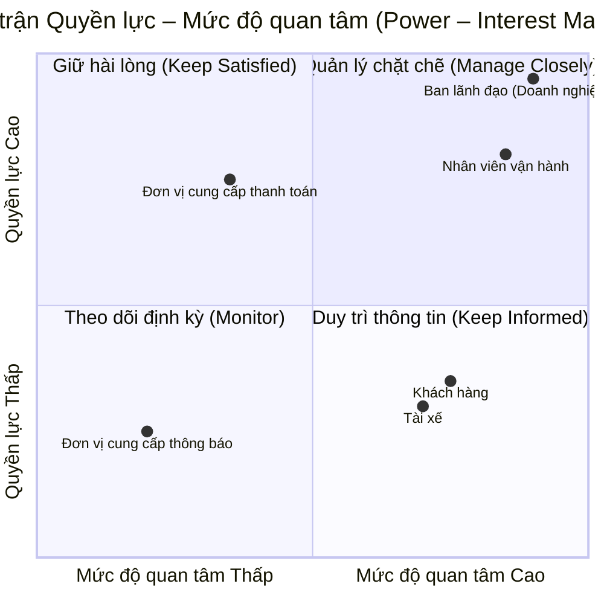
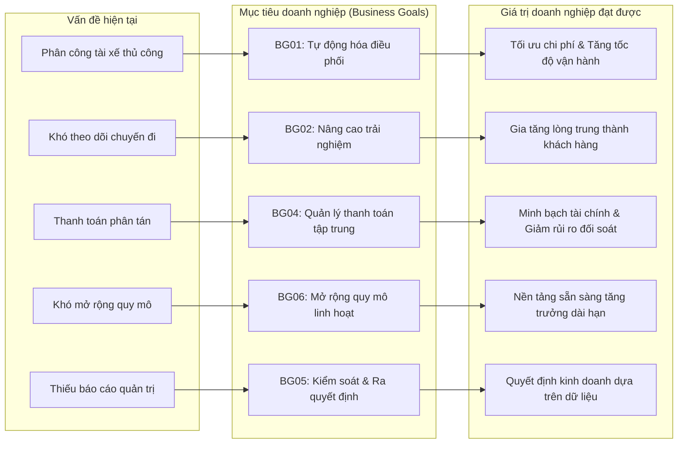
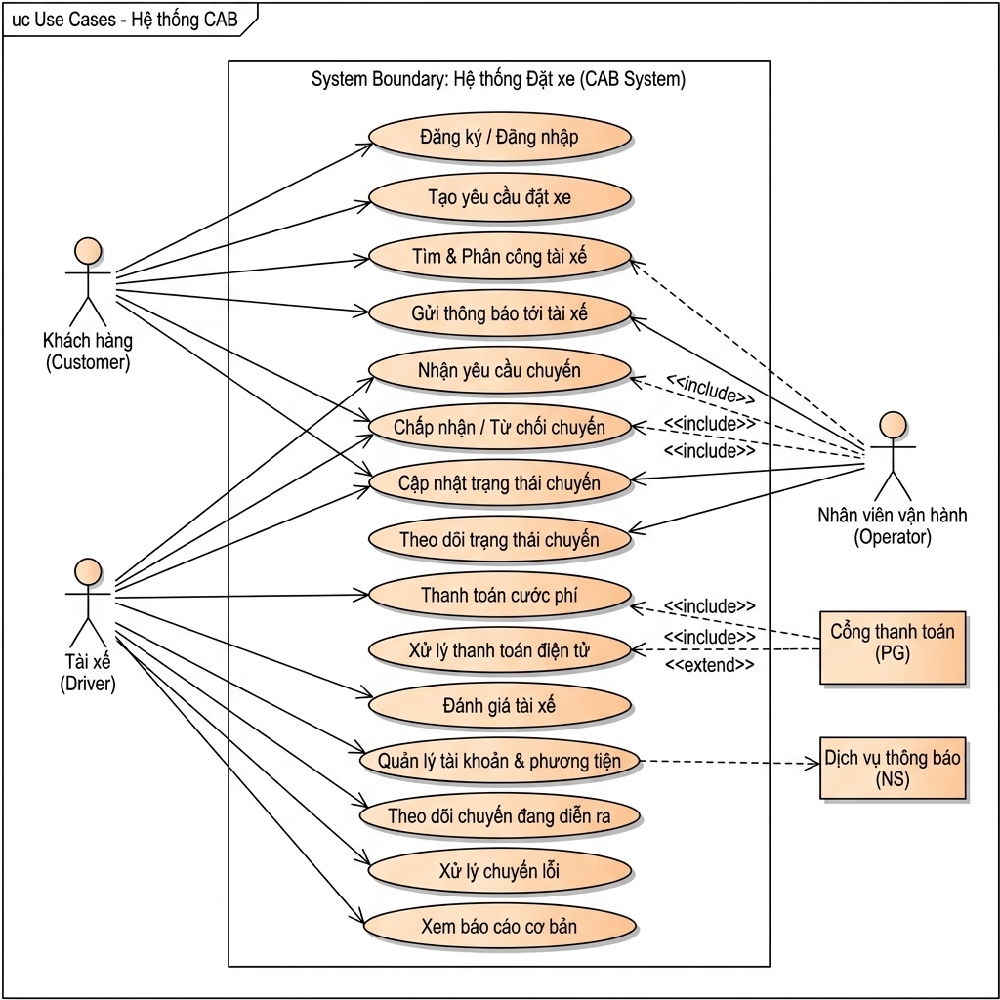
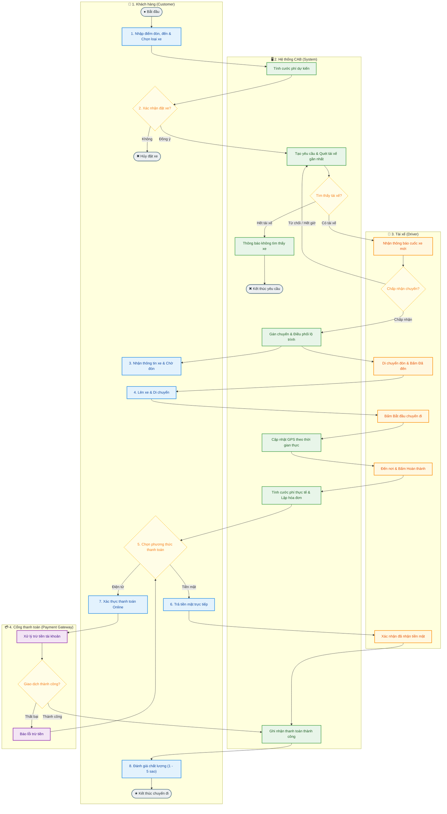

# BÁO CÁO PHÂN TÍCH VÀ THIẾT KẾ HỆ THỐNG
# ĐỀ TÀI: NỀN TẢNG ĐẶT XE TRỰC TUYẾN (CAB SYSTEM)

**Thông tin đề tài**
Mã sinh viên: 23635951
Họ và tên: Nguyễn Tuấn Kiệt
Đơn vị chủ quản: Doanh nghiệp ABC

## 1. TỔNG QUAN VÀ ĐỊNH NGHĨA HỆ THỐNG (SYSTEM DEFINITION)

### 1.1. Giới thiệu hệ thống
CAB System là nền tảng đặt xe trực tuyến được nghiên cứu và thiết kế cho Doanh nghiệp ABC nhằm số hóa quy trình đặt xe, tự động hóa công tác điều phối vận hành và tối ưu hóa trải nghiệm cho khách hàng cùng tài xế.

### 1.2. Hiện trạng và hạn chế của hệ thống cũ
Hệ thống tiếp nhận yêu cầu đặt xe hiện tại thông qua tổng đài thoại hoặc ứng dụng cơ bản đang bộc lộ nhiều điểm nghẽn nghiêm trọng trong quá trình vận hành:
Thứ nhất, quy trình điều phối hoàn toàn phụ thuộc vào việc chỉ định thủ công của nhân viên tổng đài, dẫn đến độ trễ lớn và dễ xảy ra sai sót khi lượng yêu cầu tăng cao.
Thứ hai, khách hàng không có công cụ trực quan để theo dõi vị trí di chuyển của tài xế cũng như tiến trình chuyến đi theo thời gian thực.
Thứ ba, dữ liệu về chuyến đi, lịch sử giao dịch và doanh thu chưa được quản lý tập trung, gây nhiều khó khăn và rủi ro trong công tác đối soát tài chính.
Thứ tư, kiến trúc kỹ thuật hiện tại có tính đóng và khó mở rộng quy mô khi số lượng người dùng đồng thời gia tăng nhanh chóng.

### 1.3. Mục tiêu xây dựng hệ thống mới
Hệ thống CAB mới được định hướng phát triển nhằm tự động hóa toàn diện quy trình tìm kiếm, khớp nối và phân công tài xế dựa trên vị trí GPS và các tiêu chuẩn vận hành. Đồng thời, hệ thống cung cấp giải pháp giám sát hành trình thời gian thực, tích hợp cổng thanh toán trực tuyến, quản lý tập trung toàn bộ dữ liệu nghiệp vụ và thiết lập kiến trúc module hóa đảm bảo hiệu năng cao, tính sẵn sàng và khả năng mở rộng linh hoạt.

### 1.4. Bảng so sánh cải tiến hệ thống

| Tiêu chí so sánh | Hệ thống hiện tại | Hệ thống CAB mới |
| :--- | :--- | :--- |
| **Phương thức đặt chuyến** | Tổng đài thoại hoặc ứng dụng cơ bản | Ứng dụng trực tuyến đa nền tảng |
| **Phân bổ tài xế** | Điều phối viên chỉ định thủ công | Tự động hóa phân công dựa trên thuật toán tối ưu |
| **Tiêu chí ghép chuyến** | Chưa có tiêu chuẩn định lượng | Dựa trên vị trí GPS, trạng thái sẵn sàng và tiêu chí vận hành |
| **Xử lý từ chối cuốc xe** | Xử lý thủ công, độ trễ cao | Tự động chuyển tiếp tìm kiếm tài xế kế tiếp |
| **Giám sát hành trình** | Khách hàng không theo dõi được | Theo dõi lộ trình và vị trí GPS theo thời gian thực |
| **Phương thức thanh toán** | Chủ yếu tiền mặt, dữ liệu phân tán | Hỗ trợ linh hoạt: Tiền mặt, Thẻ ngân hàng, Ví điện tử |
| **Hệ thống thông báo** | Thiếu đồng bộ | Tự động gửi SMS OTP, Push Notification theo sự kiện |
| **Công cụ quản trị** | Chưa được chuẩn hóa | Cổng quản trị tập trung (Dashboard) cho nhân viên vận hành |
| **Báo cáo & Phân tích** | Tổng hợp thủ công, thiếu tức thời | Báo cáo trực quan: Doanh thu, số chuyến, tỷ lệ hoàn thành/hủy |
| **Bảo mật & Phân quyền** | Chưa có cơ chế rõ ràng | Phân quyền theo vai trò (RBAC) và ghi log kiểm toán hệ thống |
| **Khả năng mở rộng** | Kiến trúc đóng, khó tích hợp | Kiến trúc module hóa, dễ dàng tích hợp dịch vụ mới |

### 1.5. Phạm vi của hệ thống (System Scope)

#### 1.5.1. Phạm vi thực hiện (In-Scope)
Hệ thống đảm nhiệm toàn bộ quy trình từ khâu quản lý tài khoản người dùng (Khách hàng, Tài xế, Nhân viên vận hành), tiếp nhận yêu cầu đặt chuyến, tự động điều phối tài xế, định vị lộ trình di chuyển thời gian thực, tự động tính toán cước phí và xử lý thanh toán đa phương thức. Ngoài ra, hệ thống cung cấp hạ tầng gửi tin nhắn thông báo tự động, cổng quản trị dữ liệu tập trung và hệ thống báo cáo thống kê phục vụ công tác giám sát điều hành.

#### 1.5.2. Các nội dung cần làm rõ thêm (Pending / Further Clarification)
Một số nội dung kỹ thuật và quy định nghiệp vụ chi tiết cần tiếp tục làm việc với các bên liên quan để thống nhất:
Công thức tính cước chi tiết theo hệ số nhu cầu giờ cao điểm và khu vực địa lý.
Thuật toán trọng số ưu tiên trong việc phân bổ cuốc xe cho tài xế.
Ngưỡng thời gian chờ (Timeout) tối đa cho phép tài xế phản hồi trước khi hệ thống chuyển sang tài xế khác.
Chính sách phụ phí hủy chuyến áp dụng đối với khách hàng và chế tài xử lý tài xế hủy cuốc xe.
Cơ chế đồng bộ và phục hồi dữ liệu khi thiết bị đầu cuối gặp sự cố mất kết nối mạng.
Quy chuẩn về thời hạn lưu trữ dữ liệu lịch sử chuyến đi và nhật ký hệ thống (Audit Logs).

### 1.6. Tích hợp hệ thống bên ngoài (External Integrations)
Hệ thống thực hiện tích hợp với các đối tác dịch vụ bên thứ ba bao gồm cổng thanh toán điện tử (Payment Gateway) để tiếp nhận và xác thực giao dịch trực tuyến; dịch vụ thông báo (Notification Provider) để truyền tải mã xác thực OTP và thông báo hành trình qua SMS, Email, Push Notification; và dịch vụ bản đồ số (Map/GIS Services) phục vụ tính toán cước phí, lộ trình di chuyển và thời gian dự kiến đón xe.

### 1.7. Yêu cầu phi chức năng (Non-Functional Requirements)
Hệ thống đáp ứng các tiêu chuẩn phi chức năng nghiêm ngặt về hiệu năng với độ trễ xử lý dưới 1 giây đối với các tác vụ điều phối và định vị. Kiến trúc hệ thống đảm bảo khả năng mở rộng tài nguyên tính toán độc lập cho các thành phần chịu tải cao, duy trì tính sẵn sàng 24/7 với cơ chế chịu lỗi dự phòng, áp dụng mã hóa bảo mật toàn diện cho dữ liệu cá nhân và giao dịch tài chính, đồng thời ghi vết kiểm toán đầy đủ cho mọi thao tác quản trị.

## 2. PHÂN TÍCH VÀ MA TRẬN CÁC BÊN LIÊN QUAN (STAKEHOLDER ANALYSIS & MATRIX)

### 2.1. Phân tích chi tiết các bên liên quan

#### 2.1.1. Nhóm người dùng trực tiếp
Khách hàng (Customer) là người dùng cuối có nhu cầu di chuyển, tương tác với hệ thống thông qua việc đăng ký tài khoản, tìm kiếm tuyến đường, đặt xe, theo dõi hành trình di chuyển của tài xế trên bản đồ số, thực hiện thanh toán cước phí và đánh giá chất lượng phục vụ sau mỗi chuyến đi.
Tài xế (Driver) là đối tác cung cấp phương tiện và trực tiếp thực hiện dịch vụ vận chuyển, tương tác với hệ thống qua việc cập nhật hồ sơ, bật tắt trạng thái sẵn sàng nhận cuốc, tiếp nhận hoặc từ chối yêu cầu chuyến đi, cập nhật trạng thái đón trả khách và chia sẻ dữ liệu vị trí GPS liên tục.

#### 2.1.2. Nhóm quản trị và vận hành nội bộ
Nhân viên vận hành (Operations Staff) giữ vai trò điều phối và duy trì tính ổn định của hoạt động vận hành thường nhật, thực hiện quản trị dữ liệu người dùng và phương tiện, giám sát các cuốc xe đang diễn ra trong thời gian thực, đồng thời tiếp nhận và xử lý các sự cố phát sinh hoặc khiếu nại của người dùng.
Ban lãnh đạo / Doanh nghiệp ABC (Business Owner / Management) là đơn vị sở hữu hệ thống và định hướng chiến lược kinh doanh, sử dụng hệ thống để theo dõi các báo cáo thống kê tổng quan về doanh thu, số lượng cuốc xe, tỷ lệ hoàn thành/hủy chuyến nhằm đưa ra các quyết định mở rộng dịch vụ và đầu tư nâng cấp.

#### 2.1.3. Nhóm đối tác và dịch vụ bên thứ ba
Nhà cung cấp cổng thanh toán (Payment Gateway Provider) cung cấp giải pháp xử lý giao dịch điện tử an toàn, tiếp nhận yêu cầu thanh toán từ CAB System, thực hiện xác thực bảo mật và hoàn trả kết quả giao dịch về hệ thống.
Nhà cung cấp dịch vụ thông báo (Notification Provider) cung cấp hạ tầng truyền thông điệp đa kênh, tiếp nhận dữ liệu từ hệ thống CAB để gửi tin nhắn OTP xác thực, thông báo trạng thái hành trình và chương trình ưu đãi đến người dùng.

### 2.2. Ma trận các bên liên quan (Stakeholder Matrix)

| Bên liên quan (Stakeholder) | Vai trò trong hệ thống | Phạm vi tương tác và trách nhiệm | Mức độ ảnh hưởng (Power) | Mức độ quan tâm (Interest) |
| :--- | :--- | :--- | :---: | :---: |
| **Khách hàng** | Người sử dụng dịch vụ | Đặt xe, theo dõi hành trình, thanh toán cước phí và đánh giá dịch vụ | Trung bình | Cao |
| **Tài xế** | Đối tác thực hiện chuyến xe | Tiếp nhận cuốc xe, vận chuyển khách hàng, cập nhật vị trí và trạng thái chuyến | Trung bình | Cao |
| **Nhân viên vận hành** | Quản lý và điều phối hệ thống | Quản lý dữ liệu, giám sát hoạt động thời gian thực, hỗ trợ xử lý sự cố | Trung bình | Cao |
| **Ban lãnh đạo (Doanh nghiệp ABC)** | Chủ sở hữu & Định hướng chiến lược | Đưa ra yêu cầu nghiệp vụ, theo dõi báo cáo kinh doanh, phê duyệt mở rộng hệ thống | Cao | Cao |
| **Đơn vị cung cấp thanh toán** | Đối tác xử lý giao dịch tài chính | Nhận và xác thực các giao dịch thanh toán trực tuyến | Cao | Trung bình |
| **Đơn vị cung cấp thông báo** | Đối tác hạ tầng truyền thông tin | Chuyển tiếp tin nhắn OTP, thông báo trạng thái cuốc xe tới người dùng | Trung bình | Thấp |

### 2.3. Sơ đồ Ma trận Quyền lực – Mức độ quan tâm (Power – Interest Matrix)

#### Bảng ma trận 2x2 tổng hợp phân loại:

| Mức độ Quyền lực \ Quan tâm | Mức độ quan tâm Thấp (Low Interest) | Mức độ quan tâm Cao (High Interest) |
| :--- | :--- | :--- |
| **Quyền lực Cao (High Power)** | **Giữ hài lòng (Keep Satisfied)** Đơn vị cung cấp thanh toán | **Quản lý chặt chẽ (Manage Closely)** Ban lãnh đạo / Doanh nghiệp ABC Nhân viên vận hành |
| **Quyền lực Thấp / TB (Low/Medium Power)** | **Theo dõi định kỳ (Monitor)** Đơn vị cung cấp thông báo | **Duy trì thông tin thường xuyên (Keep Informed)** Khách hàng Tài xế |

### 2.4. Chiến lược quản lý các bên liên quan

Chiến lược Quản lý chặt chẽ (Manage Closely - High Power, High Interest) áp dụng cho Ban lãnh đạo Doanh nghiệp ABC và Đội ngũ nhân viên vận hành. Đây là nhóm có quyền quyết định cao nhất về ngân sách, nghiệp vụ và trực tiếp điều hành hệ thống hàng ngày, đòi hỏi sự phối hợp chặt chẽ trong mọi giai đoạn phát triển.

Chiến lược Duy trì sự hài lòng (Keep Satisfied - High Power, Medium/Low Interest) áp dụng cho Nhà cung cấp cổng thanh toán. Cần đảm bảo quy trình tích hợp tuân thủ các chuẩn an toàn tài chính và phản hồi kịp thời nhằm giữ luồng tiền luôn thông suốt.

Chiến lược Duy trì thông tin thường xuyên (Keep Informed - Medium/Low Power, High Interest) áp dụng cho Khách hàng và Tài xế. Đây là hai đối tượng trực tiếp quyết định sự thành công của nền tảng trên thị trường, cần được cung cấp thông tin chuyến đi minh bạch và tiếp nhận phản hồi thường xuyên để cải tiến trải nghiệm.

Chiến lược Theo dõi định kỳ (Monitor - Low Power, Low Interest) áp dụng cho Nhà cung cấp dịch vụ thông báo. Cần theo dõi chất lượng dịch vụ định kỳ và đảm bảo hệ thống duy trì tính linh hoạt để có thể bổ sung hoặc thay thế nhà cung cấp khi cần thiết.

## 3. MỤC TIÊU DOANH NGHIỆP (BUSINESS GOALS)

### 3.1. Danh sách Business Goals

| ID | Business Goal | Mô tả | Vấn đề được giải quyết | Stakeholder liên quan |
| :--- | :--- | :--- | :--- | :--- |
| **BG01** | **Tự động hóa quy trình phân công và điều phối tài xế** | Tự động tìm kiếm và phân công tài xế phù hợp dựa trên vị trí GPS, trạng thái sẵn sàng và tiêu chí vận hành, giảm tối đa thao tác thủ công. | Phân công tài xế chủ yếu thực hiện thủ công, gây chậm trễ và phụ thuộc nhân sự điều phối. | Tài xế, Nhân viên vận hành, Khách hàng |
| **BG02** | **Nâng cao trải nghiệm và sự tiện lợi cho khách hàng** | Cung cấp giải pháp đặt xe trực tuyến đa nền tảng, cho phép theo dõi trực quan vị trí tài xế và trạng thái chuyến đi theo thời gian thực. | Khách hàng chỉ đặt xe qua tổng đài hoặc ứng dụng cơ bản, khó theo dõi lộ trình di chuyển. | Khách hàng |
| **BG03** | **Tối ưu hóa hiệu quả quản trị và điều hành vận hành** | Trang bị công cụ quản trị tập trung giúp nhân viên vận hành giám sát cuốc xe trực tiếp, quản lý hồ sơ và xử lý kịp thời các sự cố phát sinh. | Chưa có công cụ quản trị tập trung, quy trình hỗ trợ và xử lý sự cố cuốc xe chưa tối ưu. | Nhân viên vận hành, Ban lãnh đạo |
| **BG04** | **Tập trung hóa và minh bạch hóa quản lý thanh toán** | Tích hợp linh hoạt các phương thức thanh toán (tiền mặt và thanh toán điện tử), quản lý tập trung dữ liệu giao dịch phục vụ đối soát chính xác. | Thông tin thanh toán chưa được quản lý tập trung, hạn chế về phương thức thanh toán không tiền mặt. | Khách hàng, Tài xế, Đơn vị thanh toán, Ban lãnh đạo |
| **BG05** | **Nâng cao năng lực kiểm soát và ra quyết định kinh doanh** | Cung cấp hệ thống báo cáo phân tích toàn diện về số lượng chuyến đi, doanh thu, tỷ lệ hoàn thành, tỷ lệ hủy chuyến và hiệu quả tài xế. | Ban lãnh đạo thiếu dữ liệu thống kê kịp thời và chuẩn xác để theo dõi hoạt động kinh doanh. | Ban lãnh đạo / Doanh nghiệp ABC |
| **BG06** | **Đảm bảo khả năng mở rộng quy mô hệ thống (Scalability)** | Xây dựng kiến trúc hệ thống module hóa, đáp ứng hoạt động ổn định khi số lượng khách hàng, tài xế và giao dịch đồng thời gia tăng. | Hệ thống hiện tại khó mở rộng khi số lượng người dùng và nhu cầu thị trường tăng cao. | Ban lãnh đạo, Nhân viên vận hành |
| **BG07** | **Đảm bảo an toàn, bảo mật và lưu vết dữ liệu** | Kiểm soát chặt chẽ quyền truy cập các chức năng quản trị (RBAC) và lưu vết toàn bộ các thao tác nghiệp vụ quan trọng phục vụ kiểm toán. | Chưa có cơ chế phân quyền rõ ràng và chưa ghi log kiểm toán các thao tác quản trị hệ thống. | Ban lãnh đạo, Nhân viên vận hành |
| **BG08** | **Xây dựng nền tảng linh hoạt phục vụ mở rộng dài hạn** | Thiết kế hệ thống sẵn sàng tích hợp thêm các dịch vụ vận tải mới, cổng thanh toán và nhà cung cấp thông báo mà không phải tái cấu trúc toàn bộ. | Hệ thống cũ có tính đóng, khó mở rộng thêm đối tác và dịch vụ mới trong tương lai. | Ban lãnh đạo, Đối tác bên ngoài |

*(Ghi chú: Các chỉ số KPI định lượng cụ thể cho từng mục tiêu chưa được xác định trong tài liệu – Cần BA làm rõ thêm với stakeholder).*

### 3.2. Business Goals trọng tâm

Doanh nghiệp ABC đặt ưu tiên cao nhất vào ba mục tiêu kinh doanh cốt lõi:

Mục tiêu BG01 – Tự động hóa quy trình phân công và điều phối tài xế: Đây là nghiệp vụ trọng tâm quyết định hiệu suất vận hành của nền tảng đặt xe. Việc tự động hóa giúp giải quyết triệt để vấn đề nghẽn cổ chai điều phối thủ công, giảm độ trễ khớp cuốc xe, giúp tài xế nhận chuyến nhanh chóng phù hợp với vị trí, khách hàng được phục vụ sớm và giảm áp lực điều phối cho nhân viên vận hành.

Mục tiêu BG02 – Nâng cao trải nghiệm và sự tiện lợi cho khách hàng: Trải nghiệm khách hàng là yếu tố then chốt thu hút và giữ chân người dùng trong môi trường cạnh tranh. Mục tiêu này giải quyết tình trạng thiếu thông tin của khách hàng bằng cách cung cấp lộ trình trực quan, thời gian dự kiến đón chính xác và đa dạng hóa hình thức thanh toán, từ đó nâng cao mức độ hài lòng và uy tín thương hiệu của Doanh nghiệp ABC.

Mục tiêu BG06 – Đảm bảo khả năng mở rộng quy mô hệ thống (Scalability): Mục tiêu này bảo đảm tính sẵn sàng cao khi doanh nghiệp phát triển lượng người dùng và tăng lưu lượng cuốc xe trong giờ cao điểm. Việc chuyển đổi sang kiến trúc module hóa giúp hệ thống vận hành ổn định liên tục, giải quyết giới hạn kỹ thuật của hệ thống cũ và tạo sự tự tin cho ban lãnh đạo trong kế hoạch mở rộng thị phần.

### 3.3. Sơ đồ mối quan hệ Mục tiêu doanh nghiệp (Business Goal Relationship Diagram)

## 4. XÁC ĐỊNH PHẠM VI DỰ ÁN TRONG 7 TUẦN (PROJECT SCOPE)

### 4.1. Các chức năng cần thực hiện trong 7 tuần (In-Scope MVP)
Trong giới hạn 7 tuần của đồ án môn học, phạm vi hệ thống tập trung hoàn thiện 13 chức năng cốt lõi đảm bảo vận hành trọn vẹn luồng nghiệp vụ đặt xe:

| STT | Chức năng | Nội dung chính |
| :---: | :--- | :--- |
| **1** | Quản lý tài khoản khách hàng | Đăng ký, đăng nhập và cập nhật thông tin cá nhân |
| **2** | Quản lý tài khoản tài xế | Tạo tài khoản, đăng nhập và cập nhật hồ sơ tài xế |
| **3** | Đặt xe | Nhập điểm đón, điểm đến, chọn loại xe và gửi yêu cầu chuyến đi |
| **4** | Tìm tài xế | Tìm kiếm tài xế phù hợp dựa trên vị trí GPS và trạng thái sẵn sàng |
| **5** | Phân công tài xế | Gửi yêu cầu chuyến xe cho tài xế và xử lý phản hồi chấp nhận hoặc từ chối |
| **6** | Quản lý chuyến đi | Cập nhật các mốc trạng thái: nhận chuyến, đến điểm đón, đón khách, di chuyển và hoàn thành |
| **7** | Theo dõi chuyến | Khách hàng theo dõi trạng thái chuyến đi và thông tin tài xế theo thời gian thực |
| **8** | Tính cước | Tự động xác định số tiền cước phí khách hàng phải trả sau khi hoàn thành chuyến |
| **9** | Thanh toán | Hỗ trợ phương thức thanh toán tiền mặt và mô phỏng thanh toán điện tử cơ bản |
| **10** | Thông báo | Gửi thông báo trạng thái đặt xe, tiến trình chuyến đi và kết quả thanh toán |
| **11** | Quản lý vận hành | Cung cấp giao diện quản trị theo dõi khách hàng, tài xế và chuyến đi |
| **12** | Xử lý chuyến lỗi | Hỗ trợ nhân viên vận hành tra cứu và xử lý các trường hợp chuyến đi gặp sự cố |
| **13** | Báo cáo cơ bản | Thống kê số lượng chuyến, doanh thu, tỷ lệ hoàn thành và tỷ lệ hủy chuyến |

### 4.2. Các chức năng ngoài phạm vi thực hiện (Out-of-Scope)
Nhằm đảm bảo tính khả thi trong thời gian 7 tuần, các tính năng nâng cao sau đây sẽ được đưa ra ngoài phạm vi thực hiện:
Về tài khoản và phương tiện, không tích hợp đăng nhập qua mạng xã hội (OAuth2), xác thực sinh trắc học và không xây dựng phân hệ quản lý hồ sơ kiểm định phương tiện chuyên sâu.
Về đặt xe, không thực hiện đặt xe hẹn giờ trước, đặt xe hộ người khác, đặt chuyến nhiều điểm dừng và cơ chế ghép xe đi chung (Carpooling).
Về định vị và điều phối, không áp dụng thuật toán AI phân tích giao thông và không tích hợp bản đồ số bản quyền có định tuyến tránh kẹt xe.
Về tính cước và thanh toán, không áp dụng giá cước động theo thời tiết/giờ cao điểm (Dynamic Pricing) và không tích hợp cổng thanh toán quốc tế thật.
Về thông báo và phân tích, không tích hợp SMS Brandname viễn thông và không xây dựng báo cáo phân tích dữ liệu lớn (BI Analytics).

### 4.3. Kế hoạch triển khai theo tuần (7-Week Implementation Roadmap)

| Tuần | Nội dung công việc cốt lõi | Sản phẩm bàn giao |
| :---: | :--- | :--- |
| **Tuần 1** | Khảo sát yêu cầu, xác định phạm vi và phân tích Stakeholders | Báo cáo Definition và Stakeholder Matrix |
| **Tuần 2** | Đặc tả yêu cầu phần mềm và xây dựng sơ đồ Use Case | Use Case Diagram và Use Case Specifications |
| **Tuần 3** | Thiết kế cơ sở dữ liệu quan hệ và kiến trúc hệ thống | Sơ đồ ERD và Database Schema |
| **Tuần 4** | Thiết kế giao diện khung và đặc tả các API endpoints | Giao diện mẫu (UI Wireframe) và API Docs |
| **Tuần 5** | Xây dựng chức năng đăng nhập, đặt xe và phân công tài xế | Bản dựng phân hệ Auth và Booking |
| **Tuần 6** | Xây dựng chức năng cập nhật chuyến, thanh toán và quản trị | Bản dựng phân hệ Trip và Admin Dashboard |
| **Tuần 7** | Kiểm thử luồng nghiệp vụ, sửa lỗi và hoàn thiện đồ án | Sản phẩm hoàn chỉnh và Báo cáo nghiệm thu |

## 5. YÊU CẦU NGHIỆP VỤ (BUSINESS REQUIREMENTS)

| ID | Business Requirement | Mô tả |
| :---: | :--- | :--- |
| **BR01** | Cải thiện dịch vụ đặt xe | Hệ thống phải cung cấp nền tảng đặt xe trực tuyến thuận tiện hơn hệ thống hiện tại. |
| **BR02** | Tự động hóa tìm và phân công tài xế | Hệ thống phải hỗ trợ tự động tìm và phân công tài xế phù hợp. |
| **BR03** | Nâng cao khả năng theo dõi chuyến đi | Hệ thống phải cho phép khách hàng theo dõi trạng thái chuyến và thông tin liên quan. |
| **BR04** | Quản lý tập trung hoạt động vận hành | Hệ thống phải hỗ trợ nhân viên vận hành quản lý khách hàng, tài xế và chuyến đi. |
| **BR05** | Hỗ trợ và quản lý thanh toán | Hệ thống phải hỗ trợ thanh toán tiền mặt và điện tử và quản lý kết quả giao dịch. |
| **BR06** | Cung cấp thông tin phục vụ quản lý | Hệ thống phải cung cấp dữ liệu và báo cáo về hoạt động kinh doanh. |
| **BR07** | Đảm bảo khả năng mở rộng | Hệ thống phải phục vụ số lượng lớn người dùng và có thể mở rộng khi tải tăng. |
| **BR08** | Xây dựng nền tảng phát triển lâu dài | Hệ thống phải hỗ trợ bổ sung dịch vụ, phương thức thanh toán và nhà cung cấp mới trong tương lai. |

## 6. YÊU CẦU CHỨC NĂNG (FUNCTIONAL REQUIREMENTS)

Các yêu cầu chức năng (Functional Requirements - FR) được phân rã chi tiết từ các yêu cầu nghiệp vụ (Business Requirements) nhằm đặc tả đầy đủ các khả năng xử lý mà hệ thống CAB cung cấp cho từng nhóm người dùng và quy trình vận hành.

### 6.1. Phân hệ Quản lý tài khoản
Phân hệ đảm nhiệm các chức năng đăng ký, xác thực và quản lý hồ sơ thông tin cho khách hàng và tài xế, gắn liền với yêu cầu nghiệp vụ BR01 (Cải thiện dịch vụ đặt xe).

| Mã FR | Chức năng (Functional Requirement) | Mô tả chi tiết |
| :---: | :--- | :--- |
| **FR01.1** | Đăng ký tài khoản khách hàng | Hệ thống cho phép khách hàng mới tạo tài khoản cá nhân |
| **FR01.2** | Đăng nhập hệ thống | Hệ thống xác thực và cho phép khách hàng cùng tài xế đăng nhập |
| **FR01.3** | Cập nhật thông tin cá nhân | Người dùng có thể chỉnh sửa và cập nhật thông tin cá nhân của mình |
| **FR01.4** | Quản lý hồ sơ tài xế | Tài xế có thể cập nhật thông tin hồ sơ và giấy tờ liên quan |
| **FR01.5** | Quản lý phương tiện | Tài xế có thể cập nhật thông tin chi tiết về phương tiện vận chuyển |

### 6.2. Phân hệ Đặt xe
Phân hệ cho phép khách hàng tạo yêu cầu chuyến đi trực tuyến nhanh chóng, gắn liền với yêu cầu nghiệp vụ BR01 (Cải thiện dịch vụ đặt xe).

| Mã FR | Chức năng (Functional Requirement) | Mô tả chi tiết |
| :---: | :--- | :--- |
| **FR02.1** | Nhập điểm đón | Khách hàng nhập hoặc chọn vị trí điểm đón trên bản đồ |
| **FR02.2** | Nhập điểm đến | Khách hàng nhập địa chỉ hoặc định vị điểm trả khách |
| **FR02.3** | Chọn loại xe | Khách hàng lựa chọn loại phương tiện di chuyển mong muốn |
| **FR02.4** | Tạo yêu cầu đặt xe | Hệ thống tiếp nhận thông tin và khởi tạo yêu cầu chuyến đi |
| **FR02.5** | Theo dõi trạng thái yêu cầu | Khách hàng theo dõi tiến trình hệ thống đang tìm kiếm tài xế |

### 6.3. Phân hệ Tìm và Phân công tài xế
Phân hệ tự động hóa toàn diện quy trình khớp nối chuyến xe, thay thế quy trình điều phối thủ công, gắn liền với yêu cầu nghiệp vụ BR02 (Tự động hóa tìm và phân công tài xế).

| Mã FR | Chức năng (Functional Requirement) | Mô tả chi tiết |
| :---: | :--- | :--- |
| **FR03.1** | Xác định tài xế phù hợp | Hệ thống quét và tìm tài xế dựa trên vị trí GPS, trạng thái sẵn sàng và tiêu chuẩn vận hành |
| **FR03.2** | Ưu tiên tài xế gần nhất | Hệ thống tính toán và ưu tiên điều phối cho tài xế phù hợp ở gần khách hàng nhất |
| **FR03.3** | Gửi yêu cầu chuyến xe | Hệ thống tự động gửi thông báo đề xuất chuyến đi đến thiết bị của tài xế |
| **FR03.4** | Chấp nhận chuyến xe | Tài xế có thể xác nhận tiếp nhận cuốc xe được đề xuất |
| **FR03.5** | Từ chối chuyến xe | Tài xế có thể từ chối nhận cuốc xe được gửi đến |
| **FR03.6** | Tìm tài xế thay thế | Hệ thống tự động chuyển tiếp tìm kiếm tài xế kế tiếp khi tài xế trước từ chối hoặc hết thời gian chờ |
| **FR03.7** | Thông báo không tìm được xe | Hệ thống thông báo rõ ràng cho khách hàng khi không có tài xế khả dụng |

### 6.4. Phân hệ Quản lý tiến trình chuyến đi
Phân hệ kiểm soát chuỗi trạng thái di chuyển và hỗ trợ khách hàng giám sát hành trình thời gian thực, gắn liền với yêu cầu nghiệp vụ BR03 (Nâng cao khả năng theo dõi chuyến đi).

| Mã FR | Chức năng (Functional Requirement) | Mô tả chi tiết |
| :---: | :--- | :--- |
| **FR04.1** | Cập nhật trạng thái "Đã nhận chuyến" | Tài xế xác nhận đã nhận cuốc xe và bắt đầu di chuyển đón khách |
| **FR04.2** | Cập nhật trạng thái "Đã đến điểm đón" | Tài xế cập nhật trạng thái khi đã có mặt tại điểm đón quy định |
| **FR04.3** | Cập nhật trạng thái "Đã đón khách" | Tài xế xác nhận khách đã lên xe để bắt đầu lộ trình di chuyển |
| **FR04.4** | Cập nhật trạng thái "Đang di chuyển" | Hệ thống ghi nhận tiến trình xe đang di chuyển trên đường |
| **FR04.5** | Cập nhật trạng thái "Hoàn thành" | Tài xế xác nhận đã trả khách và hoàn thành chuyến đi |
| **FR04.6** | Theo dõi trạng thái trực quan | Khách hàng theo dõi vị trí và tiến trình cuốc xe theo thời gian thực |
| **FR04.7** | Lưu trữ dữ liệu vị trí GPS | Hệ thống liên tục lưu vết vị trí tài xế phục vụ điều phối và ước tính thời gian đón (ETA) |

### 6.5. Phân hệ Tính cước phí
Phân hệ tự động xác định giá trị thanh toán của chuyến đi, gắn liền với yêu cầu nghiệp vụ BR05 (Hỗ trợ và quản lý thanh toán).

| Mã FR | Chức năng (Functional Requirement) | Mô tả chi tiết |
| :---: | :--- | :--- |
| **FR05.1** | Tính toán cước phí chuyến đi | Hệ thống tự động xác định số tiền cước khách hàng phải trả khi chuyến đi hoàn tất |
| **FR05.2** | Xác định cước theo loại dịch vụ | Hệ thống áp dụng bảng giá tương ứng theo loại xe và quãng đường thực tế |

*(Ghi chú: Công thức tính cước chi tiết theo hệ số thời gian và khu vực chưa được xác định trong tài liệu – Cần BA làm rõ thêm với stakeholder).*

### 6.6. Phân hệ Xử lý thanh toán
Phân hệ hỗ trợ đa dạng phương thức thanh toán an toàn và lưu trữ lịch sử đối soát, gắn liền với yêu cầu nghiệp vụ BR05 (Hỗ trợ và quản lý thanh toán).

| Mã FR | Chức năng (Functional Requirement) | Mô tả chi tiết |
| :---: | :--- | :--- |
| **FR06.1** | Thanh toán bằng tiền mặt | Hệ thống ghi nhận xác nhận thu tiền mặt trực tiếp từ tài xế |
| **FR06.2** | Thanh toán điện tử | Hệ thống tích hợp xử lý giao dịch không tiền mặt qua cổng thanh toán |
| **FR06.3** | Tiếp nhận kết quả thanh toán | Hệ thống nhận và đối chiếu phản hồi xác thực giao dịch từ đối tác thanh toán |
| **FR06.4** | Thông báo thanh toán thất bại | Hệ thống gửi cảnh báo khi giao dịch thanh toán trực tuyến không thành công |
| **FR06.5** | Xử lý thanh toán lại | Hệ thống hỗ trợ thực hiện lại giao dịch hoặc chuyển sang hình thức thanh toán khác |
| **FR06.6** | Lưu trữ lịch sử giao dịch | Hệ thống ghi nhận đầy đủ chứng từ thanh toán phục vụ tra cứu và đối soát tài chính |

### 6.7. Phân hệ Quản lý thông báo
Phân hệ gửi thông điệp kịp thời đến người dùng trong từng giai đoạn của chuyến đi, gắn liền với yêu cầu nghiệp vụ BR03 (Nâng cao trải nghiệm khách hàng).

| Mã FR | Chức năng (Functional Requirement) | Mô tả chi tiết |
| :---: | :--- | :--- |
| **FR07.1** | Thông báo tiếp nhận yêu cầu | Gửi xác nhận cho khách hàng khi cuốc xe được khởi tạo thành công |
| **FR07.2** | Thông báo tài xế nhận chuyến | Gửi thông tin xe và tài xế cho khách hàng ngay khi có tài xế nhận chuyến |
| **FR07.3** | Thông báo tài xế đã đến điểm đón | Gửi thông báo nhắc nhở khách hàng khi phương tiện đã tới điểm hẹn |
| **FR07.4** | Thông báo hoàn thành chuyến đi | Gửi tổng kết chuyến đi và thông báo cước phí cho người dùng |
| **FR07.5** | Thông báo kết quả thanh toán | Gửi biên lai xác nhận giao dịch thanh toán thành công hoặc thất bại |
| **FR07.6** | Thông báo cuốc xe mới cho tài xế | Đẩy thông tin chuyến đi mới đến thiết bị tài xế để tiếp nhận |
| **FR07.7** | Thông báo thay đổi chuyến đi | Cập nhật thông tin cho tài xế và khách hàng khi có điều chỉnh hoặc hủy chuyến |

### 6.8. Phân hệ Quản trị vận hành
Phân hệ cung cấp bộ công cụ tập trung cho nhân viên vận hành giám sát và xử lý sự cố, gắn liền với yêu cầu nghiệp vụ BR04 (Quản lý tập trung hoạt động vận hành).

| Mã FR | Chức năng (Functional Requirement) | Mô tả chi tiết |
| :---: | :--- | :--- |
| **FR08.1** | Quản lý thông tin khách hàng | Tra cứu, kiểm duyệt và quản lý danh sách hồ sơ khách hàng |
| **FR08.2** | Quản lý thông tin tài xế | Tiếp nhận, xác minh hồ sơ và quản lý trạng thái tài xế |
| **FR08.3** | Quản lý thông tin phương tiện | Theo dõi và cập nhật thông tin phương tiện đăng ký hoạt động |
| **FR08.4** | Quản lý danh mục chuyến đi | Tra cứu toàn bộ dữ liệu lịch sử các cuốc xe trên hệ thống |
| **FR08.5** | Giám sát chuyến đi thời gian thực | Theo dõi các chuyến xe đang diễn ra trực tiếp trên bản đồ điều hành |
| **FR08.6** | Kiểm tra trạng thái tài xế | Giám sát danh sách tài xế đang trực tuyến, đang chở khách hoặc ngoại tuyến |
| **FR08.7** | Xử lý chuyến đi bị lỗi | Can thiệp hỗ trợ điều phối lại hoặc hủy cuốc khi phát sinh sự cố vận hành |

### 6.9. Phân hệ Báo cáo và Thống kê
Phân hệ cung cấp số liệu tổng quan phục vụ quản lý và ra quyết định kinh doanh, gắn liền với yêu cầu nghiệp vụ BR06 (Cung cấp thông tin phục vụ quản lý).

| Mã FR | Chức năng (Functional Requirement) | Mô tả chi tiết |
| :---: | :--- | :--- |
| **FR09.1** | Báo cáo số lượng chuyến đi | Tổng hợp số lượng cuốc xe theo ngày, tuần, tháng và khu vực |
| **FR09.2** | Báo cáo tổng doanh thu | Thống kê doanh thu chuyến đi, chiết khấu và đối soát thanh toán |
| **FR09.3** | Báo cáo tỷ lệ hoàn thành | Đánh giá tỷ lệ cuốc xe thực hiện thành công trên tổng số yêu cầu |
| **FR09.4** | Báo cáo tỷ lệ hủy chuyến | Phân tích tỷ lệ hủy chuyến từ phía khách hàng và từ phía tài xế |
| **FR09.5** | Báo cáo hiệu quả tài xế | Cung cấp số liệu đánh giá năng suất và chất lượng phục vụ của tài xế |

### 6.10. Phân hệ Bảo mật và Phân quyền quản trị
Phân hệ kiểm soát an toàn hệ thống và lưu vết kiểm toán dữ liệu, gắn liền với yêu cầu nghiệp vụ BR07 và BR08.

| Mã FR | Chức năng (Functional Requirement) | Mô tả chi tiết |
| :---: | :--- | :--- |
| **FR10.1** | Xác thực người dùng (Authentication) | Kiểm soát chặt chẽ danh tính trước khi cho phép thực hiện thao tác nghiệp vụ |
| **FR10.2** | Phân quyền vai trò (Role-Based Access) | Phân chia quyền hạn rõ ràng giữa Khách hàng, Tài xế và Nhân viên vận hành |
| **FR10.3** | Nhật ký kiểm toán (Audit Logging) | Ghi nhận thời điểm, người thực hiện và nội dung các thao tác quản trị quan trọng |

## 7. SƠ ĐỒ USE CASE HỆ THỐNG (USE CASE DIAGRAM)

### 7.1. Sơ đồ Use Case trực quan (UML Use Case Diagram)

---

## 8. Đặc tả USE CASE HỆ THỐNG

### 8.1. Đăng nhập

| **Trường thông tin** | **Nội dung chi tiết** |
| :--- | :--- |
| **Tên use case** | **Đăng nhập** |
| **UCID** | UC001 |
| **Mô tả** | Chức năng cho phép người dùng (Khách hàng, Tài xế, Nhân viên vận hành) xác thực tài khoản để truy cập vào hệ thống. |
| **Actor chính** | Khách hàng, Tài xế, Nhân viên vận hành |
| **Tiền điều kiện** | Người dùng đã có tài khoản trên hệ thống và thiết bị có kết nối mạng. |
| **Hậu điều kiện** | Người dùng đăng nhập thành công và được chuyển hướng tới giao diện theo đúng vai trò. |

#### Luồng sự kiện chính

| Bước | Actor | System |
| :---: | :--- | :--- |
| **1** | Người dùng chọn chức năng "Đăng nhập". | |
| **2** | | Hệ thống hiển thị biểu mẫu đăng nhập (Số điện thoại / Email và Mật khẩu). |
| **3** | Người dùng nhập thông tin tài khoản và mật khẩu. | |
| **4** | | Hệ thống kiểm tra và xác thực tính hợp lệ của thông tin. |
| **5** | Người dùng nhấn nút "Đăng nhập". | |
| **6** | | Hệ thống xác thực danh tính và phân quyền truy cập. |
| **7** | | Hệ thống khởi tạo phiên làm việc (Token / Session). |
| **8** | | Hệ thống chuyển hướng người dùng đến màn hình chính tương ứng. |

#### Luồng sự kiện thay thế

| Trường hợp | Các bước xử lý |
| :--- | :--- |
| **4.1. Sai thông tin đăng nhập** | 1. Hệ thống hiển thị thông báo lỗi: "Tài khoản hoặc mật khẩu không chính xác". 2. Quay lại bước 3 của luồng chính. |
| **4.2. Tài khoản bị khóa** | 1. Hệ thống hiển thị thông báo: "Tài khoản đã bị khóa, vui lòng liên hệ quản trị viên". 2. Dừng use case. |

### 8.2. Đăng ký tài khoản

| **Trường thông tin** | **Nội dung chi tiết** |
| :--- | :--- |
| **Tên use case** | **Đăng ký tài khoản** |
| **UCID** | UC002 |
| **Mô tả** | Chức năng cho phép người dùng mới (Khách hàng hoặc Tài xế) đăng ký tạo tài khoản trên hệ thống CAB. |
| **Actor chính** | Khách hàng, Tài xế |
| **Tiền điều kiện** | Người dùng chưa có tài khoản trên hệ thống và thiết bị có kết nối mạng. |
| **Hậu điều kiện** | Tài khoản mới được tạo thành công, có mã định danh duy nhất và sẵn sàng đăng nhập/sử dụng. |

#### Luồng sự kiện chính

| Bước | Actor | System |
| :---: | :--- | :--- |
| **1** | Người dùng chọn chức năng "Đăng ký". | |
| **2** | | Hệ thống hiển thị biểu mẫu đăng ký theo vai trò (Khách hàng: họ tên, SĐT, email, mật khẩu; Tài xế: bổ sung CCCD, bằng lái, thông tin xe). |
| **3** | Người dùng điền đầy đủ thông tin theo yêu cầu và nhấn nút "Đăng ký". | |
| **4** | | Hệ thống kiểm tra tính hợp lệ và duy nhất của thông tin (định dạng, tài khoản đã tồn tại chưa). |
| **5** | | Hệ thống gửi mã xác thực (OTP) qua SMS hoặc Email đã đăng ký. |
| **6** | Người dùng nhập mã OTP để xác nhận. | |
| **7** | | Hệ thống kiểm tra mã OTP, tạo mã định danh (ID) duy nhất và lưu thông tin người dùng vào cơ sở dữ liệu. |
| **8** | | Hệ thống hiển thị thông báo "Đăng ký thành công" và chuyển hướng đến màn hình đăng nhập (hoặc tự động đăng nhập). |

#### Luồng sự kiện thay thế

| Trường hợp | Các bước xử lý |
| :--- | :--- |
| **4.1. Thông tin không hợp lệ / Thiếu trường bắt buộc** | 1. Hệ thống hiển thị thông báo lỗi cụ thể tại từng trường (ví dụ: SĐT sai định dạng, mật khẩu không đủ độ dài). 2. Quay lại bước 3 của luồng chính. |
| **4.2. Số điện thoại / Email đã tồn tại** | 1. Hệ thống hiển thị thông báo: "Số điện thoại/Email này đã được sử dụng. Vui lòng đăng nhập hoặc dùng thông tin khác". 2. Quay lại bước 3 của luồng chính. |
| **7.1. Mã OTP không chính xác hoặc hết hạn** | 1. Hệ thống hiển thị thông báo lỗi: "Mã OTP không đúng hoặc đã hết hạn". 2. Cho phép người dùng nhập lại mã hoặc nhấn "Gửi lại mã OTP". |

### 8.3. Tạo yêu cầu đặt xe

| **Trường thông tin** | **Nội dung chi tiết** |
| :--- | :--- |
| **Tên use case** | **Tạo yêu cầu đặt xe** |
| **UCID** | UC003 |
| **Mô tả** | Chức năng cho phép Khách hàng chọn lộ trình, loại xe, xem cước phí dự kiến và gửi yêu cầu đặt xe lên hệ thống CAB. |
| **Actor chính** | Khách hàng |
| **Actor phụ** | Tài xế, Hệ thống thông báo |
| **Tiền điều kiện** | Khách hàng đã đăng nhập thành công vào ứng dụng và có kết nối mạng. |
| **Hậu điều kiện** | Yêu cầu đặt xe được khởi tạo ở trạng thái "Đang tìm tài xế" và chuyển thông tin đến tài xế phù hợp. |

#### Luồng sự kiện chính

| Bước | Actor | System |
| :---: | :--- | :--- |
| **1** | Khách hàng mở giao diện đặt xe và nhập điểm đón, điểm đến. | |
| **2** | | Hệ thống xác định tọa độ, vẽ lộ trình di chuyển và tính khoảng cách dự kiến. |
| **3** | Khách hàng chọn loại phương tiện (xe máy, ô tô 4 chỗ, ô tô 7 chỗ) và phương thức thanh toán. | |
| **4** | | Hệ thống tính toán và hiển thị giá cước ước tính cùng thời gian dự kiến di chuyển. |
| **5** | Khách hàng nhấn nút "Đặt xe". | |
| **6** | | Hệ thống tạo bản ghi chuyến đi với trạng thái "Đang tìm tài xế". |
| **7** | | Hệ thống quét vị trí các tài xế gần điểm đón đang sẵn sàng và gửi thông báo cuốc xe đến tài xế ưu tiên nhất. |
| **8** | | Hệ thống hiển thị màn hình chờ và thông báo cho Khách hàng: "Đang tìm tài xế xung quanh bạn". |

#### Luồng sự kiện thay thế

| Trường hợp | Các bước xử lý |
| :--- | :--- |
| **2.1. Không xác định được vị trí / Địa chỉ không hợp lệ** | 1. Hệ thống hiển thị thông báo lỗi: "Không thể định vị địa chỉ này, vui lòng chọn lại điểm đón/đến". 2. Quay lại bước 1 của luồng chính. |
| **6.1. Không có tài xế nào khả dụng trong khu vực** | 1. Hệ thống thông báo: "Hiện không tìm thấy tài xế phù hợp xung quanh khu vực này. Vui lòng thử lại sau". 2. Hủy yêu cầu đặt xe và dừng use case. |
| **7.1. Khách hàng chủ động hủy khi đang tìm tài xế** | 1. Khách hàng nhấn "Hủy tìm kiếm". 2. Hệ thống cập nhật trạng thái hủy và dừng use case. |

### 8.4. Tìm và phân công tài xế

| **Trường thông tin** | **Nội dung chi tiết** |
| :--- | :--- |
| **Tên use case** | **Tìm và phân công tài xế** |
| **UCID** | UC004 |
| **Mô tả** | Hệ thống tự động tìm kiếm, chọn lọc và gửi yêu cầu cuốc xe đến tài xế phù hợp gần khách hàng nhất, đồng thời gán tài xế vào chuyến khi được chấp nhận. |
| **Actor chính** | Hệ thống (Hệ thống CAB thực hiện tự động) |
| **Actor phụ** | Tài xế, Khách hàng, Hệ thống thông báo |
| **Tiền điều kiện** | Yêu cầu đặt xe của Khách hàng đã được khởi tạo ở trạng thái "Đang tìm tài xế". |
| **Hậu điều kiện** | Tài xế được gán thành công vào chuyến đi, trạng thái chuyến chuyển sang "Tài xế đang đến đón". |

#### Luồng sự kiện chính

| Bước | Actor (Tài xế / Khách hàng) | System |
| :---: | :--- | :--- |
| **1** | | Hệ thống truy xuất danh sách tài xế đang ở trạng thái "Sẵn sàng" và có loại phương tiện phù hợp xung quanh điểm đón. |
| **2** | | Hệ thống sắp xếp mức độ ưu tiên theo tiêu chí (khoảng cách gần nhất, hiệu quả hoạt động). |
| **3** | | Hệ thống gửi thông báo chuyến đi kèm bộ đếm thời gian phản hồi đến tài xế ưu tiên đầu tiên. |
| **4** | Tài xế nhận thông báo và nhấn "Chấp nhận". | |
| **5** | | Hệ thống ghi nhận, khóa trạng thái sẵn sàng của tài xế và gán tài xế vào mã chuyến đi. |
| **6** | | Hệ thống cập nhật trạng thái chuyến đi thành "Đã nhận chuyến / Đang đến điểm đón". |
| **7** | | Hệ thống gửi thông báo xác nhận thành công cho Tài xế và hiển thị thông tin lộ trình di chuyển tới điểm đón. |
| **8** | | Hệ thống gửi thông báo đến Khách hàng kèm thông tin tài xế (họ tên, biển số xe, SĐT, định vị thời gian thực và thời gian dự kiến đến). |

#### Luồng sự kiện thay thế

| Trường hợp | Các bước xử lý |
| :--- | :--- |
| **4.1. Tài xế từ chối hoặc hết thời gian phản hồi** | 1. Hệ thống tự động chuyển yêu cầu sang tài xế có mức độ ưu tiên tiếp theo trong danh sách mà không bắt khách hàng đặt lại. 2. Quay lại bước 3 của luồng chính. |
| **4.2. Không còn tài xế nào tiếp theo hoặc hết lượt quét** | 1. Hệ thống cập nhật trạng thái chuyến sang "Không tìm thấy tài xế". 2. Gửi thông báo đến Khách hàng: "Hiện không tìm thấy tài xế phù hợp, vui lòng thử lại sau". 3. Dừng use case. |
| **4.3. Khách hàng hủy chuyến trong lúc đang điều phối tài xế** | 1. Khách hàng bấm "Hủy chuyến". 2. Hệ thống dừng quy trình tìm kiếm, gửi thông báo hủy đến thiết bị của tài xế đang nhận tín hiệu (nếu có) và kết thúc use case. |

### 8.5. Gửi thông báo tới tài xế

| **Trường thông tin** | **Nội dung chi tiết** |
| :--- | :--- |
| **Tên use case** | **Gửi thông báo tới tài xế** |
| **UCID** | UC005 |
| **Mô tả** | Hệ thống tự động đẩy các thông báo quan trọng đến ứng dụng của Tài xế (chuyến mới, khách hủy chuyến, thay đổi lộ trình, thông báo vận hành). |
| **Actor chính** | Hệ thống (Hệ thống CAB thực hiện tự động) |
| **Actor phụ** | Tài xế, Hệ thống thông báo (Notification Service) |
| **Tiền điều kiện** | Tài xế đã đăng nhập vào ứng dụng và thiết bị có kết nối mạng / bật quyền nhận thông báo. |
| **Hậu điều kiện** | Nội dung thông báo được chuyển đến thiết bị của tài xế và lưu vào lịch sử thông báo. |

#### Luồng sự kiện chính

| Bước | Actor (Tài xế / Notification Service) | System |
| :---: | :--- | :--- |
| **1** | | Hệ thống ghi nhận sự kiện phát sinh cần gửi tin (ví dụ: có cuốc xe mới phù hợp, khách hàng hủy chuyến, cập nhật trạng thái hệ thống). |
| **2** | | Hệ thống xác định danh sách tài xế nhận tin và đóng gói nội dung thông báo (tiêu đề, chi tiết, âm thanh cảnh báo, dữ liệu đính kèm). |
| **3** | | Hệ thống chuyển dữ liệu đến Hệ thống thông báo (Notification Service). |
| **4** | Notification Service gửi thông báo đẩy (Push Notification) đến thiết bị của Tài xế. | |
| **5** | Thiết bị Tài xế nhận thông báo, phát âm thanh chuông báo và hiển thị popup thông tin trên màn hình. | |
| **6** | Tài xế chạm vào thông báo để mở màn hình chi tiết tương ứng trên ứng dụng. | |
| **7** | | Hệ thống ghi nhận trạng thái "Đã nhận / Đã đọc" và lưu vết vào cơ sở dữ liệu. |

#### Luồng sự kiện thay thế

| Trường hợp | Các bước xử lý |
| :--- | :--- |
| **4.1. Thiết bị tài xế mất kết nối mạng hoặc tắt ứng dụng** | 1. Hệ thống thông báo lưu tin vào hàng đợi (queue) để tự động gửi lại khi thiết bị kết nối mạng trở lại. 2. Nếu là thông báo nhận chuyến mới và hết thời gian chờ, hệ thống tự động hủy lượt gửi và chuyển cho tài xế khác. |
| **4.2. Gửi thông báo đẩy thất bại qua kênh chính** | 1. Hệ thống ghi log lỗi. 2. Kích hoạt kênh gửi dự phòng (SMS hoặc kênh thông báo thứ cấp) nếu là thông tin nghiệp vụ quan trọng. |

### 8.6. Nhận yêu cầu chuyến

| **Trường thông tin** | **Nội dung chi tiết** |
| :--- | :--- |
| **Tên use case** | **Nhận yêu cầu chuyến** |
| **UCID** | UC006 |
| **Mô tả** | Chức năng cho phép Tài xế xem thông tin cuốc xe được hệ thống phân bổ và quyết định chấp nhận hoặc từ chối chuyến đi trong một khoảng thời gian giới hạn. |
| **Actor chính** | Tài xế |
| **Actor phụ** | Hệ thống, Khách hàng |
| **Tiền điều kiện** | Tài xế đang bật trạng thái sẵn sàng làm việc và vừa nhận được thông báo yêu cầu cuốc xe mới từ hệ thống. |
| **Hậu điều kiện** | Cuốc xe được gán cho tài xế thành công (chuyển trạng thái sang đang đến đón) hoặc bị hệ thống thu hồi để chuyển cho tài xế khác. |

#### Luồng sự kiện chính

| Bước | Actor (Tài xế) | System |
| :---: | :--- | :--- |
| **1** | | Hệ thống hiển thị màn hình thông báo cuốc xe mới với các thông tin tóm tắt (điểm đón, khoảng cách ước tính, điểm đến, loại dịch vụ) kèm theo đồng hồ đếm ngược thời gian phản hồi. |
| **2** | Tài xế xem thông tin và nhấn nút "Chấp nhận" trước khi đồng hồ đếm ngược kết thúc. | |
| **3** | | Hệ thống ghi nhận phản hồi, khóa tạm thời trạng thái nhận cuốc mới của tài xế. |
| **4** | | Hệ thống chính thức gán mã tài xế vào chuyến đi và cập nhật trạng thái chuyến thành "Đã nhận chuyến / Đang đến điểm đón". |
| **5** | | Hệ thống chuyển ứng dụng của tài xế sang màn hình điều hướng lộ trình di chuyển tới điểm đón khách. |
| **6** | | Hệ thống gửi thông báo cho Khách hàng rằng tài xế đã nhận chuyến kèm thông tin chi tiết của tài xế. |

#### Luồng sự kiện thay thế

| Trường hợp | Các bước xử lý |
| :--- | :--- |
| **2.1. Tài xế chủ động từ chối chuyến** | 1. Tài xế nhấn nút "Từ chối" hoặc "Bỏ qua". 2. Hệ thống đóng màn hình thông báo, ghi nhận tỷ lệ từ chối của tài xế và giữ tài xế ở trạng thái sẵn sàng. 3. Hệ thống tiếp tục tìm và phân công cuốc xe cho tài xế khác phù hợp hơn (không bắt khách hàng tạo lại yêu cầu). |
| **2.2. Hết thời gian chờ phản hồi (Timeout)** | 1. Đồng hồ đếm ngược kết thúc nhưng tài xế không có thao tác xác nhận. 2. Hệ thống tự động thu hồi thông báo, đóng màn hình nhận chuyến. 3. Hệ thống chuyển cuốc xe cho tài xế khác theo cơ chế điều phối. |
| **2.3. Khách hàng hủy yêu cầu khi tài xế chưa kịp nhận** | 1. Trong lúc đếm ngược, Khách hàng hủy yêu cầu trên ứng dụng. 2. Hệ thống hiển thị popup: "Khách hàng đã hủy yêu cầu đặt xe". 3. Đóng màn hình nhận chuyến và trả tài xế về màn hình chính (trạng thái sẵn sàng). |

### 8.7. Chấp nhận và từ chối chuyến

| **Trường thông tin** | **Nội dung chi tiết** |
| :--- | :--- |
| **Tên use case** | **Chấp nhận và từ chối chuyến** |
| **UCID** | UC007 |
| **Mô tả** | Chức năng cho phép Tài xế đưa ra quyết định tiếp nhận thực hiện chuyến đi hoặc chủ động từ chối yêu cầu vừa được hệ thống phân bổ. |
| **Actor chính** | Tài xế |
| **Actor phụ** | Hệ thống CAB, Khách hàng |
| **Tiền điều kiện** | Tài xế đang ở trạng thái sẵn sàng và màn hình đang hiển thị thông tin cuốc xe mới được phân bổ. |
| **Hậu điều kiện** | - Nếu chấp nhận: Chuyến xe được gán cho tài xế, tài xế chuyển sang trạng thái bận và bắt đầu di chuyển đón khách. - Nếu từ chối: Yêu cầu được chuyển tiếp cho tài xế khác, tài xế hiện tại tiếp tục ở trạng thái sẵn sàng. |

#### Luồng sự kiện chính (Trường hợp Chấp nhận)

| Bước | Actor (Tài xế) | System |
| :---: | :--- | :--- |
| **1** | Tài xế xem thông tin tóm tắt chuyến đi (điểm đón, điểm đến, khoảng cách, loại xe) và đồng hồ đếm ngược. | |
| **2** | Tài xế nhấn nút **"Chấp nhận"**. | |
| **3** | | Hệ thống dừng đồng hồ đếm ngược và kiểm tra tính khả dụng của chuyến đi. |
| **4** | | Hệ thống ghi nhận trạng thái hoạt động của tài xế sang "Đang thực hiện chuyến" (bận) để không nhận cuốc khác. |
| **5** | | Hệ thống gán tài xế vào mã chuyến đi và chuyển trạng thái chuyến sang "Đang đến điểm đón". |
| **6** | | Hệ thống mở màn hình bản đồ điều hướng lộ trình tới điểm đón cho Tài xế. |
| **7** | | Hệ thống gửi thông báo xác nhận kèm thông tin tài xế và thời gian dự kiến đến cho Khách hàng. |

#### Luồng sự kiện thay thế

| Trường hợp | Các bước xử lý |
| :--- | :--- |
| **2.1. Tài xế chủ động từ chối chuyến** | 1. Tài xế nhấn nút **"Từ chối"** hoặc **"Bỏ qua"** trên màn hình. 2. Hệ thống đóng màn hình cuốc xe hiện tại và ghi nhận chỉ số từ chối vào hồ sơ tài xế. 3. Hệ thống giữ nguyên trạng thái tài xế là "Sẵn sàng" để tiếp tục nhận cuốc khác. 4. Hệ thống tự động chuyển yêu cầu chuyến sang tài xế phù hợp tiếp theo mà không bắt khách hàng đặt lại. |
| **2.2. Hết thời gian chờ phản hồi (Không thao tác)** | 1. Hết thời gian đếm ngược mà tài xế không nhấn Chấp nhận hay Từ chối. 2. Hệ thống tự động xử lý như một lần từ chối cuốc, đóng giao diện nhận chuyến. 3. Hệ thống chuyển chuyến đi sang tài xế tiếp theo theo cơ chế điều phối. |
| **3.1. Chuyến đi đã bị hủy trước khi tài xế bấm chấp nhận** | 1. Khách hàng hủy cuốc xe trong tích tắc trước khi tài xế xác nhận. 2. Hệ thống hiển thị thông báo: "Khách hàng đã hủy chuyến đi này". 3. Hệ thống đóng giao diện nhận chuyến và trả tài xế về màn hình chính ở trạng thái sẵn sàng. |

### 8.8. Cập nhật trạng thái chuyến

| **Trường thông tin** | **Nội dung chi tiết** |
| :--- | :--- |
| **Tên use case** | **Cập nhật trạng thái chuyến** |
| **UCID** | UC008 |
| **Mô tả** | Chức năng cho phép Tài xế cập nhật từng bước tiến trình thực hiện chuyến đi (Đã đến điểm đón, Đã đón khách, Đang di chuyển, Hoàn thành) để hệ thống và Khách hàng theo dõi thời gian thực. |
| **Actor chính** | Tài xế |
| **Actor phụ** | Khách hàng, Hệ thống CAB, Hệ thống thông báo |
| **Tiền điều kiện** | Tài xế đã chấp nhận cuốc xe và chuyến đi đang ở trạng thái hoạt động. |
| **Hậu điều kiện** | Trạng thái chuyến đi trên hệ thống được đồng bộ mới nhất; Khách hàng nhận được thông báo cập nhật tương ứng. |

#### Luồng sự kiện chính

| Bước | Actor (Tài xế) | System |
| :---: | :--- | :--- |
| **1** | Khi di chuyển tới vị trí đón, Tài xế nhấn nút **"Đã đến điểm đón"**. | |
| **2** | | Hệ thống cập nhật trạng thái chuyến sang "Tài xế đã đến", gửi thông báo cho Khách hàng biết xe đã tới nơi. |
| **3** | Khách hàng lên xe, Tài xế nhấn nút **"Bắt đầu chuyến đi"** (Đã đón khách). | |
| **4** | | Hệ thống cập nhật trạng thái chuyến sang "Đang di chuyển", ghi nhận thời gian bắt đầu và bật chế độ theo dõi hành trình thời gian thực. |
| **5** | Khi đưa khách tới điểm đến an toàn, Tài xế nhấn nút **"Hoàn thành chuyến đi"**. | |
| **6** | | Hệ thống cập nhật trạng thái chuyến sang "Đã hoàn thành", kết thúc ghi nhận hành trình. |
| **7** | | Hệ thống tự động kích hoạt tính cước phí và chuyển tiếp sang màn hình thanh toán cho cả hai bên. |

#### Luồng sự kiện thay thế

| Trường hợp | Các bước xử lý |
| :--- | :--- |
| **1.1. Tài xế bấm "Đã đến" nhưng vị trí GPS còn cách xa điểm đón** | 1. Hệ thống phát hiện vị trí hiện tại chưa khớp với tọa độ điểm đón. 2. Hệ thống hiển thị cảnh báo: "Bạn chưa đến gần điểm đón, vui lòng kiểm tra lại". 3. Tài xế xác nhận lại vị trí hoặc tiếp tục di chuyển tới đúng điểm hẹn. |
| **3.1. Khách hàng không xuất hiện tại điểm đón** | 1. Sau thời gian chờ quy định, Tài xế chọn tính năng "Không liên lạc được với khách / Khách không đến". 2. Hệ thống cập nhật trạng thái chuyến sang "Hủy do khách vắng mặt", ghi nhận log và giải phóng tài xế về trạng thái sẵn sàng. |
| **5.1. Mất kết nối mạng khi tài xế bấm hoàn thành** | 1. Ứng dụng lưu trạng thái hoàn thành và tọa độ điểm kết thúc vào bộ nhớ tạm (offline). 2. Khi có kết nối mạng trở lại, ứng dụng tự động đồng bộ dữ liệu lên hệ thống để chốt cước phí. |

### 8.9. Theo dõi trạng thái chuyến

| **Trường thông tin** | **Nội dung chi tiết** |
| :--- | :--- |
| **Tên use case** | **Theo dõi trạng thái chuyến** |
| **UCID** | UC009 |
| **Mô tả** | Chức năng cho phép Khách hàng theo dõi vị trí tài xế, lộ trình di chuyển và tiến trình chuyến đi theo thời gian thực từ lúc đặt xe đến khi hoàn thành. |
| **Actor chính** | Khách hàng |
| **Actor phụ** | Tài xế, Hệ thống định vị (GPS), Hệ thống thông báo |
| **Tiền điều kiện** | Khách hàng đã tạo yêu cầu đặt xe thành công và chuyến đi đang trong tiến trình xử lý hoặc thực hiện. |
| **Hậu điều kiện** | Khách hàng nắm bắt được thông tin trạng thái chuyến đi, vị trí xe và thời gian dự kiến đến theo thời gian thực. |

#### Luồng sự kiện chính

| Bước | Actor (Khách hàng) | System |
| :---: | :--- | :--- |
| **1** | Khách hàng mở màn hình chi tiết chuyến đi đang diễn ra. | |
| **2** | | Hệ thống truy xuất trạng thái hiện tại của chuyến (Đang tìm tài xế, Tài xế đang đến, Đã đến điểm đón, Đang di chuyển). |
| **3** | | Hệ thống hiển thị bản đồ trực quan gồm vị trí điểm đón, điểm đến và lộ trình di chuyển. |
| **4** | | Hệ thống liên tục nhận tọa độ GPS từ thiết bị Tài xế và cập nhật biểu tượng xe di chuyển trên bản đồ theo thời gian thực. |
| **5** | | Hệ thống tính toán và hiển thị thời gian dự kiến tài xế đến điểm đón hoặc thời gian dự kiến tới điểm đến (ETA). |
| **6** | | Khi tài xế cập nhật trạng thái mới (đến điểm đón, bắt đầu đi, hoàn thành), hệ thống lập tức cập nhật giao diện và gửi thông báo tương ứng cho Khách hàng. |
| **7** | | Khi chuyến đi kết thúc, hệ thống chuyển giao diện của Khách hàng sang màn hình chi tiết cước phí và đánh giá chuyến đi. |

#### Luồng sự kiện thay thế

| Trường hợp | Các bước xử lý |
| :--- | :--- |
| **4.1. Mất tín hiệu GPS hoặc mất kết nối mạng từ tài xế** | 1. Hệ thống giữ biểu tượng xe ở vị trí ghi nhận gần nhất và hiển thị cảnh báo: "Đang cập nhật lại vị trí tài xế...". 2. Khi có lại tín hiệu, hệ thống tự động đồng bộ lại vị trí mới nhất trên bản đồ. |
| **6.1. Tài xế hoặc Khách hàng hủy chuyến** | 1. Hệ thống nhận lệnh hủy, cập nhật trạng thái chuyến thành "Đã hủy". 2. Hệ thống hiển thị thông báo hủy chuyến kèm lý do cho Khách hàng và đóng màn hình theo dõi hành trình. |

### 8.10. Thanh toán cước phí

| **Trường thông tin** | **Nội dung chi tiết** |
| :--- | :--- |
| **Tên use case** | **Thanh toán cước phí** |
| **UCID** | UC010 |
| **Mô tả** | Chức năng cho phép xác định tổng cước phí sau khi kết thúc chuyến đi và xử lý thanh toán của Khách hàng bằng Tiền mặt hoặc qua Cổng thanh toán điện tử bên ngoài. |
| **Actor chính** | Khách hàng |
| **Actor phụ** | Tài xế, Hệ thống CAB, Cổng thanh toán điện tử (Payment Gateway), Hệ thống thông báo |
| **Tiền điều kiện** | Chuyến đi đã hoàn thành và hệ thống đã tính toán xong số tiền cước phí cuối cùng. |
| **Hậu điều kiện** | Giao dịch được ghi nhận thành công, trạng thái chuyến chuyển sang "Đã thanh toán" và hóa đơn được lưu vào lịch sử chuyến đi. |

#### Luồng sự kiện chính

| Bước | Actor (Khách hàng / Tài xế / Cổng thanh toán) | System |
| :---: | :--- | :--- |
| **1** | | Khi chuyến đi hoàn thành, Hệ thống tính toán tổng tiền cước dựa trên loại dịch vụ và thông tin hành trình thực tế, sau đó hiển thị chi tiết hóa đơn lên ứng dụng của Khách hàng và Tài xế. |
| **2** | Khách hàng lựa chọn phương thức thanh toán (Tiền mặt hoặc Thanh toán điện tử). | |
| **3** | | **Trường hợp A - Thanh toán điện tử:** 1. Hệ thống chuyển tiếp yêu cầu sang Cổng thanh toán điện tử bên ngoài (không lưu trực tiếp thông tin thẻ nhạy cảm). 2. Cổng thanh toán xử lý giao dịch và trả kết quả thành công về Hệ thống CAB. |
| **4** | | **Trường hợp B - Thanh toán tiền mặt:** 1. Khách hàng thanh toán tiền mặt trực tiếp cho Tài xế. 2. Tài xế nhận tiền và nhấn nút "Đã nhận tiền mặt" trên ứng dụng để xác nhận. |
| **5** | | Hệ thống cập nhật trạng thái thanh toán của chuyến đi thành "Đã thanh toán". |
| **6** | | Hệ thống gửi thông báo xác nhận thanh toán thành công kèm kết quả/hóa đơn điện tử cho cả Khách hàng và Tài xế. |
| **7** | | Hệ thống chuyển hướng Khách hàng sang màn hình đánh giá chuyến đi. |

#### Luồng sự kiện thay thế

| Trường hợp | Các bước xử lý |
| :--- | :--- |
| **3.1. Giao dịch thanh toán điện tử thất bại (lỗi thẻ, không đủ số dư, lỗi kết nối)** | 1. Cổng thanh toán trả về mã lỗi giao dịch. 2. Hệ thống hiển thị thông báo lỗi cho Khách hàng: "Thanh toán không thành công. Vui lòng thử lại hoặc đổi phương thức thanh toán". 3. Cho phép Khách hàng thực hiện thanh toán lại hoặc chuyển sang hình thức trả Tiền mặt theo chính sách. 4. Quay lại bước 2 của luồng chính. |
| **4.1. Tài xế chưa xác nhận nhận tiền mặt** | 1. Hệ thống gửi thông báo nhắc nhở Tài xế xác nhận nhận tiền. 2. Nếu có tranh chấp phát sinh, chuyển thông tin cuốc xe để bộ phận Vận hành tra cứu và xử lý. |

### 8.11. Xử lý thanh toán điện tử

| **Trường thông tin** | **Nội dung chi tiết** |
| :--- | :--- |
| **Tên use case** | **Xử lý thanh toán điện tử** |
| **UCID** | UC011 |
| **Mô tả** | Chức năng tích hợp và xử lý giao dịch thanh toán không dùng tiền mặt (thẻ ngân hàng, ví điện tử) qua cổng thanh toán bên ngoài đảm bảo an toàn bảo mật dữ liệu thẻ. |
| **Actor chính** | Cổng thanh toán điện tử (Payment Gateway) |
| **Actor phụ** | Khách hàng, Hệ thống CAB, Hệ thống thông báo |
| **Tiền điều kiện** | Chuyến đi đã hoàn tất và khách hàng chọn phương thức thanh toán điện tử. |
| **Hậu điều kiện** | Giao dịch trừ tiền thành công, trạng thái thanh toán được cập nhật và ghi log giao dịch vào hệ thống. |

#### Luồng sự kiện chính

| Bước | Actor (Khách hàng / Cổng thanh toán) | System |
| :---: | :--- | :--- |
| **1** | Khách hàng xác nhận thực hiện thanh toán điện tử cho chuyến đi. | |
| **2** | | Hệ thống đóng gói yêu cầu thanh toán (mã giao dịch, số tiền, mã định danh người dùng) và chuyển hướng yêu cầu sang Cổng thanh toán bên ngoài (không lưu trực tiếp thông tin nhạy cảm của thẻ). |
| **3** | Cổng thanh toán hiển thị giao diện xác thực hoặc tự động trừ tiền qua token liên kết của Khách hàng. | |
| **4** | Khách hàng hoàn tất bước xác thực bảo mật (OTP ngân hàng, FaceID/vân tay trên ví) nếu được yêu cầu. | |
| **5** | Cổng thanh toán xử lý giao dịch thành công và trả về tín hiệu phản hồi (mã giao dịch bên thứ ba, trạng thái SUCCESS) cho Hệ thống CAB. | |
| **6** | | Hệ thống tiếp nhận phản hồi, kiểm tra tính hợp lệ của chữ ký dữ liệu (signature verification). |
| **7** | | Hệ thống cập nhật trạng thái chuyến đi thành "Đã thanh toán" và lưu log lịch sử giao dịch. |
| **8** | | Hệ thống kích hoạt gửi thông báo kết quả thanh toán thành công đến Khách hàng và Tài xế. |

#### Luồng sự kiện thay thế

| Trường hợp | Các bước xử lý |
| :--- | :--- |
| **5.1. Cổng thanh toán trả kết quả thất bại (không đủ số dư, thẻ hết hạn, lỗi kết nối ngân hàng)** | 1. Cổng thanh toán gửi mã lỗi chi tiết về Hệ thống CAB. 2. Hệ thống ghi log lỗi giao dịch. 3. Hệ thống hiển thị thông báo lỗi rõ ràng cho Khách hàng: "Giao dịch thanh toán thất bại". 4. Cho phép Khách hàng thực hiện thanh toán lại hoặc chuyển sang hình thức tiền mặt theo chính sách. |
| **5.2. Mất kết nối mạng / Hết thời gian chờ (Timeout) với cổng thanh toán** | 1. Hệ thống tạm thời chuyển trạng thái giao dịch sang "Đang chờ đối soát / Pending". 2. Hệ thống tự động gửi yêu cầu truy vấn trạng thái giao dịch (Query/Webhook check) sang Cổng thanh toán. 3. Nếu vẫn không nhận được kết quả, hệ thống thông báo cho Khách hàng thử lại sau và ghi nhận sự cố để bộ phận vận hành hỗ trợ. |

### 8.12. Đánh giá tài xế

| **Trường thông tin** | **Nội dung chi tiết** |
| :--- | :--- |
| **Tên use case** | **Đánh giá tài xế** |
| **UCID** | UC012 |
| **Mô tả** | Chức năng cho phép Khách hàng chấm điểm chất lượng dịch vụ (số sao) và để lại phản hồi/nhận xét cho Tài xế sau khi hoàn thành chuyến đi. |
| **Actor chính** | Khách hàng |
| **Actor phụ** | Tài xế, Hệ thống CAB |
| **Tiền điều kiện** | Chuyến đi đã kết thúc và quá trình thanh toán cước phí đã hoàn tất thành công. |
| **Hậu điều kiện** | Điểm đánh giá và nhận xét được ghi nhận vào hệ thống, điểm đánh giá trung bình của tài xế được cập nhật. |

#### Luồng sự kiện chính

| Bước | Actor (Khách hàng) | System |
| :---: | :--- | :--- |
| **1** | | Sau khi thanh toán hoàn tất, Hệ thống tự động hiển thị biểu mẫu "Đánh giá chuyến đi" (chọn số sao từ 1-5, danh sách nhãn phản hồi nhanh, ô nhập nhận xét chi tiết). |
| **2** | Khách hàng chọn số sao đánh giá, tích chọn tiêu chí (lái xe an toàn, xe sạch sẽ, thái độ tốt, v.v.) và nhập nhận xét (tùy chọn). | |
| **3** | Khách hàng nhấn nút **"Gửi đánh giá"**. | |
| **4** | | Hệ thống kiểm tra tính hợp lệ của dữ liệu đánh giá. |
| **5** | | Hệ thống lưu thông tin đánh giá gắn liền với mã chuyến đi và hồ sơ của tài xế vào cơ sở dữ liệu. |
| **6** | | Hệ thống tự động tính toán lại điểm đánh giá trung bình và cập nhật hiệu quả hoạt động của tài xế. |
| **7** | | Hệ thống hiển thị thông báo "Cảm ơn bạn đã đánh giá dịch vụ" và đưa Khách hàng quay về màn hình chính của ứng dụng. |

#### Luồng sự kiện thay thế

| Trường hợp | Các bước xử lý |
| :--- | :--- |
| **1.1. Khách hàng bỏ qua bước đánh giá ngay sau chuyến** | 1. Khách hàng nhấn nút "Bỏ qua" hoặc đóng cửa sổ đánh giá. 2. Hệ thống đóng biểu mẫu và chuyển về màn hình chính. 3. Hệ thống giữ quyền cho phép Khách hàng đánh giá lại chuyến đi đó từ mục "Lịch sử chuyến đi" trong khoảng thời gian quy định. |
| **2.1. Đánh giá mức độ hài lòng thấp (1 - 2 sao)** | 1. Hệ thống tự động kích hoạt thêm danh sách chọn lý do phản ánh (lái xe ẩu, thái độ không tốt, xe không sạch, sai lộ trình). 2. Khách hàng chọn lý do và gửi. 3. Hệ thống lưu đánh giá và đánh dấu gắn cờ (flag) chuyến đi này để bộ phận Vận hành kiểm tra chất lượng dịch vụ nếu cần. |

### 8.13. Quản lý tài khoản và phương tiện

| **Trường thông tin** | **Nội dung chi tiết** |
| :--- | :--- |
| **Tên use case** | **Quản lý tài khoản và phương tiện** |
| **UCID** | UC013 |
| **Mô tả** | Chức năng cho phép Nhân viên vận hành tạo, tra cứu, kiểm duyệt, cập nhật và khóa/mở khóa tài khoản người dùng (Khách hàng, Tài xế) cùng thông tin phương tiện hoạt động trên hệ thống. |
| **Actor chính** | Nhân viên vận hành (Operator/Admin) |
| **Actor phụ** | Tài xế, Khách hàng, Hệ thống thông báo |
| **Tiền điều kiện** | Nhân viên vận hành đã đăng nhập vào giao diện quản trị và có quyền quản lý tài khoản/phương tiện. |
| **Hậu điều kiện** | Thông tin tài khoản và phương tiện được tạo mới hoặc cập nhật trạng thái vào cơ sở dữ liệu; nhật ký thao tác (log) được lưu lại. |

#### Luồng sự kiện chính

| Bước | Actor (Nhân viên vận hành) | System |
| :---: | :--- | :--- |
| **1** | Nhân viên truy cập vào mục "Quản lý tài khoản & phương tiện" trên giao diện quản trị. | |
| **2** | | Hệ thống kiểm tra quyền truy cập và hiển thị danh sách tài khoản kèm bộ lọc tìm kiếm (vai trò, trạng thái, biển số xe, SĐT). |
| **3** | Nhân viên chọn một hành động quản trị: Tạo tài khoản mới cho tài xế/khách hàng, Duyệt hồ sơ & phương tiện, Cập nhật thông tin hoặc Khóa/Mở khóa tài khoản. | |
| **4** | Nhân viên nhập/chỉnh sửa các trường thông tin cần thiết (Họ tên, SĐT, CCCD, loại xe, biển số xe, hãng xe, màu xe, giấy tờ xe) và nhấn "Xác nhận lưu". | |
| **5** | | Hệ thống kiểm tra tính hợp lệ của dữ liệu nhập (định dạng, trùng lặp biển số xe hoặc SĐT). |
| **6** | | Hệ thống cập nhật dữ liệu tài khoản và phương tiện vào cơ sở dữ liệu. |
| **7** | | Hệ thống lưu vết thao tác quản trị (Audit Log: người thực hiện, thời gian, nội dung thay đổi). |
| **8** | | Hệ thống hiển thị thông báo "Thao tác thành công" và gửi thông báo cập nhật trạng thái đến người dùng liên quan. |

#### Luồng sự kiện thay thế

| Trường hợp | Các bước xử lý |
| :--- | :--- |
| **2.1. Nhân viên không có quyền thực hiện** | 1. Hệ thống phát hiện tài khoản không đủ quyền hạn quản trị thao tác nhạy cảm. 2. Hiển thị thông báo: "Bạn không có quyền thực hiện chức năng này". 3. Dừng use case. |
| **5.1. Dữ liệu không hợp lệ hoặc trùng lặp** | 1. Hệ thống báo lỗi cụ thể (ví dụ: "Biển số xe đã được đăng ký cho tài xế khác", "Số điện thoại đã tồn tại"). 2. Cho phép nhân viên chỉnh sửa lại dữ liệu tại bước 4. |
| **3.1. Khóa tài khoản do vi phạm/sự cố** | 1. Nhân viên chọn tài khoản, nhập lý do khóa và xác nhận khóa. 2. Hệ thống hủy phiên đăng nhập hiện tại của người dùng, chuyển trạng thái tài khoản sang "Đã khóa", gửi thông báo lý do khóa và ghi log. |

### 8.14. Theo dõi chuyến đang diễn ra

| **Trường thông tin** | **Nội dung chi tiết** |
| :--- | :--- |
| **Tên use case** | **Theo dõi chuyến đang diễn ra** |
| **UCID** | UC014 |
| **Mô tả** | Chức năng cho phép Nhân viên vận hành giám sát trực tiếp các chuyến xe đang hoạt động trong hệ thống theo thời gian thực (vị trí xe, trạng thái chuyến, thông tin tài xế và khách hàng) nhằm điều phối và hỗ trợ kịp thời. |
| **Actor chính** | Nhân viên vận hành (Operator/Admin) |
| **Actor phụ** | Tài xế, Khách hàng, Hệ thống CAB |
| **Tiền điều kiện** | Nhân viên vận hành đã đăng nhập vào hệ thống quản trị và có quyền giám sát vận hành. |
| **Hậu điều kiện** | Thông tin chi tiết và lộ trình di chuyển của các chuyến đi đang hoạt động được hiển thị trực quan và cập nhật liên tục. |

#### Luồng sự kiện chính

| Bước | Actor (Nhân viên vận hành) | System |
| :---: | :--- | :--- |
| **1** | Nhân viên truy cập vào mục "Giám sát chuyến xe đang diễn ra" trên bảng điều khiển quản trị. | |
| **2** | | Hệ thống truy xuất và hiển thị danh sách các chuyến đi có trạng thái hoạt động (Đang tìm tài xế, Đang đón khách, Đang di chuyển) kèm bản đồ tổng quan khu vực. |
| **3** | Nhân viên sử dụng bộ lọc (theo mã chuyến, khu vực, tên/SĐT tài xế, tên/SĐT khách hàng) hoặc chọn trực tiếp một chuyến xe trên danh sách/bản đồ. | |
| **4** | | Hệ thống hiển thị chi tiết thông tin chuyến đi: thông tin khách hàng, tài xế, loại xe, điểm đón, điểm đến, lộ trình dự kiến, cước ước tính và tọa độ GPS thời gian thực của phương tiện. |
| **5** | | Hệ thống tự động làm mới (polling/websocket) vị trí xe và cập nhật các mốc thay đổi trạng thái cuốc xe trên bản đồ. |
| **6** | Nhân viên theo dõi tiến trình hoặc chọn can thiệp hỗ trợ nếu phát hiện bất thường. | |

#### Luồng sự kiện thay thế

| Trường hợp | Các bước xử lý |
| :--- | :--- |
| **3.1. Phát hiện sự cố hoặc chuyến đi có dấu hiệu bất thường (đứng yên quá lâu, sai lộ trình)** | 1. Hệ thống gắn cờ cảnh báo (Warning flag) trên giao diện giám sát. 2. Nhân viên vận hành mở bảng điều khiển chi tiết chuyến xe để liên hệ tài xế/khách hàng hoặc kích hoạt chức năng hỗ trợ xử lý sự cố. |
| **5.1. Mất tín hiệu kết nối từ thiết bị tài xế** | 1. Hệ thống hiển thị cảnh báo "Mất tín hiệu GPS / Ngoại tuyến" tại chuyến đi tương ứng. 2. Hệ thống hiển thị mốc thời gian và vị trí cập nhật cuối cùng để nhân viên vận hành chủ động kiểm tra. |

### 8.15. Xử lý chuyến lỗi

| **Trường thông tin** | **Nội dung chi tiết** |
| :--- | :--- |
| **Tên use case** | **Xử lý chuyến lỗi** |
| **UCID** | UC015 |
| **Mô tả** | Chức năng cho phép Nhân viên vận hành tiếp nhận, can thiệp và xử lý các cuốc xe gặp sự cố (lỗi kỹ thuật, tài xế hỏng xe giữa đường, tranh chấp khách - tài xế, thanh toán lỗi, mất tín hiệu kéo dài) để hoàn tất hoặc hủy chuyến hợp lệ. |
| **Actor chính** | Nhân viên vận hành (Operator/Admin) |
| **Actor phụ** | Khách hàng, Tài xế, Hệ thống CAB |
| **Tiền điều kiện** | Nhân viên vận hành đã đăng nhập hệ thống quản trị, có quyền xử lý sự cố và chuyến xe đang ở trạng thái lỗi hoặc có yêu cầu trợ giúp. |
| **Hậu điều kiện** | Sự cố chuyến xe được giải quyết (hủy, điều phối lại, cập nhật cước phí/hoàn tiền), lưu log kiểm tra và trạng thái chuyến được cập nhật chính xác. |

#### Luồng sự kiện chính

| Bước | Actor (Nhân viên vận hành) | System |
| :---: | :--- | :--- |
| **1** | Nhân viên truy cập danh sách "Sự cố & Chuyến xe lỗi" trên giao diện quản trị. | |
| **2** | | Hệ thống hiển thị danh sách các chuyến bị gắn cờ lỗi (lỗi thanh toán, hệ thống treo, tài xế/khách báo sự cố). |
| **3** | Nhân viên chọn một chuyến lỗi cụ thể để kiểm tra chi tiết. | |
| **4** | | Hệ thống truy xuất toàn bộ thông tin: lịch sử trạng thái, lộ trình đã đi, dữ liệu thanh toán và nhật ký hệ thống của chuyến. |
| **5** | Nhân viên chọn phương án can thiệp phù hợp (Hủy chuyến khẩn cấp, Điều phối xe thay thế, Điều chỉnh lại tiền cước, Chuyển trạng thái thanh toán). | |
| **6** | Nhân viên nhập lý do xử lý và nhấn nút "Xác nhận can thiệp". | |
| **7** | | Hệ thống cập nhật trạng thái chuyến đi theo quyết định của nhân viên. |
| **8** | | Hệ thống ghi nhận nhật ký thao tác (Audit Log: mã nhân viên, thời gian, hành động, lý do) để phục vụ kiểm tra. |
| **9** | | Hệ thống tự động gửi thông báo cập nhật kết quả xử lý sự cố tới Khách hàng và Tài xế liên quan. |

#### Luồng sự kiện thay thế

| Trường hợp | Các bước xử lý |
| :--- | :--- |
| **5.1. Chuyến xe bị hỏng phương tiện / tai nạn giữa đường** | 1. Nhân viên chọn thao tác "Hủy chuyến do sự cố kỹ thuật". 2. Hệ thống tính cước cho đoạn đường thực tế đã đi (hoặc miễn phí theo chính sách) và giải phóng trạng thái cho tài xế. 3. Hệ thống tạo yêu cầu đặt xe mới ưu tiên cho Khách hàng nếu khách có nhu cầu tiếp tục di chuyển. |
| **5.2. Chuyến xe bị lỗi treo thanh toán điện tử** | 1. Nhân viên tra cứu mã giao dịch bên cổng thanh toán. 2. Nếu tiền đã trừ bên khách: Nhân viên cập nhật trạng thái chuyến thành "Đã thanh toán". 3. Nếu tiền chưa trừ: Nhân viên chuyển trạng thái chuyến về "Chờ thanh toán lại" hoặc chuyển sang phương thức tiền mặt. |
| **6.1. Thao tác vượt quá thẩm quyền của nhân viên** | 1. Hệ thống yêu cầu xác nhận duyệt từ cấp Quản lý cao hơn đối với các thao tác nhạy cảm (như hoàn tiền lớn, hủy doanh thu). 2. Chuyến xe được chuyển sang hàng đợi "Chờ quản lý phê duyệt". |

### 8.16. Xem báo cáo cơ bản

| **Trường thông tin** | **Nội dung chi tiết** |
| :--- | :--- |
| **Tên use case** | **Xem báo cáo cơ bản** |
| **UCID** | UC016 |
| **Mô tả** | Chức năng cho phép Ban lãnh đạo và Nhân viên vận hành xem, lọc và xuất các số liệu thống kê cơ bản về hoạt động của hệ thống (số lượng chuyến đi, doanh thu, tỷ lệ hoàn thành, tỷ lệ hủy và hiệu quả hoạt động của tài xế). |
| **Actor chính** | Nhân viên vận hành, Ban lãnh đạo (Operator/Admin) |
| **Actor phụ** | Hệ thống CAB |
| **Tiền điều kiện** | Người dùng đã đăng nhập vào hệ thống quản trị và được phân quyền xem báo cáo thống kê. |
| **Hậu điều kiện** | Báo cáo thống kê được hiển thị trực quan dạng bảng/biểu đồ và có thể xuất ra tệp dữ liệu theo nhu cầu. |

#### Luồng sự kiện chính

| Bước | Actor (Ban lãnh đạo / Nhân viên vận hành) | System |
| :---: | :--- | :--- |
| **1** | Người dùng truy cập vào mục "Báo cáo thống kê" trên thanh điều hướng quản trị. | |
| **2** | | Hệ thống kiểm tra quyền truy cập và hiển thị màn hình tổng quan báo cáo cơ bản. |
| **3** | Người dùng thiết lập các tiêu chí lọc: khoảng thời gian (ngày, tuần, tháng, quý), loại dịch vụ, khu vực hoạt động hoặc theo mã tài xế. | |
| **4** | Người dùng nhấn nút **"Xem báo cáo"**. | |
| **5** | | Hệ thống tổng hợp dữ liệu từ cơ sở dữ liệu và tính toán các chỉ số nghiệp vụ: tổng số chuyến, doanh thu, tỷ lệ chuyến hoàn thành, tỷ lệ hủy chuyến và đánh giá hiệu quả hoạt động của tài xế. |
| **6** | | Hệ thống hiển thị kết quả trực quan dưới dạng biểu đồ và bảng số liệu chi tiết. |
| **7** | Người dùng nhấn nút **"Xuất báo cáo"** (Excel/PDF) nếu cần lưu trữ ngoại tuyến. | |
| **8** | | Hệ thống tạo tệp báo cáo tương ứng và tải về thiết bị của người dùng. |

#### Luồng sự kiện thay thế

| Trường hợp | Các bước xử lý |
| :--- | :--- |
| **2.1. Không có quyền truy cập module báo cáo** | 1. Hệ thống phát hiện tài khoản không đủ quyền hạn xem số liệu doanh thu/báo cáo tổng thể. 2. Hiển thị thông báo: "Bạn không có quyền truy cập báo cáo này". 3. Dừng use case. |
| **3.1. Khoảng thời gian lọc không hợp lệ** | 1. Hệ thống phát hiện ngày bắt đầu lớn hơn ngày kết thúc. 2. Hiển thị thông báo cảnh báo: "Khoảng thời gian không hợp lệ, vui lòng chọn lại". 3. Người dùng nhập lại mốc thời gian tại bước 3. |
| **5.1. Không có dữ liệu trong khoảng thời gian đã chọn** | 1. Hệ thống hiển thị thông báo: "Không có dữ liệu chuyến đi trong khoảng thời gian này". 2. Hiển thị bảng số liệu trống với giá trị 0 cho các chỉ số. |

### 9. Business Diagram

### 10. Business Rules (Quy tắc nghiệp vụ)

| Mã quy tắc | Tên quy tắc | Mô tả chi tiết & Điều kiện áp dụng | Phạm vi áp dụng |
| :---: | :--- | :--- | :--- |
| **BR-01** | **Xác thực tài khoản bắt buộc** | Khách hàng và Tài xế bắt buộc phải được xác thực danh tính (đăng nhập hợp lệ) trước khi thực hiện các thao tác cốt lõi trên ứng dụng. | Toàn hệ thống |
| **BR-02** | **Ưu tiên phân công tài xế** | Hệ thống tự động ưu tiên gán cuốc xe cho tài xế dựa trên 3 tiêu chí: (1) Đang ở trạng thái sẵn sàng, (2) Có khoảng cách/vị trí gần khách hàng nhất, (3) Có hiệu quả hoạt động tốt. | Điều phối xe |
| **BR-03** | **Chuyển tiếp điều phối tự động** | Khi tài xế được chỉ định từ chối nhận chuyến hoặc không phản hồi sau thời gian chờ quy định (timeout), hệ thống phải tự động chuyển yêu cầu sang tài xế tiếp theo mà không bắt khách hàng phải tạo lại cuốc. | Điều phối xe |
| **BR-04** | **Xử lý khi không có tài xế** | Nếu sau thời gian tìm kiếm mà không có bất kỳ tài xế nào tiếp nhận, hệ thống phải dừng tìm kiếm và hiển thị thông báo rõ ràng cho khách hàng. | Điều phối xe |
| **BR-05** | **Tính cước phí sau chuyến đi** | Số tiền khách hàng phải trả được hệ thống tự động xác định và chốt lại sau khi chuyến đi hoàn thành, căn cứ vào loại dịch vụ và thông tin hành trình di chuyển thực tế. | Thanh toán & Tính cước |
| **BR-06** | **Bảo mật dữ liệu thanh toán** | Hệ thống CAB tuyệt đối không lưu trữ trực tiếp các thông tin nhạy cảm của thẻ thanh toán hoặc tài khoản ngân hàng của người dùng mà phải ủy quyền xử lý qua cổng thanh toán bên ngoài. | Thanh toán & Bảo mật |
| **BR-07** | **Xử lý lỗi thanh toán điện tử** | Trường hợp giao dịch trừ tiền qua cổng thanh toán thất bại, hệ thống phải thông báo ngay cho khách hàng và cho phép thực hiện thanh toán lại hoặc chuyển sang hình thức tiền mặt theo chính sách. | Thanh toán |
| **BR-08** | **Đồng bộ trạng thái hành trình** | Trong suốt chuyến đi, tài xế phải cập nhật tuần tự các mốc trạng thái (Đã đến điểm đón $\rightarrow$ Đã đón khách $\rightarrow$ Đang di chuyển $\rightarrow$ Hoàn thành chuyến) để hệ thống gửi thông báo và đồng bộ theo thời gian thực cho khách hàng. | Thực hiện chuyến |
| **BR-09** | **Phân quyền thao tác quản trị** | Các chức năng quản trị hệ thống phải được phân cấp quyền hạn chặt chẽ; nhân viên thông thường không được phép thực hiện các thao tác nhạy cảm (như can thiệp doanh thu, duyệt hồ sơ đặc biệt). | Quản trị & Vận hành |
| **BR-10** | **Ghi vết nhật ký hệ thống (Audit Log)** | Mọi thao tác quản trị quan trọng, lịch sử giao dịch và thay đổi trạng thái cuốc xe phải được lưu vết tự động để phục vụ công tác đối soát, kiểm tra khi có sự cố. | Bảo mật & Vận hành |
| **BR-11** | **Bảo vệ dữ liệu nhạy cảm** | Dữ liệu vị trí theo thời gian thực, thông tin cá nhân của người dùng, phương tiện và lịch sử giao dịch phải được mã hóa và bảo vệ quyền riêng tư. | Bảo mật |
