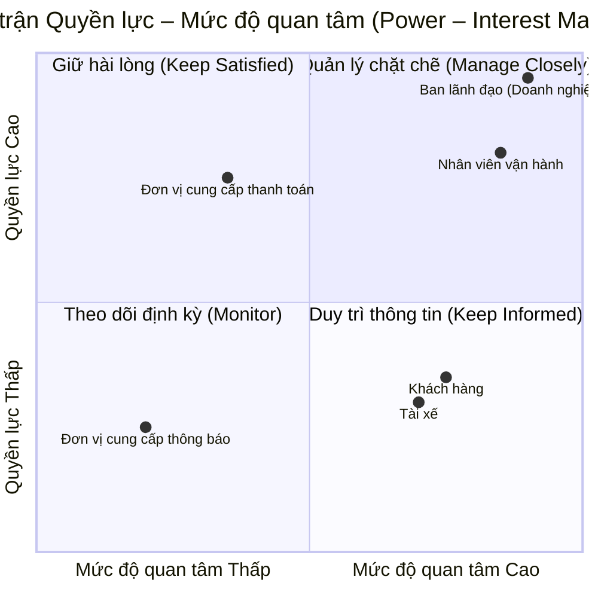
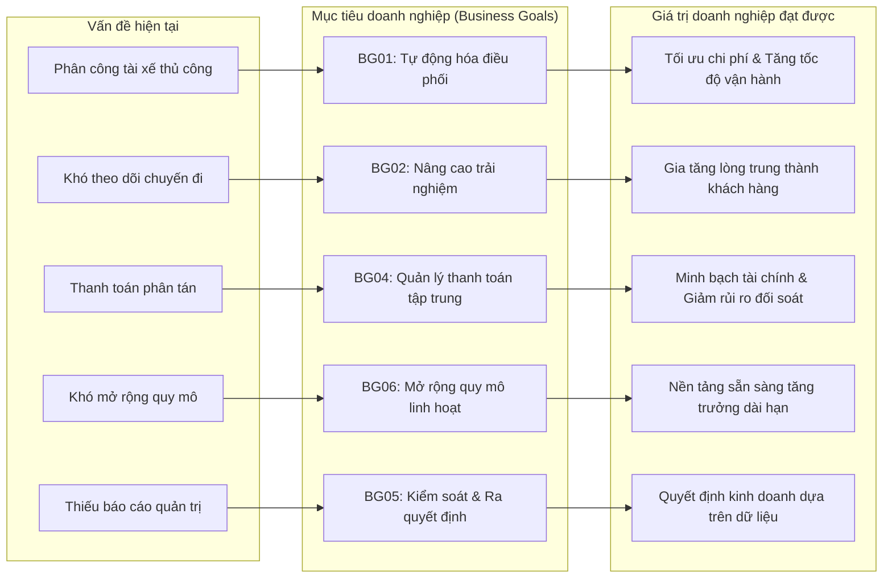
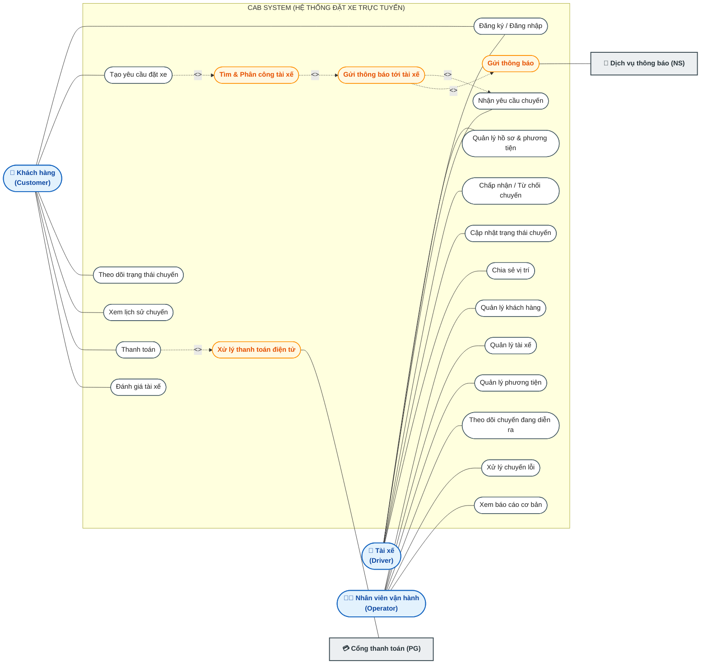
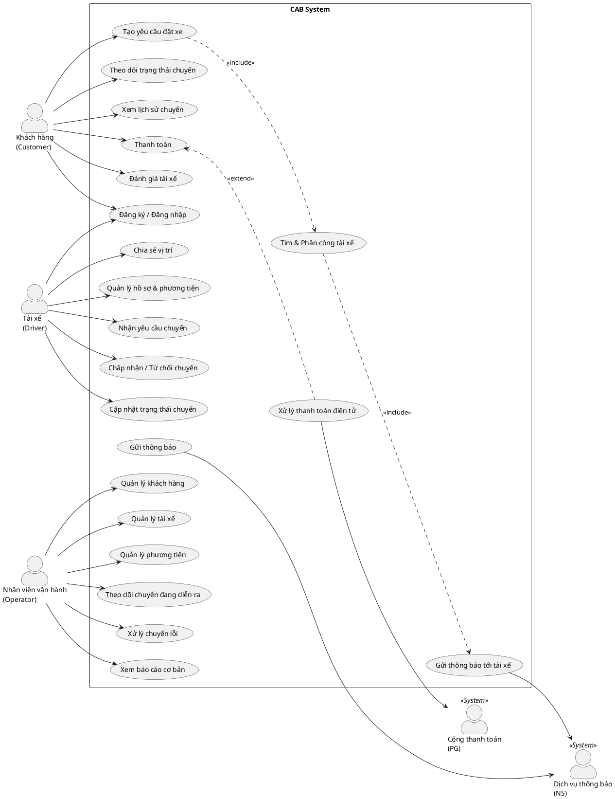

# BÁO CÁO PHÂN TÍCH VÀ THIẾT KẾ HỆ THỐNG
# ĐỀ TÀI: NỀN TẢNG ĐẶT XE TRỰC TUYẾN (CAB SYSTEM)

**Thông tin đề tài**
Mã sinh viên: 23635951
Họ và tên: Nguyễn Tuấn Kiệt
Đơn vị chủ quản: Doanh nghiệp ABC

## 1. TỔNG QUAN VÀ ĐỊNH NGHĨA HỆ THỐNG (SYSTEM DEFINITION)

### 1.1. Giới thiệu hệ thống
CAB System là nền tảng đặt xe trực tuyến được nghiên cứu và thiết kế cho Doanh nghiệp ABC nhằm số hóa quy trình đặt xe, tự động hóa công tác điều phối vận hành và tối ưu hóa trải nghiệm cho khách hàng cùng tài xế.

### 1.2. Hiện trạng và hạn chế của hệ thống cũ
Hệ thống tiếp nhận yêu cầu đặt xe hiện tại thông qua tổng đài thoại hoặc ứng dụng cơ bản đang bộc lộ nhiều điểm nghẽn nghiêm trọng trong quá trình vận hành:
Thứ nhất, quy trình điều phối hoàn toàn phụ thuộc vào việc chỉ định thủ công của nhân viên tổng đài, dẫn đến độ trễ lớn và dễ xảy ra sai sót khi lượng yêu cầu tăng cao.
Thứ hai, khách hàng không có công cụ trực quan để theo dõi vị trí di chuyển của tài xế cũng như tiến trình chuyến đi theo thời gian thực.
Thứ ba, dữ liệu về chuyến đi, lịch sử giao dịch và doanh thu chưa được quản lý tập trung, gây nhiều khó khăn và rủi ro trong công tác đối soát tài chính.
Thứ tư, kiến trúc kỹ thuật hiện tại có tính đóng và khó mở rộng quy mô khi số lượng người dùng đồng thời gia tăng nhanh chóng.

### 1.3. Mục tiêu xây dựng hệ thống mới
Hệ thống CAB mới được định hướng phát triển nhằm tự động hóa toàn diện quy trình tìm kiếm, khớp nối và phân công tài xế dựa trên vị trí GPS và các tiêu chuẩn vận hành. Đồng thời, hệ thống cung cấp giải pháp giám sát hành trình thời gian thực, tích hợp cổng thanh toán trực tuyến, quản lý tập trung toàn bộ dữ liệu nghiệp vụ và thiết lập kiến trúc module hóa đảm bảo hiệu năng cao, tính sẵn sàng và khả năng mở rộng linh hoạt.

### 1.4. Bảng so sánh cải tiến hệ thống

| Tiêu chí so sánh | Hệ thống hiện tại | Hệ thống CAB mới |
| :--- | :--- | :--- |
| **Phương thức đặt chuyến** | Tổng đài thoại hoặc ứng dụng cơ bản | Ứng dụng trực tuyến đa nền tảng |
| **Phân bổ tài xế** | Điều phối viên chỉ định thủ công | Tự động hóa phân công dựa trên thuật toán tối ưu |
| **Tiêu chí ghép chuyến** | Chưa có tiêu chuẩn định lượng | Dựa trên vị trí GPS, trạng thái sẵn sàng và tiêu chí vận hành |
| **Xử lý từ chối cuốc xe** | Xử lý thủ công, độ trễ cao | Tự động chuyển tiếp tìm kiếm tài xế kế tiếp |
| **Giám sát hành trình** | Khách hàng không theo dõi được | Theo dõi lộ trình và vị trí GPS theo thời gian thực |
| **Phương thức thanh toán** | Chủ yếu tiền mặt, dữ liệu phân tán | Hỗ trợ linh hoạt: Tiền mặt, Thẻ ngân hàng, Ví điện tử |
| **Hệ thống thông báo** | Thiếu đồng bộ | Tự động gửi SMS OTP, Push Notification theo sự kiện |
| **Công cụ quản trị** | Chưa được chuẩn hóa | Cổng quản trị tập trung (Dashboard) cho nhân viên vận hành |
| **Báo cáo & Phân tích** | Tổng hợp thủ công, thiếu tức thời | Báo cáo trực quan: Doanh thu, số chuyến, tỷ lệ hoàn thành/hủy |
| **Bảo mật & Phân quyền** | Chưa có cơ chế rõ ràng | Phân quyền theo vai trò (RBAC) và ghi log kiểm toán hệ thống |
| **Khả năng mở rộng** | Kiến trúc đóng, khó tích hợp | Kiến trúc module hóa, dễ dàng tích hợp dịch vụ mới |

### 1.5. Phạm vi của hệ thống (System Scope)

#### 1.5.1. Phạm vi thực hiện (In-Scope)
Hệ thống đảm nhiệm toàn bộ quy trình từ khâu quản lý tài khoản người dùng (Khách hàng, Tài xế, Nhân viên vận hành), tiếp nhận yêu cầu đặt chuyến, tự động điều phối tài xế, định vị lộ trình di chuyển thời gian thực, tự động tính toán cước phí và xử lý thanh toán đa phương thức. Ngoài ra, hệ thống cung cấp hạ tầng gửi tin nhắn thông báo tự động, cổng quản trị dữ liệu tập trung và hệ thống báo cáo thống kê phục vụ công tác giám sát điều hành.

#### 1.5.2. Các nội dung cần làm rõ thêm (Pending / Further Clarification)
Một số nội dung kỹ thuật và quy định nghiệp vụ chi tiết cần tiếp tục làm việc với các bên liên quan để thống nhất:
Công thức tính cước chi tiết theo hệ số nhu cầu giờ cao điểm và khu vực địa lý.
Thuật toán trọng số ưu tiên trong việc phân bổ cuốc xe cho tài xế.
Ngưỡng thời gian chờ (Timeout) tối đa cho phép tài xế phản hồi trước khi hệ thống chuyển sang tài xế khác.
Chính sách phụ phí hủy chuyến áp dụng đối với khách hàng và chế tài xử lý tài xế hủy cuốc xe.
Cơ chế đồng bộ và phục hồi dữ liệu khi thiết bị đầu cuối gặp sự cố mất kết nối mạng.
Quy chuẩn về thời hạn lưu trữ dữ liệu lịch sử chuyến đi và nhật ký hệ thống (Audit Logs).

### 1.6. Tích hợp hệ thống bên ngoài (External Integrations)
Hệ thống thực hiện tích hợp với các đối tác dịch vụ bên thứ ba bao gồm cổng thanh toán điện tử (Payment Gateway) để tiếp nhận và xác thực giao dịch trực tuyến; dịch vụ thông báo (Notification Provider) để truyền tải mã xác thực OTP và thông báo hành trình qua SMS, Email, Push Notification; và dịch vụ bản đồ số (Map/GIS Services) phục vụ tính toán cước phí, lộ trình di chuyển và thời gian dự kiến đón xe.

### 1.7. Yêu cầu phi chức năng (Non-Functional Requirements)
Hệ thống đáp ứng các tiêu chuẩn phi chức năng nghiêm ngặt về hiệu năng với độ trễ xử lý dưới 1 giây đối với các tác vụ điều phối và định vị. Kiến trúc hệ thống đảm bảo khả năng mở rộng tài nguyên tính toán độc lập cho các thành phần chịu tải cao, duy trì tính sẵn sàng 24/7 với cơ chế chịu lỗi dự phòng, áp dụng mã hóa bảo mật toàn diện cho dữ liệu cá nhân và giao dịch tài chính, đồng thời ghi vết kiểm toán đầy đủ cho mọi thao tác quản trị.

## 2. PHÂN TÍCH VÀ MA TRẬN CÁC BÊN LIÊN QUAN (STAKEHOLDER ANALYSIS & MATRIX)

### 2.1. Phân tích chi tiết các bên liên quan

#### 2.1.1. Nhóm người dùng trực tiếp
Khách hàng (Customer) là người dùng cuối có nhu cầu di chuyển, tương tác với hệ thống thông qua việc đăng ký tài khoản, tìm kiếm tuyến đường, đặt xe, theo dõi hành trình di chuyển của tài xế trên bản đồ số, thực hiện thanh toán cước phí và đánh giá chất lượng phục vụ sau mỗi chuyến đi.
Tài xế (Driver) là đối tác cung cấp phương tiện và trực tiếp thực hiện dịch vụ vận chuyển, tương tác với hệ thống qua việc cập nhật hồ sơ, bật tắt trạng thái sẵn sàng nhận cuốc, tiếp nhận hoặc từ chối yêu cầu chuyến đi, cập nhật trạng thái đón trả khách và chia sẻ dữ liệu vị trí GPS liên tục.

#### 2.1.2. Nhóm quản trị và vận hành nội bộ
Nhân viên vận hành (Operations Staff) giữ vai trò điều phối và duy trì tính ổn định của hoạt động vận hành thường nhật, thực hiện quản trị dữ liệu người dùng và phương tiện, giám sát các cuốc xe đang diễn ra trong thời gian thực, đồng thời tiếp nhận và xử lý các sự cố phát sinh hoặc khiếu nại của người dùng.
Ban lãnh đạo / Doanh nghiệp ABC (Business Owner / Management) là đơn vị sở hữu hệ thống và định hướng chiến lược kinh doanh, sử dụng hệ thống để theo dõi các báo cáo thống kê tổng quan về doanh thu, số lượng cuốc xe, tỷ lệ hoàn thành/hủy chuyến nhằm đưa ra các quyết định mở rộng dịch vụ và đầu tư nâng cấp.

#### 2.1.3. Nhóm đối tác và dịch vụ bên thứ ba
Nhà cung cấp cổng thanh toán (Payment Gateway Provider) cung cấp giải pháp xử lý giao dịch điện tử an toàn, tiếp nhận yêu cầu thanh toán từ CAB System, thực hiện xác thực bảo mật và hoàn trả kết quả giao dịch về hệ thống.
Nhà cung cấp dịch vụ thông báo (Notification Provider) cung cấp hạ tầng truyền thông điệp đa kênh, tiếp nhận dữ liệu từ hệ thống CAB để gửi tin nhắn OTP xác thực, thông báo trạng thái hành trình và chương trình ưu đãi đến người dùng.

### 2.2. Ma trận các bên liên quan (Stakeholder Matrix)

| Bên liên quan (Stakeholder) | Vai trò trong hệ thống | Phạm vi tương tác và trách nhiệm | Mức độ ảnh hưởng (Power) | Mức độ quan tâm (Interest) |
| :--- | :--- | :--- | :---: | :---: |
| **Khách hàng** | Người sử dụng dịch vụ | Đặt xe, theo dõi hành trình, thanh toán cước phí và đánh giá dịch vụ | Trung bình | Cao |
| **Tài xế** | Đối tác thực hiện chuyến xe | Tiếp nhận cuốc xe, vận chuyển khách hàng, cập nhật vị trí và trạng thái chuyến | Trung bình | Cao |
| **Nhân viên vận hành** | Quản lý và điều phối hệ thống | Quản lý dữ liệu, giám sát hoạt động thời gian thực, hỗ trợ xử lý sự cố | Trung bình | Cao |
| **Ban lãnh đạo (Doanh nghiệp ABC)** | Chủ sở hữu & Định hướng chiến lược | Đưa ra yêu cầu nghiệp vụ, theo dõi báo cáo kinh doanh, phê duyệt mở rộng hệ thống | Cao | Cao |
| **Đơn vị cung cấp thanh toán** | Đối tác xử lý giao dịch tài chính | Nhận và xác thực các giao dịch thanh toán trực tuyến | Cao | Trung bình |
| **Đơn vị cung cấp thông báo** | Đối tác hạ tầng truyền thông tin | Chuyển tiếp tin nhắn OTP, thông báo trạng thái cuốc xe tới người dùng | Trung bình | Thấp |

### 2.3. Sơ đồ Ma trận Quyền lực – Mức độ quan tâm (Power – Interest Matrix)

#### Bảng ma trận 2x2 tổng hợp phân loại:

| Mức độ Quyền lực \ Quan tâm | Mức độ quan tâm Thấp (Low Interest) | Mức độ quan tâm Cao (High Interest) |
| :--- | :--- | :--- |
| **Quyền lực Cao (High Power)** | **Giữ hài lòng (Keep Satisfied)** Đơn vị cung cấp thanh toán | **Quản lý chặt chẽ (Manage Closely)** Ban lãnh đạo / Doanh nghiệp ABC Nhân viên vận hành |
| **Quyền lực Thấp / TB (Low/Medium Power)** | **Theo dõi định kỳ (Monitor)** Đơn vị cung cấp thông báo | **Duy trì thông tin thường xuyên (Keep Informed)** Khách hàng Tài xế |

### 2.4. Chiến lược quản lý các bên liên quan

Chiến lược Quản lý chặt chẽ (Manage Closely - High Power, High Interest) áp dụng cho Ban lãnh đạo Doanh nghiệp ABC và Đội ngũ nhân viên vận hành. Đây là nhóm có quyền quyết định cao nhất về ngân sách, nghiệp vụ và trực tiếp điều hành hệ thống hàng ngày, đòi hỏi sự phối hợp chặt chẽ trong mọi giai đoạn phát triển.

Chiến lược Duy trì sự hài lòng (Keep Satisfied - High Power, Medium/Low Interest) áp dụng cho Nhà cung cấp cổng thanh toán. Cần đảm bảo quy trình tích hợp tuân thủ các chuẩn an toàn tài chính và phản hồi kịp thời nhằm giữ luồng tiền luôn thông suốt.

Chiến lược Duy trì thông tin thường xuyên (Keep Informed - Medium/Low Power, High Interest) áp dụng cho Khách hàng và Tài xế. Đây là hai đối tượng trực tiếp quyết định sự thành công của nền tảng trên thị trường, cần được cung cấp thông tin chuyến đi minh bạch và tiếp nhận phản hồi thường xuyên để cải tiến trải nghiệm.

Chiến lược Theo dõi định kỳ (Monitor - Low Power, Low Interest) áp dụng cho Nhà cung cấp dịch vụ thông báo. Cần theo dõi chất lượng dịch vụ định kỳ và đảm bảo hệ thống duy trì tính linh hoạt để có thể bổ sung hoặc thay thế nhà cung cấp khi cần thiết.

## 3. MỤC TIÊU DOANH NGHIỆP (BUSINESS GOALS)

### 3.1. Danh sách Business Goals

| ID | Business Goal | Mô tả | Vấn đề được giải quyết | Stakeholder liên quan |
| :--- | :--- | :--- | :--- | :--- |
| **BG01** | **Tự động hóa quy trình phân công và điều phối tài xế** | Tự động tìm kiếm và phân công tài xế phù hợp dựa trên vị trí GPS, trạng thái sẵn sàng và tiêu chí vận hành, giảm tối đa thao tác thủ công. | Phân công tài xế chủ yếu thực hiện thủ công, gây chậm trễ và phụ thuộc nhân sự điều phối. | Tài xế, Nhân viên vận hành, Khách hàng |
| **BG02** | **Nâng cao trải nghiệm và sự tiện lợi cho khách hàng** | Cung cấp giải pháp đặt xe trực tuyến đa nền tảng, cho phép theo dõi trực quan vị trí tài xế và trạng thái chuyến đi theo thời gian thực. | Khách hàng chỉ đặt xe qua tổng đài hoặc ứng dụng cơ bản, khó theo dõi lộ trình di chuyển. | Khách hàng |
| **BG03** | **Tối ưu hóa hiệu quả quản trị và điều hành vận hành** | Trang bị công cụ quản trị tập trung giúp nhân viên vận hành giám sát cuốc xe trực tiếp, quản lý hồ sơ và xử lý kịp thời các sự cố phát sinh. | Chưa có công cụ quản trị tập trung, quy trình hỗ trợ và xử lý sự cố cuốc xe chưa tối ưu. | Nhân viên vận hành, Ban lãnh đạo |
| **BG04** | **Tập trung hóa và minh bạch hóa quản lý thanh toán** | Tích hợp linh hoạt các phương thức thanh toán (tiền mặt và thanh toán điện tử), quản lý tập trung dữ liệu giao dịch phục vụ đối soát chính xác. | Thông tin thanh toán chưa được quản lý tập trung, hạn chế về phương thức thanh toán không tiền mặt. | Khách hàng, Tài xế, Đơn vị thanh toán, Ban lãnh đạo |
| **BG05** | **Nâng cao năng lực kiểm soát và ra quyết định kinh doanh** | Cung cấp hệ thống báo cáo phân tích toàn diện về số lượng chuyến đi, doanh thu, tỷ lệ hoàn thành, tỷ lệ hủy chuyến và hiệu quả tài xế. | Ban lãnh đạo thiếu dữ liệu thống kê kịp thời và chuẩn xác để theo dõi hoạt động kinh doanh. | Ban lãnh đạo / Doanh nghiệp ABC |
| **BG06** | **Đảm bảo khả năng mở rộng quy mô hệ thống (Scalability)** | Xây dựng kiến trúc hệ thống module hóa, đáp ứng hoạt động ổn định khi số lượng khách hàng, tài xế và giao dịch đồng thời gia tăng. | Hệ thống hiện tại khó mở rộng khi số lượng người dùng và nhu cầu thị trường tăng cao. | Ban lãnh đạo, Nhân viên vận hành |
| **BG07** | **Đảm bảo an toàn, bảo mật và lưu vết dữ liệu** | Kiểm soát chặt chẽ quyền truy cập các chức năng quản trị (RBAC) và lưu vết toàn bộ các thao tác nghiệp vụ quan trọng phục vụ kiểm toán. | Chưa có cơ chế phân quyền rõ ràng và chưa ghi log kiểm toán các thao tác quản trị hệ thống. | Ban lãnh đạo, Nhân viên vận hành |
| **BG08** | **Xây dựng nền tảng linh hoạt phục vụ mở rộng dài hạn** | Thiết kế hệ thống sẵn sàng tích hợp thêm các dịch vụ vận tải mới, cổng thanh toán và nhà cung cấp thông báo mà không phải tái cấu trúc toàn bộ. | Hệ thống cũ có tính đóng, khó mở rộng thêm đối tác và dịch vụ mới trong tương lai. | Ban lãnh đạo, Đối tác bên ngoài |

*(Ghi chú: Các chỉ số KPI định lượng cụ thể cho từng mục tiêu chưa được xác định trong tài liệu – Cần BA làm rõ thêm với stakeholder).*

### 3.2. Business Goals trọng tâm

Doanh nghiệp ABC đặt ưu tiên cao nhất vào ba mục tiêu kinh doanh cốt lõi:

Mục tiêu BG01 – Tự động hóa quy trình phân công và điều phối tài xế: Đây là nghiệp vụ trọng tâm quyết định hiệu suất vận hành của nền tảng đặt xe. Việc tự động hóa giúp giải quyết triệt để vấn đề nghẽn cổ chai điều phối thủ công, giảm độ trễ khớp cuốc xe, giúp tài xế nhận chuyến nhanh chóng phù hợp với vị trí, khách hàng được phục vụ sớm và giảm áp lực điều phối cho nhân viên vận hành.

Mục tiêu BG02 – Nâng cao trải nghiệm và sự tiện lợi cho khách hàng: Trải nghiệm khách hàng là yếu tố then chốt thu hút và giữ chân người dùng trong môi trường cạnh tranh. Mục tiêu này giải quyết tình trạng thiếu thông tin của khách hàng bằng cách cung cấp lộ trình trực quan, thời gian dự kiến đón chính xác và đa dạng hóa hình thức thanh toán, từ đó nâng cao mức độ hài lòng và uy tín thương hiệu của Doanh nghiệp ABC.

Mục tiêu BG06 – Đảm bảo khả năng mở rộng quy mô hệ thống (Scalability): Mục tiêu này bảo đảm tính sẵn sàng cao khi doanh nghiệp phát triển lượng người dùng và tăng lưu lượng cuốc xe trong giờ cao điểm. Việc chuyển đổi sang kiến trúc module hóa giúp hệ thống vận hành ổn định liên tục, giải quyết giới hạn kỹ thuật của hệ thống cũ và tạo sự tự tin cho ban lãnh đạo trong kế hoạch mở rộng thị phần.

### 3.3. Sơ đồ mối quan hệ Mục tiêu doanh nghiệp (Business Goal Relationship Diagram)

## 4. XÁC ĐỊNH PHẠM VI DỰ ÁN TRONG 7 TUẦN (PROJECT SCOPE)

### 4.1. Các chức năng cần thực hiện trong 7 tuần (In-Scope MVP)
Trong giới hạn 7 tuần của đồ án môn học, phạm vi hệ thống tập trung hoàn thiện 13 chức năng cốt lõi đảm bảo vận hành trọn vẹn luồng nghiệp vụ đặt xe:

| STT | Chức năng | Nội dung chính |
| :---: | :--- | :--- |
| **1** | Quản lý tài khoản khách hàng | Đăng ký, đăng nhập và cập nhật thông tin cá nhân |
| **2** | Quản lý tài khoản tài xế | Tạo tài khoản, đăng nhập và cập nhật hồ sơ tài xế |
| **3** | Đặt xe | Nhập điểm đón, điểm đến, chọn loại xe và gửi yêu cầu chuyến đi |
| **4** | Tìm tài xế | Tìm kiếm tài xế phù hợp dựa trên vị trí GPS và trạng thái sẵn sàng |
| **5** | Phân công tài xế | Gửi yêu cầu chuyến xe cho tài xế và xử lý phản hồi chấp nhận hoặc từ chối |
| **6** | Quản lý chuyến đi | Cập nhật các mốc trạng thái: nhận chuyến, đến điểm đón, đón khách, di chuyển và hoàn thành |
| **7** | Theo dõi chuyến | Khách hàng theo dõi trạng thái chuyến đi và thông tin tài xế theo thời gian thực |
| **8** | Tính cước | Tự động xác định số tiền cước phí khách hàng phải trả sau khi hoàn thành chuyến |
| **9** | Thanh toán | Hỗ trợ phương thức thanh toán tiền mặt và mô phỏng thanh toán điện tử cơ bản |
| **10** | Thông báo | Gửi thông báo trạng thái đặt xe, tiến trình chuyến đi và kết quả thanh toán |
| **11** | Quản lý vận hành | Cung cấp giao diện quản trị theo dõi khách hàng, tài xế và chuyến đi |
| **12** | Xử lý chuyến lỗi | Hỗ trợ nhân viên vận hành tra cứu và xử lý các trường hợp chuyến đi gặp sự cố |
| **13** | Báo cáo cơ bản | Thống kê số lượng chuyến, doanh thu, tỷ lệ hoàn thành và tỷ lệ hủy chuyến |

### 4.2. Các chức năng ngoài phạm vi thực hiện (Out-of-Scope)
Nhằm đảm bảo tính khả thi trong thời gian 7 tuần, các tính năng nâng cao sau đây sẽ được đưa ra ngoài phạm vi thực hiện:
Về tài khoản và phương tiện, không tích hợp đăng nhập qua mạng xã hội (OAuth2), xác thực sinh trắc học và không xây dựng phân hệ quản lý hồ sơ kiểm định phương tiện chuyên sâu.
Về đặt xe, không thực hiện đặt xe hẹn giờ trước, đặt xe hộ người khác, đặt chuyến nhiều điểm dừng và cơ chế ghép xe đi chung (Carpooling).
Về định vị và điều phối, không áp dụng thuật toán AI phân tích giao thông và không tích hợp bản đồ số bản quyền có định tuyến tránh kẹt xe.
Về tính cước và thanh toán, không áp dụng giá cước động theo thời tiết/giờ cao điểm (Dynamic Pricing) và không tích hợp cổng thanh toán quốc tế thật.
Về thông báo và phân tích, không tích hợp SMS Brandname viễn thông và không xây dựng báo cáo phân tích dữ liệu lớn (BI Analytics).

### 4.3. Kế hoạch triển khai theo tuần (7-Week Implementation Roadmap)

| Tuần | Nội dung công việc cốt lõi | Sản phẩm bàn giao |
| :---: | :--- | :--- |
| **Tuần 1** | Khảo sát yêu cầu, xác định phạm vi và phân tích Stakeholders | Báo cáo Definition và Stakeholder Matrix |
| **Tuần 2** | Đặc tả yêu cầu phần mềm và xây dựng sơ đồ Use Case | Use Case Diagram và Use Case Specifications |
| **Tuần 3** | Thiết kế cơ sở dữ liệu quan hệ và kiến trúc hệ thống | Sơ đồ ERD và Database Schema |
| **Tuần 4** | Thiết kế giao diện khung và đặc tả các API endpoints | Giao diện mẫu (UI Wireframe) và API Docs |
| **Tuần 5** | Xây dựng chức năng đăng nhập, đặt xe và phân công tài xế | Bản dựng phân hệ Auth và Booking |
| **Tuần 6** | Xây dựng chức năng cập nhật chuyến, thanh toán và quản trị | Bản dựng phân hệ Trip và Admin Dashboard |
| **Tuần 7** | Kiểm thử luồng nghiệp vụ, sửa lỗi và hoàn thiện đồ án | Sản phẩm hoàn chỉnh và Báo cáo nghiệm thu |

## 5. YÊU CẦU NGHIỆP VỤ (BUSINESS REQUIREMENTS)

| ID | Business Requirement | Mô tả |
| :---: | :--- | :--- |
| **BR01** | Cải thiện dịch vụ đặt xe | Hệ thống phải cung cấp nền tảng đặt xe trực tuyến thuận tiện hơn hệ thống hiện tại. |
| **BR02** | Tự động hóa tìm và phân công tài xế | Hệ thống phải hỗ trợ tự động tìm và phân công tài xế phù hợp. |
| **BR03** | Nâng cao khả năng theo dõi chuyến đi | Hệ thống phải cho phép khách hàng theo dõi trạng thái chuyến và thông tin liên quan. |
| **BR04** | Quản lý tập trung hoạt động vận hành | Hệ thống phải hỗ trợ nhân viên vận hành quản lý khách hàng, tài xế và chuyến đi. |
| **BR05** | Hỗ trợ và quản lý thanh toán | Hệ thống phải hỗ trợ thanh toán tiền mặt và điện tử và quản lý kết quả giao dịch. |
| **BR06** | Cung cấp thông tin phục vụ quản lý | Hệ thống phải cung cấp dữ liệu và báo cáo về hoạt động kinh doanh. |
| **BR07** | Đảm bảo khả năng mở rộng | Hệ thống phải phục vụ số lượng lớn người dùng và có thể mở rộng khi tải tăng. |
| **BR08** | Xây dựng nền tảng phát triển lâu dài | Hệ thống phải hỗ trợ bổ sung dịch vụ, phương thức thanh toán và nhà cung cấp mới trong tương lai. |

## 6. YÊU CẦU CHỨC NĂNG (FUNCTIONAL REQUIREMENTS)

Các yêu cầu chức năng (Functional Requirements - FR) được phân rã chi tiết từ các yêu cầu nghiệp vụ (Business Requirements) nhằm đặc tả đầy đủ các khả năng xử lý mà hệ thống CAB cung cấp cho từng nhóm người dùng và quy trình vận hành.

### 6.1. Phân hệ Quản lý tài khoản
Phân hệ đảm nhiệm các chức năng đăng ký, xác thực và quản lý hồ sơ thông tin cho khách hàng và tài xế, gắn liền với yêu cầu nghiệp vụ BR01 (Cải thiện dịch vụ đặt xe).

| Mã FR | Chức năng (Functional Requirement) | Mô tả chi tiết |
| :---: | :--- | :--- |
| **FR01.1** | Đăng ký tài khoản khách hàng | Hệ thống cho phép khách hàng mới tạo tài khoản cá nhân |
| **FR01.2** | Đăng nhập hệ thống | Hệ thống xác thực và cho phép khách hàng cùng tài xế đăng nhập |
| **FR01.3** | Cập nhật thông tin cá nhân | Người dùng có thể chỉnh sửa và cập nhật thông tin cá nhân của mình |
| **FR01.4** | Quản lý hồ sơ tài xế | Tài xế có thể cập nhật thông tin hồ sơ và giấy tờ liên quan |
| **FR01.5** | Quản lý phương tiện | Tài xế có thể cập nhật thông tin chi tiết về phương tiện vận chuyển |

### 6.2. Phân hệ Đặt xe
Phân hệ cho phép khách hàng tạo yêu cầu chuyến đi trực tuyến nhanh chóng, gắn liền với yêu cầu nghiệp vụ BR01 (Cải thiện dịch vụ đặt xe).

| Mã FR | Chức năng (Functional Requirement) | Mô tả chi tiết |
| :---: | :--- | :--- |
| **FR02.1** | Nhập điểm đón | Khách hàng nhập hoặc chọn vị trí điểm đón trên bản đồ |
| **FR02.2** | Nhập điểm đến | Khách hàng nhập địa chỉ hoặc định vị điểm trả khách |
| **FR02.3** | Chọn loại xe | Khách hàng lựa chọn loại phương tiện di chuyển mong muốn |
| **FR02.4** | Tạo yêu cầu đặt xe | Hệ thống tiếp nhận thông tin và khởi tạo yêu cầu chuyến đi |
| **FR02.5** | Theo dõi trạng thái yêu cầu | Khách hàng theo dõi tiến trình hệ thống đang tìm kiếm tài xế |

### 6.3. Phân hệ Tìm và Phân công tài xế
Phân hệ tự động hóa toàn diện quy trình khớp nối chuyến xe, thay thế quy trình điều phối thủ công, gắn liền với yêu cầu nghiệp vụ BR02 (Tự động hóa tìm và phân công tài xế).

| Mã FR | Chức năng (Functional Requirement) | Mô tả chi tiết |
| :---: | :--- | :--- |
| **FR03.1** | Xác định tài xế phù hợp | Hệ thống quét và tìm tài xế dựa trên vị trí GPS, trạng thái sẵn sàng và tiêu chuẩn vận hành |
| **FR03.2** | Ưu tiên tài xế gần nhất | Hệ thống tính toán và ưu tiên điều phối cho tài xế phù hợp ở gần khách hàng nhất |
| **FR03.3** | Gửi yêu cầu chuyến xe | Hệ thống tự động gửi thông báo đề xuất chuyến đi đến thiết bị của tài xế |
| **FR03.4** | Chấp nhận chuyến xe | Tài xế có thể xác nhận tiếp nhận cuốc xe được đề xuất |
| **FR03.5** | Từ chối chuyến xe | Tài xế có thể từ chối nhận cuốc xe được gửi đến |
| **FR03.6** | Tìm tài xế thay thế | Hệ thống tự động chuyển tiếp tìm kiếm tài xế kế tiếp khi tài xế trước từ chối hoặc hết thời gian chờ |
| **FR03.7** | Thông báo không tìm được xe | Hệ thống thông báo rõ ràng cho khách hàng khi không có tài xế khả dụng |

### 6.4. Phân hệ Quản lý tiến trình chuyến đi
Phân hệ kiểm soát chuỗi trạng thái di chuyển và hỗ trợ khách hàng giám sát hành trình thời gian thực, gắn liền với yêu cầu nghiệp vụ BR03 (Nâng cao khả năng theo dõi chuyến đi).

| Mã FR | Chức năng (Functional Requirement) | Mô tả chi tiết |
| :---: | :--- | :--- |
| **FR04.1** | Cập nhật trạng thái "Đã nhận chuyến" | Tài xế xác nhận đã nhận cuốc xe và bắt đầu di chuyển đón khách |
| **FR04.2** | Cập nhật trạng thái "Đã đến điểm đón" | Tài xế cập nhật trạng thái khi đã có mặt tại điểm đón quy định |
| **FR04.3** | Cập nhật trạng thái "Đã đón khách" | Tài xế xác nhận khách đã lên xe để bắt đầu lộ trình di chuyển |
| **FR04.4** | Cập nhật trạng thái "Đang di chuyển" | Hệ thống ghi nhận tiến trình xe đang di chuyển trên đường |
| **FR04.5** | Cập nhật trạng thái "Hoàn thành" | Tài xế xác nhận đã trả khách và hoàn thành chuyến đi |
| **FR04.6** | Theo dõi trạng thái trực quan | Khách hàng theo dõi vị trí và tiến trình cuốc xe theo thời gian thực |
| **FR04.7** | Lưu trữ dữ liệu vị trí GPS | Hệ thống liên tục lưu vết vị trí tài xế phục vụ điều phối và ước tính thời gian đón (ETA) |

### 6.5. Phân hệ Tính cước phí
Phân hệ tự động xác định giá trị thanh toán của chuyến đi, gắn liền với yêu cầu nghiệp vụ BR05 (Hỗ trợ và quản lý thanh toán).

| Mã FR | Chức năng (Functional Requirement) | Mô tả chi tiết |
| :---: | :--- | :--- |
| **FR05.1** | Tính toán cước phí chuyến đi | Hệ thống tự động xác định số tiền cước khách hàng phải trả khi chuyến đi hoàn tất |
| **FR05.2** | Xác định cước theo loại dịch vụ | Hệ thống áp dụng bảng giá tương ứng theo loại xe và quãng đường thực tế |

*(Ghi chú: Công thức tính cước chi tiết theo hệ số thời gian và khu vực chưa được xác định trong tài liệu – Cần BA làm rõ thêm với stakeholder).*

### 6.6. Phân hệ Xử lý thanh toán
Phân hệ hỗ trợ đa dạng phương thức thanh toán an toàn và lưu trữ lịch sử đối soát, gắn liền với yêu cầu nghiệp vụ BR05 (Hỗ trợ và quản lý thanh toán).

| Mã FR | Chức năng (Functional Requirement) | Mô tả chi tiết |
| :---: | :--- | :--- |
| **FR06.1** | Thanh toán bằng tiền mặt | Hệ thống ghi nhận xác nhận thu tiền mặt trực tiếp từ tài xế |
| **FR06.2** | Thanh toán điện tử | Hệ thống tích hợp xử lý giao dịch không tiền mặt qua cổng thanh toán |
| **FR06.3** | Tiếp nhận kết quả thanh toán | Hệ thống nhận và đối chiếu phản hồi xác thực giao dịch từ đối tác thanh toán |
| **FR06.4** | Thông báo thanh toán thất bại | Hệ thống gửi cảnh báo khi giao dịch thanh toán trực tuyến không thành công |
| **FR06.5** | Xử lý thanh toán lại | Hệ thống hỗ trợ thực hiện lại giao dịch hoặc chuyển sang hình thức thanh toán khác |
| **FR06.6** | Lưu trữ lịch sử giao dịch | Hệ thống ghi nhận đầy đủ chứng từ thanh toán phục vụ tra cứu và đối soát tài chính |

### 6.7. Phân hệ Quản lý thông báo
Phân hệ gửi thông điệp kịp thời đến người dùng trong từng giai đoạn của chuyến đi, gắn liền với yêu cầu nghiệp vụ BR03 (Nâng cao trải nghiệm khách hàng).

| Mã FR | Chức năng (Functional Requirement) | Mô tả chi tiết |
| :---: | :--- | :--- |
| **FR07.1** | Thông báo tiếp nhận yêu cầu | Gửi xác nhận cho khách hàng khi cuốc xe được khởi tạo thành công |
| **FR07.2** | Thông báo tài xế nhận chuyến | Gửi thông tin xe và tài xế cho khách hàng ngay khi có tài xế nhận chuyến |
| **FR07.3** | Thông báo tài xế đã đến điểm đón | Gửi thông báo nhắc nhở khách hàng khi phương tiện đã tới điểm hẹn |
| **FR07.4** | Thông báo hoàn thành chuyến đi | Gửi tổng kết chuyến đi và thông báo cước phí cho người dùng |
| **FR07.5** | Thông báo kết quả thanh toán | Gửi biên lai xác nhận giao dịch thanh toán thành công hoặc thất bại |
| **FR07.6** | Thông báo cuốc xe mới cho tài xế | Đẩy thông tin chuyến đi mới đến thiết bị tài xế để tiếp nhận |
| **FR07.7** | Thông báo thay đổi chuyến đi | Cập nhật thông tin cho tài xế và khách hàng khi có điều chỉnh hoặc hủy chuyến |

### 6.8. Phân hệ Quản trị vận hành
Phân hệ cung cấp bộ công cụ tập trung cho nhân viên vận hành giám sát và xử lý sự cố, gắn liền với yêu cầu nghiệp vụ BR04 (Quản lý tập trung hoạt động vận hành).

| Mã FR | Chức năng (Functional Requirement) | Mô tả chi tiết |
| :---: | :--- | :--- |
| **FR08.1** | Quản lý thông tin khách hàng | Tra cứu, kiểm duyệt và quản lý danh sách hồ sơ khách hàng |
| **FR08.2** | Quản lý thông tin tài xế | Tiếp nhận, xác minh hồ sơ và quản lý trạng thái tài xế |
| **FR08.3** | Quản lý thông tin phương tiện | Theo dõi và cập nhật thông tin phương tiện đăng ký hoạt động |
| **FR08.4** | Quản lý danh mục chuyến đi | Tra cứu toàn bộ dữ liệu lịch sử các cuốc xe trên hệ thống |
| **FR08.5** | Giám sát chuyến đi thời gian thực | Theo dõi các chuyến xe đang diễn ra trực tiếp trên bản đồ điều hành |
| **FR08.6** | Kiểm tra trạng thái tài xế | Giám sát danh sách tài xế đang trực tuyến, đang chở khách hoặc ngoại tuyến |
| **FR08.7** | Xử lý chuyến đi bị lỗi | Can thiệp hỗ trợ điều phối lại hoặc hủy cuốc khi phát sinh sự cố vận hành |

### 6.9. Phân hệ Báo cáo và Thống kê
Phân hệ cung cấp số liệu tổng quan phục vụ quản lý và ra quyết định kinh doanh, gắn liền với yêu cầu nghiệp vụ BR06 (Cung cấp thông tin phục vụ quản lý).

| Mã FR | Chức năng (Functional Requirement) | Mô tả chi tiết |
| :---: | :--- | :--- |
| **FR09.1** | Báo cáo số lượng chuyến đi | Tổng hợp số lượng cuốc xe theo ngày, tuần, tháng và khu vực |
| **FR09.2** | Báo cáo tổng doanh thu | Thống kê doanh thu chuyến đi, chiết khấu và đối soát thanh toán |
| **FR09.3** | Báo cáo tỷ lệ hoàn thành | Đánh giá tỷ lệ cuốc xe thực hiện thành công trên tổng số yêu cầu |
| **FR09.4** | Báo cáo tỷ lệ hủy chuyến | Phân tích tỷ lệ hủy chuyến từ phía khách hàng và từ phía tài xế |
| **FR09.5** | Báo cáo hiệu quả tài xế | Cung cấp số liệu đánh giá năng suất và chất lượng phục vụ của tài xế |

### 6.10. Phân hệ Bảo mật và Phân quyền quản trị
Phân hệ kiểm soát an toàn hệ thống và lưu vết kiểm toán dữ liệu, gắn liền với yêu cầu nghiệp vụ BR07 và BR08.

| Mã FR | Chức năng (Functional Requirement) | Mô tả chi tiết |
| :---: | :--- | :--- |
| **FR10.1** | Xác thực người dùng (Authentication) | Kiểm soát chặt chẽ danh tính trước khi cho phép thực hiện thao tác nghiệp vụ |
| **FR10.2** | Phân quyền vai trò (Role-Based Access) | Phân chia quyền hạn rõ ràng giữa Khách hàng, Tài xế và Nhân viên vận hành |
| **FR10.3** | Nhật ký kiểm toán (Audit Logging) | Ghi nhận thời điểm, người thực hiện và nội dung các thao tác quản trị quan trọng |

## 7. MÔ HÌNH HÓA VÀ ĐẶC TẢ USE CASE (USE CASE MODELING & SPECIFICATIONS)

### 7.1. Danh sách các Tác nhân (Actors)

| Tác nhân (Actor) | Phân loại | Vai trò và Trách nhiệm chính |
| :--- | :---: | :--- |
| **Khách hàng (Customer)** | Primary Actor | Người dùng có nhu cầu di chuyển, khởi tạo yêu cầu đặt xe, theo dõi hành trình, thực hiện thanh toán và đánh giá tài xế. |
| **Tài xế (Driver)** | Primary Actor | Đối tác vận chuyển trực tiếp, tiếp nhận cuốc xe, cập nhật trạng thái đón/trả khách, chia sẻ vị trí GPS và quản lý phương tiện. |
| **Nhân viên vận hành (Operator)** | Secondary Actor | Quản lý dữ liệu người dùng, giám sát các cuốc xe đang diễn ra trong thời gian thực, can thiệp xử lý chuyến lỗi và theo dõi báo cáo. |
| **Cổng thanh toán (Payment Gateway - PG)** | Supporting System | Hệ thống bên thứ ba tiếp nhận yêu cầu thanh toán không tiền mặt, xác thực bảo mật và hoàn trả kết quả giao dịch. |
| **Dịch vụ thông báo (Notification Service - NS)** | Supporting System | Hệ thống bên thứ ba cung cấp hạ tầng gửi mã OTP qua SMS và đẩy tin nhắn thông báo (Push Notification) đến thiết bị người dùng. |

---

### 7.2. Sơ đồ Use Case tổng quan (Use Case Diagram)

#### 7.2.1. Sơ đồ trực quan (Mermaid Use Case Diagram)

#### 7.2.2. Đặc tả PlantUML Use Case Diagram

---

### 7.3. Bảng Ma trận Ánh xạ Use Case và Yêu cầu Chức năng (FR - UC Mapping Matrix)

| Mã UC | Tên Use Case | Tác nhân chính (Actors) | Yêu cầu chức năng tương ứng (FR) | Quan hệ phụ thuộc |
| :---: | :--- | :--- | :--- | :--- |
| **UC01** | Đăng ký / Đăng nhập | Customer, Driver | FR01.1, FR01.2, FR10.1 | - |
| **UC02** | Quản lý hồ sơ & phương tiện | Driver | FR01.4, FR01.5 | - |
| **UC03** | Tạo yêu cầu đặt xe | Customer | FR02.1, FR02.2, FR02.3, FR02.4 | Include: UC04 |
| **UC04** | Tìm & Phân công tài xế | Hệ thống (CAB System) | FR03.1, FR03.2, FR03.6, FR03.7 | Include: UC05 |
| **UC05** | Gửi thông báo tới tài xế | Hệ thống, NS | FR03.3, FR07.6 | Trigger: UC06 |
| **UC06** | Nhận yêu cầu chuyến | Driver | FR03.3, FR07.6 | - |
| **UC07** | Chấp nhận / Từ chối chuyến | Driver | FR03.4, FR03.5 | - |
| **UC08** | Cập nhật trạng thái chuyến | Driver | FR04.1, FR04.2, FR04.3, FR04.4, FR04.5 | Trigger: Cập nhật tới UC09 |
| **UC09** | Theo dõi trạng thái chuyến | Customer | FR02.5, FR04.6, FR07.2, FR07.3 | - |
| **UC10** | Chia sẻ vị trí | Driver | FR04.7 | Hỗ trợ cho UC04, UC09 |
| **UC11** | Thanh toán | Customer | FR05.1, FR05.2, FR06.1, FR06.2 | Extend: UC12 |
| **UC12** | Xử lý thanh toán điện tử | PG, CAB System | FR06.2, FR06.3, FR06.4, FR06.5 | Extend của UC11 |
| **UC13** | Đánh giá tài xế | Customer | FR09.5 | Sau khi UC08 hoàn thành |
| **UC14** | Xem lịch sử chuyến | Customer | FR06.6, FR08.4 | - |
| **UC15** | Gửi thông báo | NS, CAB System | FR07.1, FR07.4, FR07.5, FR07.7 | - |
| **UC16** | Quản lý khách hàng | Operator | FR08.1 | - |
| **UC17** | Quản lý tài xế & phương tiện | Operator | FR08.2, FR08.3 | - |
| **UC18** | Theo dõi chuyến đang diễn ra | Operator | FR08.5, FR08.6 | - |
| **UC19** | Xử lý chuyến lỗi | Operator | FR08.7 | - |
| **UC20** | Xem báo cáo cơ bản | Operator | FR09.1, FR09.2, FR09.3, FR09.4 | - |

---

### 7.4. Đặc tả chi tiết các Use Case cốt lõi (Use Case Specifications)

#### 7.4.1. Đặc tả Use Case UC03: Tạo yêu cầu đặt xe & Điều phối tài xế

- **Tên Use Case:** Tạo yêu cầu đặt xe (Create Ride Request)
- **Tác nhân chính:** Khách hàng (Customer)
- **Tác nhân phụ / Hệ thống:** Tài xế (Driver), Hệ thống điều phối (CAB System), Dịch vụ thông báo (NS)
- **Tiền điều kiện (Pre-conditions):** Khách hàng đã đăng nhập vào ứng dụng và bật dịch vụ định vị.
- **Hậu điều kiện (Post-conditions):** Cuốc xe được tạo, tài xế nhận cuốc thành công và khách hàng nhận được thông báo tài xế đang tới đón.

##### Luồng sự kiện chính (Main Success Scenario):
1. Khách hàng nhập hoặc chọn điểm đón và điểm trả khách trên bản đồ.
2. Khách hàng lựa chọn loại phương tiện (Xe 4 chỗ, 7 chỗ, xe máy,...).
3. Hệ thống tính toán quãng đường và hiển thị cước phí dự kiến cùng thời gian ước tính (ETA).
4. Khách hàng nhấn xác nhận "Đặt xe".
5. Hệ thống khởi tạo cuốc xe ở trạng thái `REQUESTED`.
6. Hệ thống thực hiện Use Case con `Tìm & Phân công tài xế` (UC04): Quét tìm tài xế khả dụng gần nhất dựa trên tọa độ GPS.
7. Hệ thống thực hiện `Gửi thông báo tới tài xế` (UC05) thông qua NS.
8. Tài xế nhận cuốc xe (UC06) và nhấn "Chấp nhận" (UC07).
9. Hệ thống chuyển trạng thái chuyến đi sang `ACCEPTED`, cập nhật thông tin tài xế cho khách hàng và hoàn tất luồng đặt xe.

##### Các luồng nhánh / ngoại lệ (Alternative & Exception Flows):
- **3a. Địa chỉ không hợp lệ:** Hệ thống báo lỗi và yêu cầu khách hàng chọn lại điểm đón/trả.
- **8a. Tài xế từ chối hoặc hết thời gian phản hồi (Timeout):** Hệ thống tự động chuyển tiếp và gửi yêu cầu cho tài xế phù hợp tiếp theo.
- **8b. Không tìm được tài xế khả dụng trong bán kính quy định:** Hệ thống thông báo *"Hiện không có tài xế phù hợp quanh khu vực này"* và chuyển cuốc xe sang trạng thái `FAILED/CANCELLED`.

---

#### 7.4.2. Đặc tả Use Case UC08: Cập nhật tiến trình & Theo dõi chuyến đi

- **Tên Use Case:** Cập nhật tiến trình chuyến đi (Update Ride Progress)
- **Tác nhân chính:** Tài xế (Driver)
- **Tác nhân phụ:** Khách hàng (Customer)
- **Tiền điều kiện:** Chuyến đi đang ở trạng thái `ACCEPTED`.
- **Hậu điều kiện:** Toàn bộ tiến trình chuyến đi được ghi nhận và chuyến đi kết thúc ở trạng thái `COMPLETED`.

##### Luồng sự kiện chính (Main Success Scenario):
1. Sau khi nhận chuyến, tài xế bắt đầu di chuyển và hệ thống cập nhật trạng thái `ARRIVING`.
2. Khi tới điểm hẹn đón khách, tài xế nhấn "Đã đến điểm đón" -> Hệ thống chuyển trạng thái `ARRIVED` và gửi thông báo nhắc khách hàng.
3. Khi khách lên xe, tài xế nhấn "Bắt đầu chuyến đi" -> Hệ thống chuyển trạng thái `IN_TRANSIT`.
4. Trong suốt hành trình, ứng dụng tài xế gửi tọa độ GPS định kỳ (UC10) để khách hàng theo dõi trực tiếp vị trí xe (UC09).
5. Khi đến điểm trả khách an toàn, tài xế nhấn "Hoàn thành chuyến đi" -> Hệ thống chuyển trạng thái `COMPLETED`, tính toán cước phí chính thức và chuyển sang màn hình thanh toán.

---

#### 7.4.3. Đặc tả Use Case UC11: Thanh toán chuyến đi

- **Tên Use Case:** Thanh toán chuyến đi (Process Ride Payment)
- **Tác nhân chính:** Khách hàng (Customer)
- **Tác nhân phụ:** Tài xế (Driver), Cổng thanh toán (PG)
- **Tiền điều kiện:** Chuyến đi vừa hoàn thành (`COMPLETED`) và hệ thống đã tính toán cước phí chính thức.
- **Hậu điều kiện:** Cước phí được thanh toán thành công, hóa đơn điện tử được lưu vào lịch sử giao dịch.

##### Luồng sự kiện chính (Main Success Scenario):
1. Hệ thống hiển thị tổng tiền cước cần thanh toán và các phương thức thanh toán khả dụng (Tiền mặt / Thẻ / Ví điện tử).
2. **Trường hợp Tiền mặt:** Khách hàng thanh toán trực tiếp cho tài xế. Tài xế nhấn xác nhận "Đã thu tiền mặt" trên ứng dụng -> Hệ thống ghi nhận trạng thái `PAID`.
3. **Trường hợp Thanh toán điện tử (UC12):** Khách hàng chọn Cổng thanh toán trực tuyến -> Hệ thống chuyển hướng yêu cầu sang Cổng thanh toán (PG) -> PG xác thực và trừ tiền -> PG hoàn trả mã giao dịch thành công -> Hệ thống ghi nhận trạng thái `PAID`.
4. Hệ thống xuất biên lai điện tử và hiển thị màn hình `Đánh giá tài xế` (UC13) cho khách hàng.

##### Luồng ngoại lệ:
- **3a. Giao dịch điện tử thất bại (Không đủ số dư / Lỗi kết nối):** Hệ thống thông báo lỗi, cho phép khách hàng thực hiện lại hoặc chuyển hình thức sang trả tiền mặt.

---

#### 7.4.4. Đặc tả Use Case UC18 & UC19: Giám sát vận hành và Xử lý chuyến lỗi

- **Tên Use Case:** Giám sát vận hành & Xử lý sự cố (Operations Monitoring & Incident Handling)
- **Tác nhân chính:** Nhân viên vận hành (Operator)
- **Tiền điều kiện:** Nhân viên vận hành đăng nhập thành công vào cổng Quản trị (Admin Portal).
- **Hậu điều kiện:** Sự cố cuốc xe được can thiệp xử lý, đảm bảo thông suốt cho khách hàng và tài xế.

##### Luồng sự kiện chính (Main Success Scenario):
1. Nhân viên vận hành mở bản đồ điều hành trực tiếp để theo dõi danh sách cuốc xe đang diễn ra (`IN_TRANSIT`, `ACCEPTED`, `REQUESTED`).
2. Hệ thống cảnh báo các cuốc xe có dấu hiệu bất thường (đứng yên quá lâu, tài xế không di chuyển, hoặc khách hàng gửi khiếu nại khẩn cấp).
3. Nhân viên vận hành chọn cuốc xe gặp sự cố để xem chi tiết lịch sử và vị trí.
4. Nhân viên vận hành liên hệ xác minh với tài xế/khách hàng và thực hiện thao tác can thiệp:
   - Điều phối lại (Re-assign) cho tài xế khác.
   - Hủy cuốc xe khẩn cấp và hoàn tiền (nếu đã trừ phí).
5. Hệ thống cập nhật trạng thái mới của chuyến đi và tự động ghi nhật ký kiểm toán (Audit Log) ghi rõ nhân viên thực hiện thao tác.