# Phân rã domain cho CAB System theo DDD

Ngày cập nhật: 21/09/2026 — Phiên bản 2, phương án 7 domain.

Tài liệu đề xuất các vùng nghiệp vụ, phân loại DDD, trách nhiệm, dữ liệu sở hữu và quan hệ phối hợp. Đây là thiết kế để xem xét, chưa phải kiến trúc đã triển khai.

## 1. Căn cứ và phạm vi

- [README](README.md): phạm vi MVP mục 4, FR01–FR11 mục 6, UC001–UC016 mục 8, Business Diagram mục 9 và BR-01–BR-26 mục 10.
- Hợp đồng API để đối chiếu: [Identity](api-document/yaml/identity.yaml), [Rides](api-document/yaml/rides.yaml), [Payments](api-document/yaml/payments.yaml), [Notifications](api-document/yaml/notifications.yaml), [Administration](api-document/yaml/administration.yaml).
- Lời giảng và hình bảng: phân rã từ nghiệp vụ, xác định dữ liệu riêng và liên kết các vùng theo quy trình.

Domain tổng thể là **CAB System Domain — Cung cấp và vận hành dịch vụ đặt xe trực tuyến**. Bảy domain dưới đây là các **subdomain của CAB System**; dùng hậu tố “Domain” để thống nhất tên vùng nghiệp vụ.

Phương án này gộp đặt chuyến với điều phối, tách vị trí và theo dõi, gộp vận hành với báo cáo. Phạm vi vẫn là MVP 7 tuần, không bổ sung đặt xe hẹn giờ, đi chung, giá động hay cổng thanh toán quốc tế thật.

## 2. Ý nghĩa phân loại DDD

| Phân loại DDD | Ý nghĩa trong CAB |
| --- | --- |
| **Core Domain — Miền nghiệp vụ cốt lõi** | Năng lực trọng tâm tạo giá trị và sự khác biệt của CAB, cần ưu tiên mô hình hóa các quy tắc nghiệp vụ. |
| **Supporting Subdomain — Miền nghiệp vụ hỗ trợ** | Năng lực hỗ trợ CAB, có quy tắc riêng cần xây dựng nhưng chưa phải yếu tố khác biệt chính trong phạm vi đồ án. |
| **Generic Subdomain — Miền nghiệp vụ phổ dụng** | Năng lực phổ biến ở nhiều hệ thống, có thể tận dụng giải pháp sẵn có và tích hợp vào CAB. |

Phân loại này là đánh giá thiết kế theo phạm vi CAB, không phải xếp hạng quan trọng hoặc mức tải. Một vùng xử lý nhiều dữ liệu hay yêu cầu chính xác cao không tự động trở thành Core Domain.

## 3. Bảng 7 domain và phân loại DDD

| Mã | Tên domain | Tên tiếng Việt | Phân loại DDD | Trách nhiệm chính | Căn cứ nghiệp vụ |
| --- | --- | --- | --- | --- | --- |
| SD01 | **Identity & Access Domain** | Quản lý danh tính và quyền truy cập | **Generic Subdomain** | Đăng ký, OTP, đăng nhập/đăng xuất, hồ sơ cá nhân, phiên, khóa tài khoản, vai trò và quyền. | FR01.1–FR01.3, FR08.1, FR10.1–FR10.2; UC001, UC002, phần tài khoản UC013. |
| SD02 | **Driver & Vehicle Domain** | Quản lý tài xế và phương tiện | **Supporting Subdomain** | Hồ sơ nghề nghiệp, giấy tờ, xe, phê duyệt điều kiện hoạt động, lựa chọn bật/tắt nhận cuốc. | FR01.4–FR01.5, FR08.2–FR08.3; phần điều kiện hoạt động FR08.6; UC013. |
| SD03 | **Booking & Dispatch Domain** | Quản lý đặt chuyến và điều phối | **Core Domain** | Báo giá, tạo/hủy chuyến, tìm/xếp ưu tiên tài xế, lời mời, phân công, tiến trình chuyến, cước cuối và đánh giá. | FR02.1–FR02.5, FR03.1–FR03.7, FR04.1–FR04.5, FR05.1–FR05.2, FR08.4, FR11.1–FR11.2; UC003, UC004, UC006–UC008, UC012. |
| SD04 | **Location & Tracking Domain** | Quản lý vị trí và theo dõi hành trình | **Supporting Subdomain** | Tiếp nhận GPS, vị trí mới nhất, lịch sử vị trí theo chuyến, độ mới/mất tín hiệu, truy vấn theo khoảng cách, lộ trình và ETA. | FR04.6–FR04.10; hỗ trợ FR02.1–FR02.2, FR03.1–FR03.2, FR08.5; UC009, UC014. |
| SD05 | **Payment Domain** | Quản lý thanh toán và hoàn tiền | **Supporting Subdomain** | Khoản phải thu, hóa đơn, tiền mặt/điện tử, giao dịch, callback, đối soát và hoàn tiền. | FR06.1–FR06.8; UC010–UC011, phần tài chính UC015. |
| SD06 | **Notification Domain** | Quản lý thông báo | **Generic Subdomain** | Gửi thông báo, hộp thông báo, thiết bị nhận, trạng thái gửi/nhận/đọc và thử gửi lại. | FR07.1–FR07.7; UC005 và phần thông báo trong các UC khác. |
| SD07 | **Operations & Reporting Domain** | Quản lý vận hành và báo cáo | **Supporting Subdomain** | Giám sát, cảnh báo vận hành, sự cố, can thiệp/phê duyệt, tổng hợp chỉ số và xuất báo cáo. | FR08.5, FR08.7–FR08.8, FR09.1–FR09.6; tổng hợp FR08.6; UC014–UC016. |

**Tổng: 1 Core Domain, 4 Supporting Subdomain, 2 Generic Subdomain.**

Lý do phân loại:

- **Booking & Dispatch** trực tiếp biến nhu cầu di chuyển thành chuyến có tài xế phù hợp và được thực hiện đúng quy trình nên được chọn là Core.
- **Location & Tracking** hỗ trợ bằng dữ liệu không gian/thời gian. MVP chưa có thuật toán định vị/ETA độc quyền nên xếp Supporting. Thư viện bản đồ có thể phổ dụng, nhưng quy tắc GPS theo chuyến và quyền theo dõi vẫn cần thiết kế cho CAB.
- **Payment** gồm quy tắc riêng của CAB: khoản phải thu theo chuyến, xác nhận tiền mặt, chống thu trùng, đối soát và hoàn tiền. Cổng thanh toán mô phỏng là một tích hợp, không phải toàn bộ domain này.
- **Operations & Reporting** phục vụ quản lý CAB. Việc gộp phù hợp quy mô đồ án; bên trong vẫn giữ hai module Operations và Reporting.
- **Identity & Access** và **Notification** giải quyết nhu cầu phổ biến; việc xếp Generic không làm giảm yêu cầu bảo mật hoặc độ tin cậy.

FR10.3/BR-10 về audit và BR-11 về bảo vệ dữ liệu áp dụng xuyên domain. Identity quản lý danh tính/quyền; từng domain vẫn kiểm tra quyền và chủ sở hữu tài nguyên khi xử lý.

## 4. Dữ liệu sở hữu và ranh giới trách nhiệm

Đề xuất mỗi domain có một service tương ứng. Domain là vùng nghiệp vụ; service là thành phần triển khai. Tên database dưới đây là tên logic đề xuất. Có thể dùng chung máy chủ database nhưng phải tách quyền, không dùng chung bảng hoặc JOIN trực tiếp xuyên service.

| Domain | Service / database dự kiến | Dữ liệu gốc sở hữu | Không tự quyết định |
| --- | --- | --- | --- |
| Identity & Access Domain | Identity & Access Service / identity_access_db | User, liên hệ, mật khẩu đã băm, đăng ký tạm, OTP, phiên, vai trò/quyền, trạng thái khóa. | Duyệt xe, phân công chuyến hoặc xác nhận thu tiền. |
| Driver & Vehicle Domain | Driver & Vehicle Service / driver_vehicle_db | DriverProfile, Vehicle, giấy tờ/metadata tệp, kết quả duyệt, điều kiện hoạt động, lựa chọn bật/tắt nhận cuốc. | GPS gốc, phân công chuyến và trạng thái BUSY độc lập với dữ liệu phân công. |
| Booking & Dispatch Domain | Booking & Dispatch Service / booking_dispatch_db | Trip, Assignment, MatchingJob, Offer, phản hồi/hạn lời mời, lịch sử trạng thái chuyến, danh mục dịch vụ/khu vực, bảng giá/phiên bản, Quote, Fare, Rating. | Duyệt tài xế, sửa GPS gốc hoặc ghi PAID khi chưa có xác nhận Payment. |
| Location & Tracking Domain | Location & Tracking Service / location_tracking_db | GPS mẫu, vị trí mới nhất, dấu thời gian/độ mới, chỉ mục không gian, hành trình theo tripId, lộ trình/ETA và tổng hợp quãng đường. | Chọn người thắng điều phối, chuyển trạng thái chuyến hoặc tính tiền cước. |
| Payment Domain | Payment Service / payment_db | Invoice/Receivable, PaymentAttempt, xác nhận tiền mặt, callback đã xử lý, Refund, đối soát và bản sao phiên bản cước được tiếp nhận. | Sửa bảng giá/hành trình hoặc chuyển chuyến sang COMPLETED. |
| Notification Domain | Notification Service / notification_db | Notification, DeviceToken, mẫu thông báo, lần gửi, trạng thái gửi/nhận/đọc. | Coi gửi thông báo thành công là đã nhận chuyến hoặc đã PAID. |
| Operations & Reporting Domain | Operations & Reporting Service / operations_reporting_db | Operations: Incident, Alert, InterventionRequest, Approval, bằng chứng/kết quả. Reporting: bản đọc tổng hợp, chỉ số, bộ lọc/mốc dữ liệu, ExportJob, metadata tệp. | Sửa trực tiếp dữ liệu tài khoản, xe, chuyến, giao dịch; tự coi quyền xem báo cáo là quyền can thiệp. |

### 4.1. Phân công tài xế chỉ có một chủ sở hữu

- Driver & Vehicle trả lời: tài xế/xe đủ điều kiện và đã bật nhận cuốc chưa?
- Location & Tracking trả lời: tài xế ở đâu, vị trí còn mới không, khoảng cách/ETA là bao nhiêu?
- Booking & Dispatch trả lời: tài xế được giữ hoặc phân công cho chuyến nào, ai được mời tiếp theo?
- Booking & Dispatch là nguồn gốc duy nhất của **Assignment**, đồng thời sở hữu Trip và Offer. Khi nhận chuyến, kiểm tra trạng thái/phiên bản và cập nhật trong giao dịch cục bộ: một chuyến chỉ có một tài xế, một tài xế chỉ có một phân công hoạt động.
- Nhãn AVAILABLE/BUSY/OFFLINE được tổng hợp từ điều kiện hoạt động, lựa chọn nhận cuốc và Assignment. BUSY xuất phát từ Booking; bản sao hiển thị ở domain khác không có quyền tạo phân công.
- Khóa tài khoản hoặc thu hồi điều kiện hoạt động có thể cạnh tranh với nhận chuyến. Cần xác định thời điểm hiệu lực, kiểm tra dữ liệu đủ mới và xử lý yêu cầu đang chạy; giao dịch cục bộ chống gán trùng không tự giải quyết mọi cạnh tranh xuyên service.

### 4.2. Vị trí, hành trình và quyền theo dõi

- Location sở hữu vị trí mới nhất và GPS theo chuyến. Booking chỉ giữ tham chiếu hành trình, phiên bản và số liệu chốt phục vụ tính cước.
- Gắn GPS vào chuyến phải kiểm tra đúng tài xế và khoảng thời gian hợp lệ theo thông tin từ Booking. Mẫu cũ không ghi đè vị trí mới.
- Đề xuất khách xem vị trí qua Booking: kiểm tra chủ chuyến/trạng thái trước khi lấy dữ liệu từ Location. Không cho theo dõi tùy ý chỉ bằng driverId.
- Khi chuyến kết thúc, ngừng cung cấp vị trí mới ngoài chuyến; dữ liệu lịch sử vẫn được đọc theo quyền và chính sách lưu trữ.
- Location cung cấp quãng đường; Booking áp bảng giá. Thiếu dữ liệu hành trình thì không báo cước cuối đã sẵn sàng.

### 4.3. Các ranh giới khác

- Identity sở hữu danh tính/liên hệ; Driver sở hữu hồ sơ nghề nghiệp/xe, liên kết bằng userId. File identity.yaml đang có endpoint giấy tờ không quyết định domain sở hữu giấy tờ.
- Booking tính cước có phiên bản; Payment tiếp nhận khoản phải thu và sở hữu thu/hoàn. Điều chỉnh cước phải phối hợp Payment để chống thay đổi đồng thời với giao dịch PENDING/PAID.
- Booking sở hữu đánh giá, kiểm tra chủ chuyến, COMPLETED, xác nhận PAID, hạn và tính duy nhất theo BR-23. Driver/Reporting nhận bản đọc hoặc điểm tổng hợp.
- Operations quản lý phê duyệt; Booking thực thi hủy chuyến, Payment thực thi hoàn tiền, Identity khóa tài khoản, Driver duyệt xe.
- Mỗi service ghi audit của mình; Operations & Reporting có thể tổng hợp bản sao theo quyền.

## 5. Sơ đồ phân rã và database riêng

### 5.1. Sơ đồ phân rã 7 domain tổng thể

Sơ đồ thể hiện cấu trúc sở hữu, không biểu diễn thứ tự gọi nghiệp vụ.

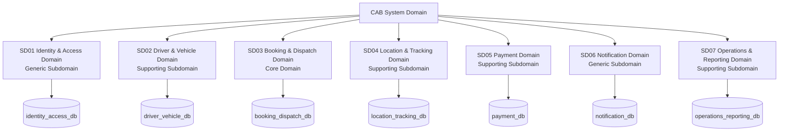

---

### 5.2. Sơ đồ khối kiến trúc dịch vụ & Database cô lập (Database-per-Service)

Mục này hiện thực hóa kiến trúc phần mềm hướng dịch vụ (Service-Oriented / Microservice Architecture) cho CAB System dựa trên đặc tả SRS và kết quả phân rã 7 Domain theo chuẩn DDD. Mỗi dịch vụ sở hữu và chịu trách nhiệm toàn vẹn một cơ sở dữ liệu độc lập (Database-per-Service pattern), tuyệt đối không chia sẻ bảng hoặc truy vấn trực tiếp chéo database.

*Ghi chú: Đoạn mã Mermaid dưới đây có thể copy trực tiếp vào [Mermaid Live Editor](https://mermaid.live) để kết xuất biểu đồ đồ họa độ nét cao.*

```mermaid
flowchart TB
    %% ====================================================
    %% 1. TẦNG CLIENT / GIAO DIỆN NGƯỜI DÙNG
    %% ====================================================
    subgraph CLIENT_LAYER ["1. TẦNG GIAO DIỆN NGƯỜI DÙNG & THIẾT BỊ (CLIENT TIER)"]
        direction LR
        CLI_CUST["📱 <b>Customer Mobile / Web App</b><br/>• Đăng ký/Đăng nhập, OTP<br/>• Báo giá, Đặt chuyến, Xem ETA<br/>• Theo dõi GPS trực quan realtime<br/>• Thanh toán Online/Tiền mặt, Rating"]
        CLI_DRIV["📱 <b>Driver Mobile App</b><br/>• Bật/Tắt nhận chuyến (Online/Offline)<br/>• Nhận & Phản hồi Offer (Đếm ngược 15s)<br/>• Gửi tọa độ GPS nền liên tục<br/>• Cập nhật tiến trình & Xác nhận thu tiền"]
        CLI_OPS["💻 <b>Operations & Admin Portal</b><br/>• Bản đồ giám sát trực tiếp (Live Fleet Map)<br/>• Quản lý tài khoản, duyệt xe & giấy tờ<br/>• Xử lý sự cố & Phê duyệt can thiệp/Hoàn tiền<br/>• Dashboard KPI, Báo cáo & Xuất file XLSX/PDF"]
    end

    %% ====================================================
    %% 2. TẦNG API GATEWAY & BẢO MẬT ĐỊNH TUYẾN
    %% ====================================================
    subgraph GATEWAY_LAYER ["2. TẦNG API GATEWAY & SECURITY ROUTING"]
        direction TB
        APIGW["🚪 <b>CAB API Gateway & Reverse Proxy</b><br/>• Xác thực tập trung JWT (Centralized Token Verification)<br/>• Kiểm soát tần suất (Rate Limiting) & Chống tấn công lặp (Idempotency)<br/>• Định tuyến đường dẫn (Reverse Proxy Routing) & Cân bằng tải (Load Balancer)<br/>• Bảo mật SSL/TLS Termination & CORS Management"]
    end

    %% ====================================================
    %% 3. TẦNG CÁC DỊCH VỤ NGHIỆP VỤ (MICROSERVICES)
    %% ====================================================
    subgraph SERVICES_LAYER ["3. TẦNG DỊCH VỤ NGHIỆP VỤ MICROSERVICES (7 SUBDOMAINS)"]
        direction TB
        
        subgraph S1 ["SD01: Identity & Access (Generic)"]
            SVC_IDN["🔑 <b>Identity & Access Service</b><br/>• Quản lý tài khoản, hồ sơ người dùng<br/>• Cấp phát phiên JWT, mã hóa mật khẩu<br/>• Phân quyền vai trò RBAC (Customer, Driver, Ops, Admin)<br/>• Trạng thái khóa tài khoản (Active/Locked)"]
        end

        subgraph S2 ["SD02: Driver & Vehicle (Supporting)"]
            SVC_DRV["🚗 <b>Driver & Vehicle Service</b><br/>• Hồ sơ nghề nghiệp tài xế & Thông tin xe<br/>• Quản lý và thẩm định giấy tờ (CCCD, Bằng lái, Đăng kiểm)<br/>• Quản lý điều kiện hoạt động & Lựa chọn Bật/Tắt nhận cuốc"]
        end

        subgraph S3 ["SD03: Booking & Dispatch (CORE DOMAIN)"]
            SVC_BKD["⭐ <b>Booking & Dispatch Service</b><br/>• Tính toán báo giá cước phí (Fare Quote Engine)<br/>• Khớp nối & Xếp hạng ưu tiên tài xế (Matching Engine)<br/>• Quản lý đề xuất chuyến đi (Trip Offers & Timeout 15s)<br/>• Phân công độc quyền (Single Assignment Lock)<br/>• Vòng đời chuyến đi (Trip Lifecycle) & Đánh giá (Rating)"]
        end

        subgraph S4 ["SD04: Location & Tracking (Supporting)"]
            SVC_LOC["📍 <b>Location & Tracking Service</b><br/>• Tiếp nhận luồng GPS tốc độ cao từ tài xế<br/>• Lưu vị trí mới nhất & Vết lộ trình theo chuyến (Breadcrumbs)<br/>• Truy vấn không gian tìm tài xế lân cận (Spatial Query)<br/>• Kiểm tra độ mới dữ liệu (Live/Stale) & Ước tính ETA/Lộ trình"]
        end

        subgraph S5 ["SD05: Payment (Supporting)"]
            SVC_PAY["💳 <b>Payment Service</b><br/>• Quản lý khoản phải thu theo chuyến (Receivable/Invoice)<br/>• Xác nhận thanh toán tiền mặt từ tài xế<br/>• Xử lý giao dịch điện tử & Tiếp nhận Webhook Callback<br/>• Chống thu trùng lặp & Xử lý hoàn tiền (Refunds)"]
        end

        subgraph S6 ["SD06: Notification (Generic)"]
            SVC_NOT["🔔 <b>Notification Service</b><br/>• Quản lý Device Tokens (FCM) & Mẫu thông báo (Templates)<br/>• Gửi thông báo đa kênh: Push Notification, SMS OTP, Email<br/>• Quản lý hộp thư đến (Inbox) & Hàng đợi gửi lại (Retry Queue)"]
        end

        subgraph S7 ["SD07: Operations & Reporting (Supporting)"]
            SVC_OPS["📊 <b>Operations & Reporting Service</b><br/>• <i>Module Operations:</i> Giám sát bản đồ, Quản lý sự cố (Incidents), Quy trình phê duyệt can thiệp (2-man rule)<br/>• <i>Module Reporting:</i> Tổng hợp Read-Models, Thống kê KPI (Doanh thu, Tỷ lệ hủy), Xuất báo cáo XLSX/PDF"]
        end
    end

    %% ====================================================
    %% 4. TẦNG CƠ SỞ DỮ LIỆU CÔ LẬP (DATABASE-PER-SERVICE)
    %% ====================================================
    subgraph DB_LAYER ["4. TẦNG LƯU TRỮ DỮ LIỆU CÔ LẬP (DATABASE-PER-SERVICE TIER)"]
        direction TB
        DB_IDN[("🗄️ <b>identity_access_db</b><br/>• users, roles, permissions<br/>• auth_sessions, otp_registrations<br/>• auth_audit_logs")]
        DB_DRV[("🗄️ <b>driver_vehicle_db</b><br/>• driver_profiles, vehicles<br/>• driver_documents, approval_records<br/>• driver_shift_status")]
        DB_BKD[("🗄️ <b>booking_dispatch_db</b><br/>• trips, fare_quotes, matching_jobs<br/>• trip_offers, assignments<br/>• trip_status_history, ratings")]
        DB_LOC[("🗄️ <b>location_tracking_db</b><br/>• driver_latest_locations (GIS)<br/>• trip_gps_breadcrumbs (Timeseries)<br/>• spatial_driver_index")]
        DB_PAY[("🗄️ <b>payment_db</b><br/>• invoices, payment_transactions<br/>• cash_receipts, payment_callbacks<br/>• refund_records, reconciliations")]
        DB_NOT[("🗄️ <b>notification_db</b><br/>• notifications, device_tokens<br/>• message_templates, delivery_logs<br/>• notification_retry_queue")]
        DB_OPS[("🗄️ <b>operations_reporting_db</b><br/>• incidents, operational_alerts<br/>• intervention_requests, approvals<br/>• report_read_models, export_jobs")]
    end

    %% ====================================================
    %% 5. TẦNG TRUYỀN THÔNG SỰ KIỆN BẤT ĐỒNG BỘ
    %% ====================================================
    subgraph EVENT_LAYER ["5. TẦNG EVENT BUS & MESSAGE BROKER (ASYNC COMMUNICATION)"]
        EVENT_BUS{{"⚡ <b>Enterprise Message Broker / Event Bus</b><br/>(RabbitMQ / Apache Kafka — Pub/Sub Topics with Dead Letter Queue)"}}
    end

    %% ====================================================
    %% 6. TẦNG TÍCH HỢP BÊN THỨ BA
    %% ====================================================
    subgraph EXT_LAYER ["6. TẦNG TÍCH HỢP HỆ THỐNG NGOÀI (EXTERNAL INTEGRATIONS)"]
        direction LR
        EXT_MAP["🗺️ <b>Map / GIS Services</b><br/><i>(OpenStreetMap / OSRM / Google Maps)</i><br/>Tính toán khoảng cách, định tuyến & Geocoding"]
        EXT_PAY["🏦 <b>Payment Gateway</b><br/><i>(VNPay / MoMo / Cổng mô phỏng)</i><br/>Xử lý thanh toán thẻ/ví & gửi Callback IPN"]
        EXT_NOT["📩 <b>Notification Providers</b><br/><i>(Firebase FCM / SMS Gateway)</i><br/>Đẩy tin nhắn OTP & Push Notification"]
    end

    %% ====================================================
    %% KẾT NỐI LUỒNG DỮ LIỆU (DATA FLOWS)
    %% ====================================================
    %% Clients to Gateway
    CLI_CUST ==>|HTTPS / WSS / REST| APIGW
    CLI_DRIV ==>|HTTPS / WSS / REST| APIGW
    CLI_OPS  ==>|HTTPS / REST| APIGW

    %% Gateway to Microservices
    APIGW -->|/api/v1/auth, /api/v1/users| SVC_IDN
    APIGW -->|/api/v1/drivers, /api/v1/vehicles| SVC_DRV
    APIGW -->|/api/v1/rides, /api/v1/quotes| SVC_BKD
    APIGW -->|/api/v1/locations, /api/v1/tracking| SVC_LOC
    APIGW -->|/api/v1/payments, /api/v1/refunds| SVC_PAY
    APIGW -->|/api/v1/notifications| SVC_NOT
    APIGW -->|/api/v1/admin/operations, /reports| SVC_OPS

    %% Isolated Database Links (1:1 Ownership)
    SVC_IDN --- DB_IDN
    SVC_DRV --- DB_DRV
    SVC_BKD --- DB_BKD
    SVC_LOC --- DB_LOC
    SVC_PAY --- DB_PAY
    SVC_NOT --- DB_NOT
    SVC_OPS --- DB_OPS

    %% Event Bus Publish
    SVC_IDN -.->|Pub: AccountLocked| EVENT_BUS
    SVC_DRV -.->|Pub: DriverStatusChanged| EVENT_BUS
    SVC_BKD -.->|Pub: TripCreated, DriverAssigned,<br/>TripCompleted, FareFinalized| EVENT_BUS
    SVC_LOC -.->|Pub: DriverLocationUpdated| EVENT_BUS
    SVC_PAY -.->|Pub: PaymentSucceeded, PaymentFailed| EVENT_BUS
    SVC_OPS -.->|Pub: IncidentCreated, ApprovalCompleted| EVENT_BUS

    %% Event Bus Subscribe
    EVENT_BUS -.->|Sub: Broadcast Events| SVC_NOT
    EVENT_BUS -.->|Sub: Sync Read-Models & Aggregates| SVC_OPS
    EVENT_BUS -.->|Sub: Payment Confirmed Event| SVC_BKD

    %% External Integrations
    SVC_LOC <-->|Routing & Distance API| EXT_MAP
    SVC_PAY <-->|Charge API & Callback IPN| EXT_PAY
    SVC_NOT -->|Push / SMS API| EXT_NOT

    %% ====================================================
    %% STYLING (AESTHETICS & THEME)
    %% ====================================================
    classDef clientStyle fill:#e1f5fe,stroke:#0288d1,stroke-width:2px,color:#01579b;
    classDef gwStyle fill:#ede7f6,stroke:#512da8,stroke-width:2px,color:#311b92;
    classDef coreStyle fill:#fff3e0,stroke:#e65100,stroke-width:3px,color:#bf360c;
    classDef svcStyle fill:#f1f8e9,stroke:#33691e,stroke-width:2px,color:#1b5e20;
    classDef dbStyle fill:#e0f2f1,stroke:#004d40,stroke-width:2px,color:#004d40;
    classDef busStyle fill:#fffde7,stroke:#f57f17,stroke-width:2px,color:#e65100;
    classDef extStyle fill:#fce4ec,stroke:#880e4f,stroke-width:2px,color:#4a148c;

    class CLI_CUST,CLI_DRIV,CLI_OPS clientStyle;
    class APIGW gwStyle;
    class SVC_BKD coreStyle;
    class SVC_IDN,SVC_DRV,SVC_LOC,SVC_PAY,SVC_NOT,SVC_OPS svcStyle;
    class DB_IDN,DB_DRV,DB_BKD,DB_LOC,DB_PAY,DB_NOT,DB_OPS dbStyle;
    class EVENT_BUS busStyle;
    class EXT_MAP,EXT_PAY,EXT_NOT extStyle;
```

---

### 5.3. Phân tích chi tiết 6 tầng kiến trúc & ranh giới dữ liệu

| Tầng kiến trúc | Thành phần chính | Trách nhiệm cốt lõi | Dữ liệu & Công nghệ đề xuất |
| :--- | :--- | :--- | :--- |
| **1. Client Tier** | Khách hàng App, Tài xế App, Admin Portal | Cung cấp giao diện tương tác trực quan cho từng đối tượng người dùng, hiển thị trạng thái cuốc xe, bản đồ và báo cáo. | Flutter / React Native (Mobile), React / Vue.js (Web Admin), WebSocket Client. |
| **2. Gateway Tier** | API Gateway & Reverse Proxy | Điểm tiếp nhận duy nhất cho toàn bộ traffic bên ngoài: Xác thực JWT, phân quyền sơ bộ, điều tiết lưu lượng (Rate Limiting), cân bằng tải, SSL Termination và định tuyến URL. | Kong API Gateway, NGINX Reverse Proxy, Traefik hoặc Spring Cloud Gateway. |
| **3. Microservices Tier** | 7 Dịch vụ nghiệp vụ độc lập | Thực thi toàn bộ quy tắc nghiệp vụ (Business Rules BR-01 – BR-26) theo đúng ranh giới trách nhiệm (Bounded Context) của 7 Subdomain. | Node.js (Express/NestJS), Go, Java (Spring Boot) hoặc Python (FastAPI). |
| **4. Database Tier** | 7 Cơ sở dữ liệu cô lập | Đảm bảo tính toàn vẹn dữ liệu, quyền sở hữu độc quyền (1-1 Mapping giữa Service và Database), không chia sẻ bảng. | PostgreSQL / MySQL (Relational), Redis (Cache & Spatial Index), TimescaleDB / PostGIS (GIS & Lộ trình GPS). |
| **5. Event Bus Tier** | Message Broker / Event Bus | Phục vụ trao đổi thông tin bất đồng bộ (Event-Driven), giảm tải kết nối trực tiếp, đảm bảo tính liên kết lỏng (Loose Coupling) và khả năng mở rộng. | RabbitMQ (AMQP Topic Exchange) hoặc Apache Kafka (Event Streaming Log). |
| **6. External Tier** | Map/GIS, Cổng thanh toán, SMS/Push Gateway | Tích hợp các dịch vụ hạ tầng chuyên biệt ngoài hệ thống để tính lộ trình bản đồ, xử lý cổng tiền điện tử và truyền tải tin nhắn. | OpenStreetMap/OSRM, VNPay/MoMo/Bank Simulator, Firebase FCM, SMS Telco Gateway. |

---

### 5.4. Nguyên tắc cô lập Database (Database-per-Service Isolation Rules)

1. **Quyền sở hữu dữ liệu duy nhất (Single Source of Truth):** Mỗi bảng dữ liệu chỉ thuộc về một Service duy nhất. Mọi hành động Đọc/Ghi đều phải đi qua API hoặc Event của Service sở hữu bảng đó.
2. **Tuyệt đối cấm Cross-Database Queries:** Không thực hiện câu lệnh SQL `JOIN` xuyên cơ sở dữ liệu, không chia sẻ Connection Pool hoặc sử dụng chung Database Schema giữa các service.
3. **Quản lý giao dịch phân tán (Distributed Transaction / Saga Pattern):** Các luồng nghiệp vụ xuyên service (như Hoàn thành chuyến -> Chốt cước -> Thanh toán -> Giải phóng tài xế) được điều phối thông qua Saga (Choreography/Orchestration) dựa trên Domain Events, đảm bảo tính nhất quán cuối cùng (Eventual Consistency).
4. **CQRS & Read-Models cho Báo cáo:** Module Reporting trong `Operations & Reporting Service` không truy vấn trực tiếp vào database giao dịch của `Booking`, `Payment` hay `Driver`. Thay vào đó, nó đăng ký nhận sự kiện (Domain Events) qua Message Broker để tổng hợp dữ liệu vào các bảng đọc chuyên biệt (Materialized Views / Read-Models), tránh làm suy giảm hiệu năng xử lý chuyến đi thời gian thực.

## 6. High cohesion và loose coupling

High cohesion: chức năng trong vùng cùng phục vụ trách nhiệm rõ ràng. Loose coupling: phối hợp bằng hợp đồng, hạn chế phụ thuộc cấu trúc và dữ liệu nội bộ của nhau.

| Quyết định | High cohesion | Loose coupling | Đánh đổi |
| --- | --- | --- | --- |
| Identity & Access riêng | Tài khoản, phiên, quyền cùng quản lý truy cập. | Domain khác dùng danh tính/quyền được xác minh, tự kiểm tra tài nguyên. | Cần kiểm tra thu hồi phiên/khóa đủ mới. |
| Driver & Vehicle riêng | Hồ sơ, xe và phê duyệt cùng quyết định điều kiện phục vụ. | Booking hỏi điều kiện, không đọc bảng giấy tờ. | Điều kiện có thể đổi lúc điều phối. |
| Gộp Booking & Dispatch | Đặt, mời, gán, hủy và tiến trình cùng quản lý thực hiện chuyến. | Trip, Offer, Assignment có một chủ sở hữu, giảm phối hợp khi gán. | Chia module nội bộ Booking, Dispatch, Trip Lifecycle, Fare, Rating để kiểm soát phạm vi. |
| Tách Location & Tracking | GPS, chỉ mục không gian, hành trình và ETA cùng xử lý vị trí/thời gian. | Cung cấp dữ liệu qua hợp đồng, không quyết định phân công hoặc tiền. | Quản lý GPS trễ, thiếu và quyền theo dõi. |
| Payment riêng | Thu, đối soát, chống trùng và hoàn cùng bảo vệ giao dịch. | Nhận phiên bản cước, cung cấp kết quả xác nhận. | Callback trùng/trễ, cạnh tranh với sửa cước. |
| Notification riêng | Kênh gửi và trạng thái chuyển thông tin cùng một mục tiêu. | Lỗi gửi không đảo ngược chuyến/tiền. | Cần thử lại và chống gửi trùng. |
| Gộp Operations & Reporting | Cùng phục vụ quản lý hoạt động; giữ module can thiệp và tổng hợp riêng. | Dùng API/sự kiện, gửi lệnh tới đúng chủ dữ liệu. | Gắn kết giữa hai module yếu hơn Booking–Dispatch; cần tránh báo cáo nặng cản xử lý sự cố. |

Việc gộp Operations & Reporting là lựa chọn theo quy mô đồ án, không có nghĩa hai module phải dùng chung mọi mô hình và quyền. Module Reporting không sửa dữ liệu nghiệp vụ; module Operations kiểm tra quyền can thiệp riêng.

API Gateway, kênh truyền sự kiện, kho tệp và nhà cung cấp bản đồ là thành phần kỹ thuật/tích hợp, không được đếm thêm vào 7 domain.

## 7. Liên kết theo quy trình nghiệp vụ

Tên ngắn: Identity, Driver, Booking, Location tương ứng bốn domain đầu; Operations và Reporting là hai module cùng SD07.

| Quy trình / Use case | Chủ trì | Phối hợp | Kết quả / giới hạn |
| --- | --- | --- | --- |
| Đăng ký/OTP — UC002 | Identity | Notification chuyển OTP; Driver tạo hồ sơ nghề nghiệp sau xác minh. | Tạo hồ sơ lỗi phải lưu tiến trình/thử lại; chưa đủ điều kiện thì chưa nhận cuốc. |
| Đăng nhập — UC001 | Identity | Ứng dụng nhận phiên và gọi các domain theo quyền. | Đăng nhập thành công không đồng nghĩa hồ sơ đã duyệt. |
| Quản lý tài khoản/hồ sơ/xe — UC013 | Identity hoặc Driver theo đối tượng | Notification báo kết quả; Booking kiểm soát nhận chuyến; Operations hỗ trợ chuyến đang có khi khóa tài khoản. | Mỗi chủ dữ liệu thực hiện thay đổi và ghi audit. |
| Báo giá/tạo chuyến — UC003 | Booking | Location cung cấp địa chỉ/lộ trình/quãng đường; Notification báo tiếp nhận. | Booking tính giá, tạo SEARCHING/UNPAID và bắt đầu điều phối nội bộ. |
| Tìm/mời/nhận chuyến — UC004–UC007 | Booking | Location tìm ứng viên theo khoảng cách; Driver cung cấp điều kiện; Notification chuyển lời mời. | Booking xếp ưu tiên, gán một lần; từ chối/timeout thì mời tiếp. |
| Cập nhật tiến trình — UC008 | Booking | Location cung cấp vị trí; Notification gửi trạng thái. | Đúng thứ tự/đúng tài xế; COMPLETED chưa phải PAID. |
| Theo dõi — UC009 | Booking kiểm tra quyền; Location cung cấp vị trí | Ứng dụng nhận dữ liệu đúng chuyến và ETA khi có. | Đánh dấu dữ liệu cũ, dừng vị trí mới sau kết thúc. |
| Chốt cước/thu tiền — UC010–UC011 | Booking chốt cước; Payment thu | Location cung cấp hành trình; Payment gọi cổng mô phỏng; Notification báo kết quả. | Chỉ ghi PAID khi có căn cứ xác nhận. |
| Đánh giá — UC012 | Booking | Payment xác nhận PAID; Driver/Reporting nhận điểm; Operations nhận cờ phản ánh. | Đúng chủ, hoàn thành, đã trả, còn hạn và chưa đánh giá. |
| Giám sát — UC014 | Operations & Reporting | Booking cung cấp chuyến, Location cung cấp vị trí theo quyền, Driver cung cấp hồ sơ/xe. | Xem không làm thay đổi trạng thái hay tiền. |
| Can thiệp/sự cố — UC015 | Operations & Reporting | Booking hủy/tạo chuyến thay thế, Driver xử lý điều kiện xe, Payment đối soát/hoàn, Notification báo kết quả. | Phê duyệt khác thực thi; chỉ đóng thành công khi có kết quả. |
| Báo cáo — UC016 | Operations & Reporting | Nhận chuyến/đánh giá từ Booking, thu/hoàn từ Payment và phân loại cần thiết từ Driver. | Có bộ lọc/mốc dữ liệu và quyền doanh thu riêng. |

## 8. Tương tác giữa các domain theo quy trình nghiệp vụ

Phần này thực hiện bước 2 của bài tập: từ quy trình nghiệp vụ, xác định domain nào xử lý bước nào và trao đổi với domain nào. Các sơ đồ Mermaid dưới đây là **bản demo thiết kế**, không phải các API đã triển khai.

Tên viết ngắn trong sơ đồ tương ứng đúng 7 domain ở mục 3. Operations và Reporting là hai module của cùng **Operations & Reporting Domain**, không phải hai service riêng.

Quy ước đọc sơ đồ:

- Đọc sequence diagram từ trên xuống; số thứ tự được Mermaid tự đánh.
- Mũi tên liền `->>`: yêu cầu hoặc lệnh xử lý; mũi tên nét đứt `-->>`: phản hồi.
- Mũi tên mở `-)`: gửi sự kiện/yêu cầu bất đồng bộ; tên sự kiện là đề xuất.
- `alt/else`: các nhánh loại trừ nhau; `opt`: bước có điều kiện; `loop`: bước lặp có giới hạn.
- Actor là người dùng hoặc đối tác ngoài CAB. Domain nội bộ là participant, mỗi domain chỉ thao tác trực tiếp database của mình.
- Mọi request phải được xác thực và kiểm tra quyền tại bên nhận; bước này chỉ vẽ riêng khi cần giải thích luồng.

### 8.1. Đăng ký, OTP và đăng nhập — UC001, UC002

**Chủ trì:** Identity & Access. **Phối hợp:** Notification gửi OTP; Driver & Vehicle tạo hồ sơ nghề nghiệp cho tài xế.

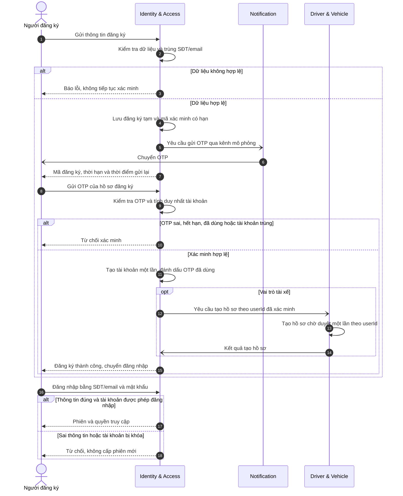

**Điểm cần bảo đảm:** tài khoản được xác minh không đồng nghĩa hồ sơ tài xế đã duyệt. Nếu tạo hồ sơ Driver lỗi, giữ tiến trình để gửi lại, không cho nhận cuốc khi chưa đủ điều kiện. Notification không kiểm tra OTP hoặc quyết định kích hoạt tài khoản; OTP không xuất hiện trong phản hồi đăng ký gửi về ứng dụng.

### 8.2. Báo giá, đặt xe và tìm tài xế — UC003–UC007

**Chủ trì:** Booking & Dispatch. Location trả dữ liệu khoảng cách; Driver trả điều kiện hoạt động; Booking quyết định xếp ưu tiên và phân công.

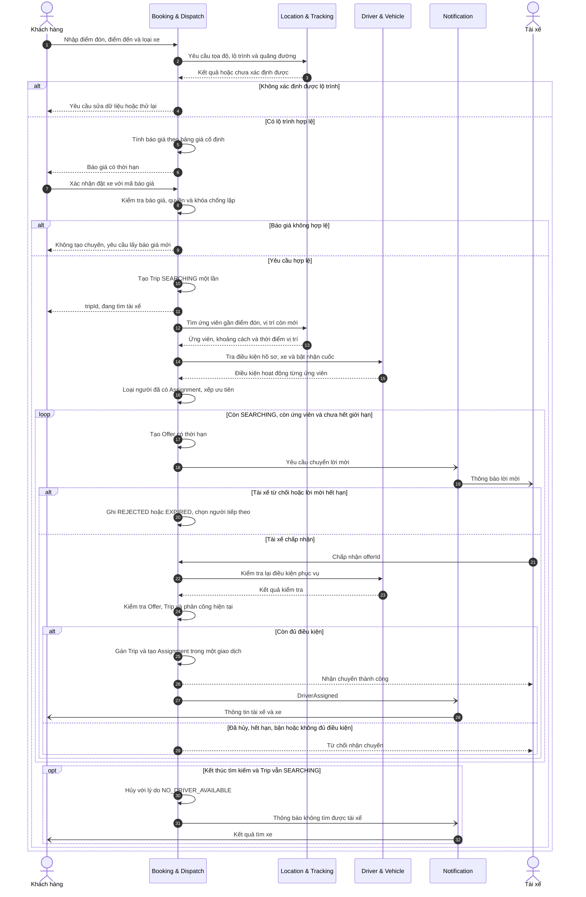

**Điểm cần bảo đảm:** vòng lặp tiếp tục trên cùng tripId và dừng khi đã gán/hủy/hết giới hạn. Giao dịch cục bộ của Booking bảo vệ hai điều kiện: một tài xế chỉ có một phân công hoạt động, một chuyến chỉ có một tài xế. Điều kiện khóa tài khoản/xe thay đổi đồng thời vẫn cần chính sách hiệu lực và cơ chế phối hợp riêng.

### 8.3. Hủy chuyến trong lúc điều phối — UC003, UC004, UC007

**Chủ trì:** Booking & Dispatch. Nhánh này làm rõ cạnh tranh giữa khách hủy và tài xế nhận chuyến.

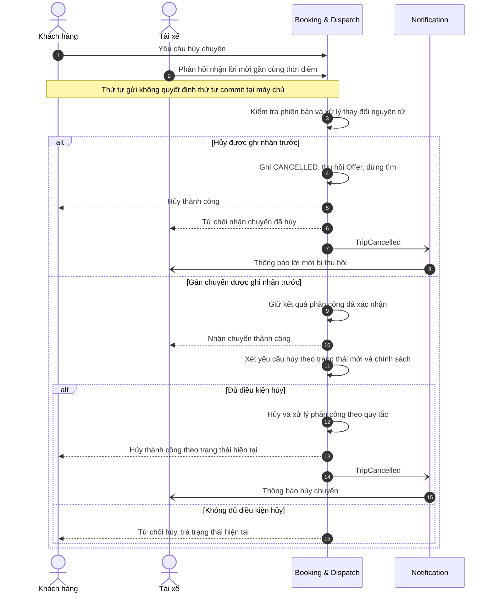

**Điểm cần bảo đảm:** không tự ghi đè DRIVER_ASSIGNED bằng yêu cầu hủy dựa trên dữ liệu cũ; phí hủy và điều kiện giải phóng tài xế áp dụng theo quy tắc được chốt.

### 8.4. Thực hiện chuyến, GPS và theo dõi — UC008, UC009

**Chủ trì:** Booking quản lý tiến trình; Location quản lý dữ liệu vị trí. Quyền theo dõi gắn với chuyến, không chỉ với driverId.

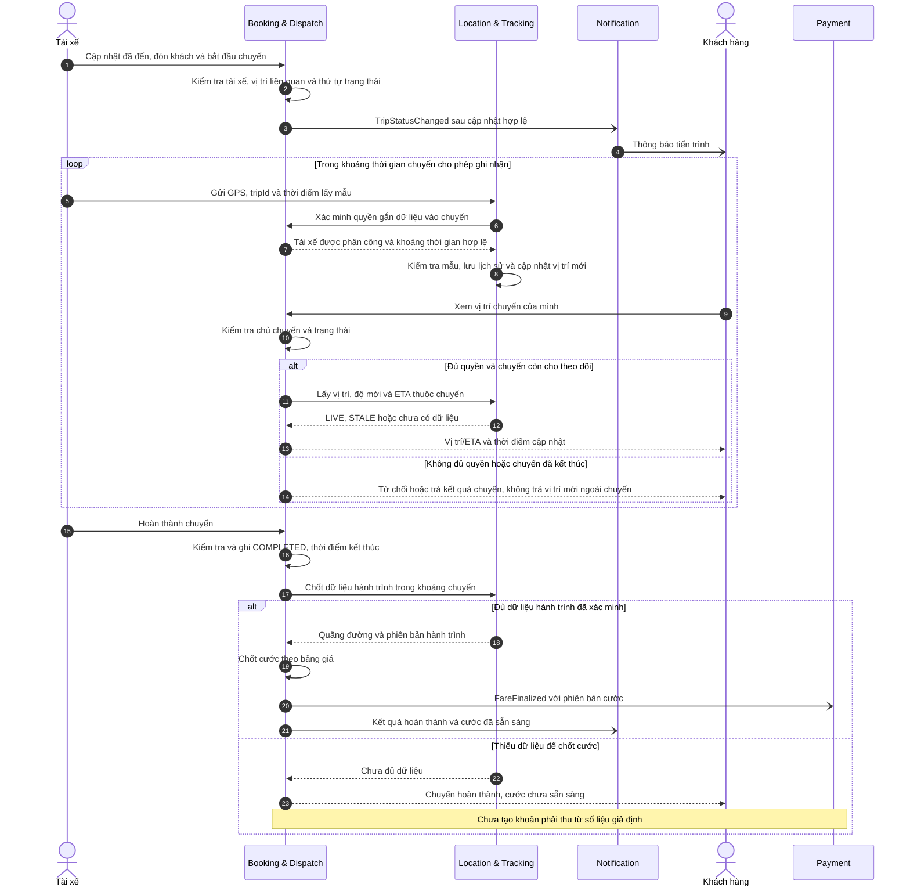

**Điểm cần bảo đảm:** COMPLETED không đồng nghĩa PAID; GPS mất tín hiệu không tự hủy chuyến hoặc xóa phân công. Việc Location xác minh với Booking trong demo thể hiện điều kiện logic; tần suất gọi/cách dùng bản sao có phiên bản sẽ được chốt khi thiết kế hợp đồng để tránh gọi mạng cho mọi mẫu một cách không cần thiết.

### 8.5. Thanh toán tiền mặt và điện tử — UC010, UC011

**Chủ trì:** Payment. Booking cung cấp cước đã chốt; Payment quyết định kết quả thu tiền.

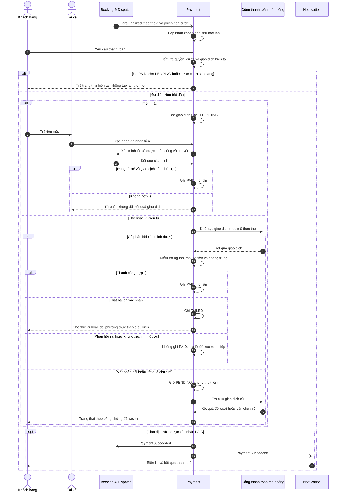

**Điểm cần bảo đảm:** timeout không đồng nghĩa FAILED. Callback đến trễ được xử lý qua cùng quy tắc xác minh/chống trùng; khi đối soát xác nhận PAID cũng phát kết quả một lần theo cơ chế gửi lại an toàn.

### 8.6. Đánh giá sau chuyến — UC012

**Chủ trì:** Booking. Operations nhận phản ánh; điểm tổng hợp gửi cho Driver và module Reporting phục vụ đọc.

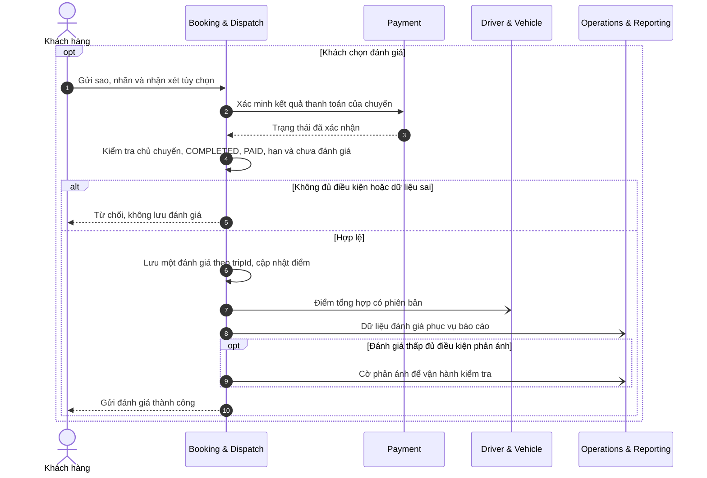

**Điểm cần bảo đảm:** bỏ qua không tạo đánh giá rỗng; gửi lặp không làm tăng số đánh giá. Bản đọc PAID đã xác nhận có thể thay lời gọi tra cứu nếu hợp đồng đảm bảo điều kiện cần thiết.

### 8.7. Quản lý tài khoản, hồ sơ tài xế và xe — UC013

**Chủ trì:** domain sở hữu đối tượng. Giao diện quản trị không phải một domain mới và không có quyền sửa trực tiếp các database.

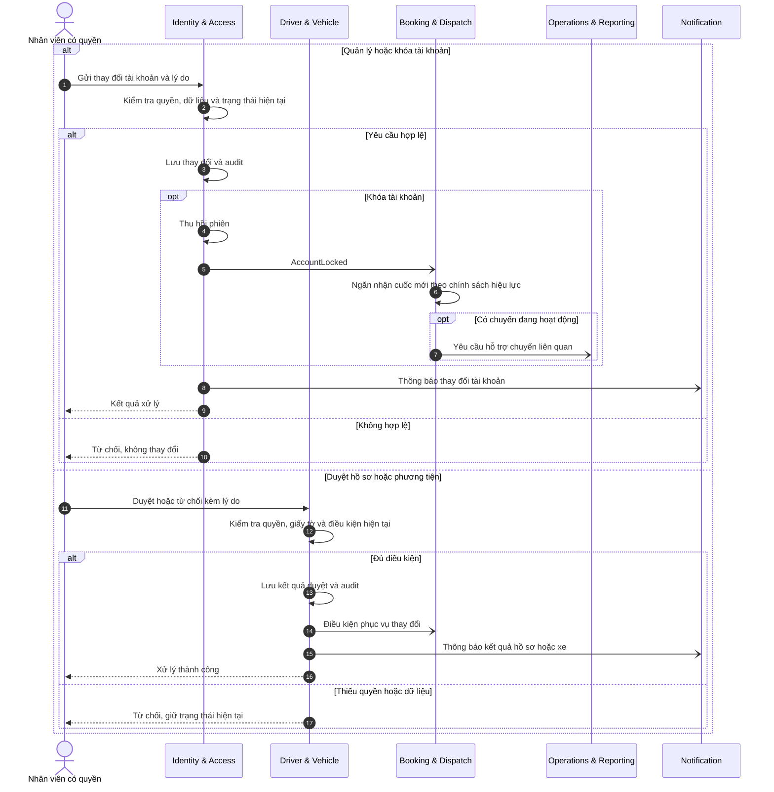

**Điểm cần bảo đảm:** chỉ nhận sự kiện khóa chưa đủ bảo đảm chặn tức thì khi sự kiện trễ; kiểm tra quyền/thu hồi đủ mới ở thao tác nhạy cảm và thứ tự hiệu lực cần được chốt. Mở khóa không tự duyệt hồ sơ/xe.

### 8.8. Giám sát và xử lý sự cố — UC014, UC015

**Chủ trì:** Operations & Reporting quản lý hồ sơ sự cố/phê duyệt. Thực thi nghiệp vụ thuộc Booking, Driver hoặc Payment.

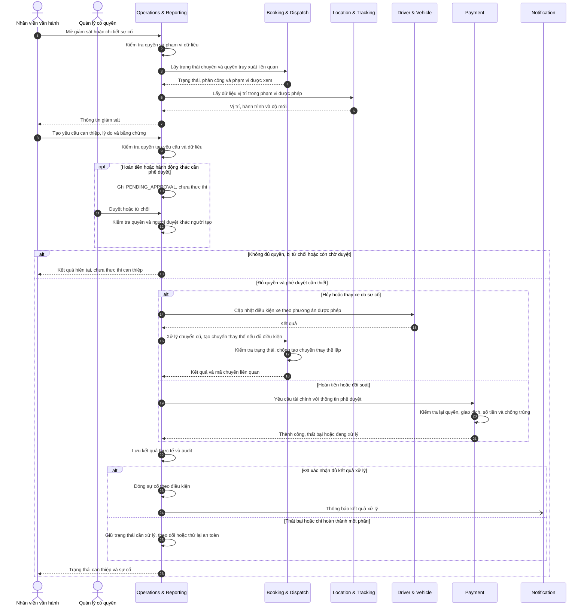

**Điểm cần bảo đảm:** xe hỏng không tự trở thành AVAILABLE sau khi kết thúc chuyến. Sơ đồ minh họa hai nhóm can thiệp; điều chỉnh cước chưa thu cần luồng phối hợp Booking–Payment riêng để chống cạnh tranh với thanh toán. Không thực hiện bước phụ thuộc khi bước trước thất bại nếu điều kiện nghiệp vụ chưa được đáp ứng.

### 8.9. Tổng hợp, xem và xuất báo cáo — UC016

**Chủ trì:** module Reporting trong Operations & Reporting. Báo cáo dùng bản đọc tổng hợp, không JOIN trực tiếp database của domain khác.

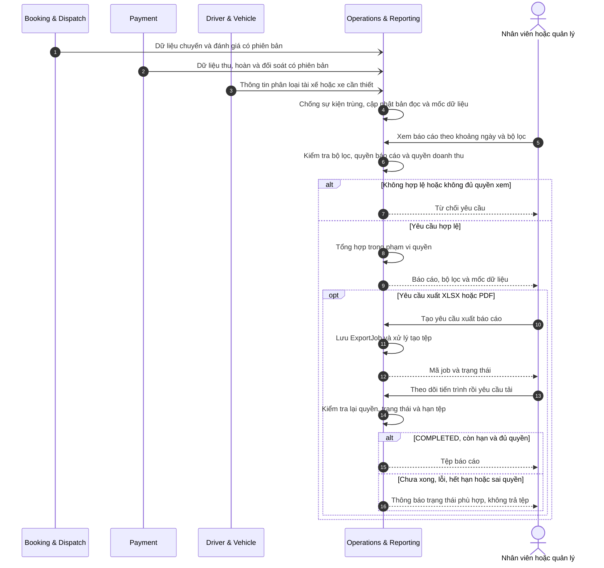

**Điểm cần bảo đảm:** có quyền xem báo cáo nhưng thiếu quyền doanh thu thì không trả các số liệu doanh thu. Bản đọc có thể trễ; mốc dữ liệu phải rõ, không dùng báo cáo làm căn cứ tự sửa giao dịch. Hai lần tạo báo cáo có thể khác nhau nếu dữ liệu nguồn đã thay đổi.

### 8.10. Quy tắc chung khi hiện thực hóa các sơ đồ

1. Mọi thay đổi dữ liệu do domain sở hữu thực hiện; quyền xem không suy ra quyền can thiệp.
2. Yêu cầu/sự kiện có mã nhận diện để xử lý lặp an toàn; kiểm soát phiên bản và thứ tự theo đối tượng.
3. Lưu dữ liệu nghiệp vụ cùng thông tin sự kiện cần gửi trong giao dịch cục bộ; có cơ chế gửi lại và theo dõi lỗi.
4. Mất phản hồi không tự chứng minh thao tác thất bại; tra cứu kết quả cũ trước khi tạo thao tác mới.
5. Notification lỗi không đảo ngược kết quả chuyến/tiền; Reporting trễ không quyết định trạng thái giao dịch.
6. Các sơ đồ là mô hình logic. Áp dụng quy tắc/timeout đã chốt được dẫn ở mục 9; cơ chế phục hồi, bù trừ và hợp đồng dữ liệu tiếp tục chi tiết hóa ở mục 10.

## 9. Quy tắc nghiệp vụ áp dụng theo domain

Nguồn quyết định chính thức là [README — mục 10](README.md#10-business-rules-quy-tắc-nghiệp-vụ); giá trị nằm duy nhất trong [bảng cấu hình mục 10.1](README.md#101-tham-số-cấu-hình-nghiệp-vụ-đã-chốt). Các quy tắc đã được người dùng chốt cho đồ án; không đồng nghĩa đã triển khai hoặc kiểm thử đạt.

| Domain thực thi | Quy tắc áp dụng | Tham số tham chiếu | Trách nhiệm phối hợp |
| --- | --- | --- | --- |
| Identity & Access Domain | BR-01, BR-18, BR-25 | CFG-AUTH-01–CFG-AUTH-07 | Thu hồi phiên, chuyển trạng thái khóa tới Booking; Operations tiếp quản chuyến đang chạy. |
| Driver & Vehicle Domain | BR-13, BR-18, BR-24 | CFG-DOC-01–CFG-DOC-02 | Cung cấp điều kiện hoạt động, lựa chọn nhận cuốc; không tự giải phóng Assignment. |
| Booking & Dispatch Domain | BR-12–BR-20, BR-23 | CFG-MATCH-01–CFG-MATCH-04, CFG-TRIP-01–CFG-TRIP-03, CFG-FARE-01, CFG-RATE-01–CFG-RATE-02 | Phân công duy nhất; giải phóng khi COMPLETED/CANCELLED hợp lệ, không chờ PAID; nhận hành trình từ Location và PAID từ Payment. |
| Location & Tracking Domain | BR-11, BR-19 | CFG-GPS-01–CFG-GPS-03 | Cung cấp vị trí/độ mới và dữ liệu khoảng cách cho Booking; không tự hủy chuyến hoặc tính cước. |
| Payment Domain | BR-15, BR-20–BR-22 | CFG-PAY-01–CFG-PAY-02 | Thu/đối soát/hoàn; giữ hạn mức cho yêu cầu hoàn đang xử lý; mọi hoàn tiền cần phê duyệt độc lập. |
| Notification Domain | BR-10–BR-11; chuyển thông báo của các quy tắc liên quan | Dùng thời hạn tài nguyên do domain sở hữu cung cấp | Không tự đặt TTL OTP/lời mời mới; kết quả gửi không thay kết quả nghiệp vụ. |
| Operations & Reporting Domain | BR-09–BR-11, BR-18, BR-21–BR-22, BR-26 | CFG-REPORT-01–CFG-REPORT-02 | Phê duyệt hoàn tiền, tiếp quản sự cố/đối soát; tổng hợp tập chuyến và giao dịch theo cơ sở thời gian đã chốt. |

Các vấn đề còn mở được quản lý tại [README — mục 11.2](README.md#112-danh-sách-quyết-định-còn-mở-trước-nghiệm-thu). Không sao chép các giá trị cấu hình sang sơ đồ để tránh lệch khi cập nhật. Trước hiện thực hóa, đồng bộ lại YAML và test case theo nguồn quy tắc này.

## 10. Bước thiết kế tiếp theo

1. Hoàn thiện các bản demo ở mục 8 bằng luồng lỗi và phục hồi chi tiết, đặc biệt điều chỉnh cước, hiệu lực khóa tài khoản và kết quả can thiệp một phần.
2. Lập hợp đồng giao tiếp: domain gửi/nhận, API hoặc sự kiện, dữ liệu tối thiểu, quyền, phiên bản và xử lý lỗi/lặp.
3. Đối chiếu FR/UC/BR → domain chủ trì → domain phối hợp → test case.

Phương án hiện tại là **7 domain ở mục 3**. README đã được cập nhật yêu cầu và bảng truy vết theo phương án này; YAML và code chưa được sửa theo thiết kế.

